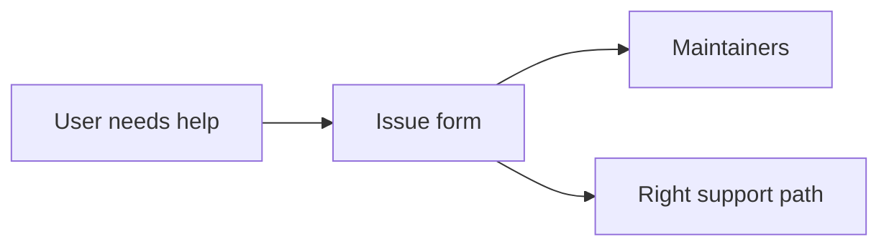

# Issue Templates

This folder contains the issue forms people see on GitHub.

## What is in this folder

| File | Plain meaning |
| --- | --- |
| `bug_report.yml` | Use this when the chart seems broken |
| `documentation.yml` | Use this when the guide files are confusing or missing something |
| `feature_request.yml` | Use this when you want the chart to support a new pattern |
| `config.yml` | GitHub's routing settings for the issue page |

## When you can ignore this folder

You can ignore this folder unless you are changing issue intake on GitHub.

## Common mistake

Keep these forms aligned with [../../SUPPORT.md](../../SUPPORT.md) and the
collaborator-only pull request boundary.
