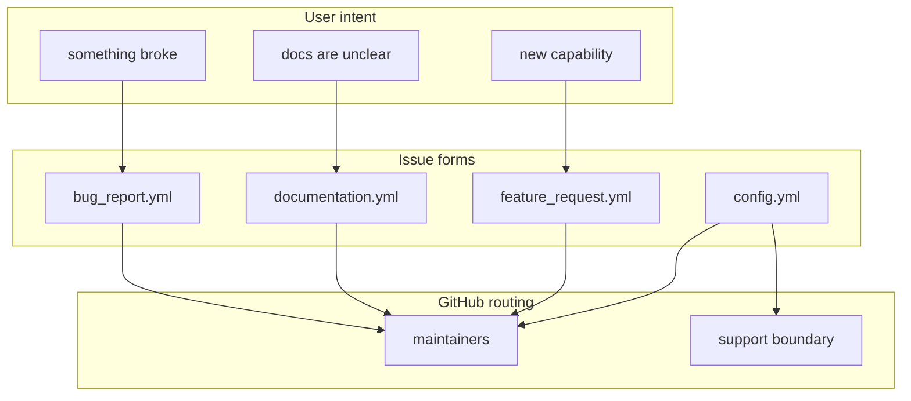

# Issue Templates

This folder contains the issue forms people see on GitHub.

These files do not change chart behavior. They change how users describe bugs,
docs gaps, and feature requests when they contact maintainers.

## Who Should Read This

| Reader | Why this guide matters |
| --- | --- |
| maintainer | to shape issue intake quality and routing |
| contributor | to understand what information maintainers expect from users |
| support triager | to know which form is meant for which problem |

## What Lives In This Folder

| File | What it does |
| --- | --- |
| `bug_report.yml` | asks for reproducible bug information |
| `documentation.yml` | collects missing or confusing doc reports |
| `feature_request.yml` | captures chart-scope enhancements |
| `config.yml` | disables blank issues and adds support/security links |
| `README.md` | this guide |

## What Each Form Collects

### `bug_report.yml`

This form asks for:

- chart version or commit
- Kubernetes environment
- values file or overlay used
- observed behavior
- reproduction steps
- expected behavior

Why it matters:

- most bug reports are only useful if a maintainer can reproduce the chart
  state locally or in CI

### `documentation.yml`

This form asks for:

- which file is confusing
- what is missing or unclear
- an optional suggested improvement

Why it matters:

- it gives maintainers a direct pointer into the guide system instead of a vague
  “the docs are bad” report

### `feature_request.yml`

This form asks for:

- the problem to solve
- the proposed change
- alternatives considered
- expected impact

The wording deliberately reminds users that pull requests are collaborator-only
even though feature requests are welcome.

### `config.yml`

This file shapes the issue landing page by:

- disabling blank issues
- sending support questions toward `SUPPORT.md`
- sending security reports toward the security policy

## How This Folder Fits Into The Repo

This folder sits at the boundary between public users and repo maintainers.

It should stay aligned with:

- `SUPPORT.md`
- `SECURITY.md`
- the collaborator-only contribution model described elsewhere in the repo

## Common Tasks

If you need to:

- demand more reproducibility information for bugs: edit `bug_report.yml`
- improve documentation feedback quality: edit `documentation.yml`
- change the feature-request boundary: edit `feature_request.yml`
- route users away from the wrong issue type: edit `config.yml`

## Validation

After editing this folder:

- preview the YAML for obvious syntax mistakes
- run `./hack/docs-check.sh` if you changed this guide
- sanity-check links back to `SUPPORT.md` and the security policy

## Common Mistakes

- allowing blank issues when the repo wants structured intake
- asking users for information maintainers do not actually use
- drifting out of sync with `SUPPORT.md`

## When You Can Ignore This Folder

You can ignore this folder unless you are changing GitHub issue intake or the
support boundary.
