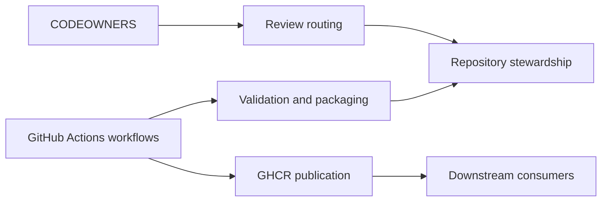

# Repository Automation and Ownership

This directory holds the repository-level governance and automation entry
points.

## What lives here

| File or directory | Purpose |
| --- | --- |
| `CODEOWNERS` | Default review ownership and stewardship routing |
| `dependabot.yml` | Automated GitHub Actions dependency update policy |
| `ISSUE_TEMPLATE/` | Structured public issue forms and contact routing |
| `pull_request_template.md` | Pull-request checklist for collaborators |
| `release.yml` | GitHub-generated release-note categories |
| `workflows/` | GitHub Actions workflows for validation and publication |

## How this directory fits together

## Child guide

| Path | Guide | Purpose |
| --- | --- | --- |
| `.github/ISSUE_TEMPLATE/` | [ISSUE_TEMPLATE/README.md](ISSUE_TEMPLATE/README.md) | Support and issue intake configuration |
| `.github/workflows/` | [workflows/README.md](workflows/README.md) | CI, release, and GHCR publication flow |

## Notes for maintainers

- Repository ownership is currently managed through the
  `@sanger-pathogens/data-engineering-and-integration-sanger` team.
- Public visibility does not imply open pull requests; collaborator-only pull
  requests are part of the repository governance model.
- Public issue intake is structured so consumers are steered toward the right
  support, documentation, and security channels.
- Workflow behavior is documented separately so the root README can stay focused
  on handover and platform architecture.
- Dependabot keeps pinned GitHub Actions references reviewable over time instead
  of letting workflow dependencies drift silently.
