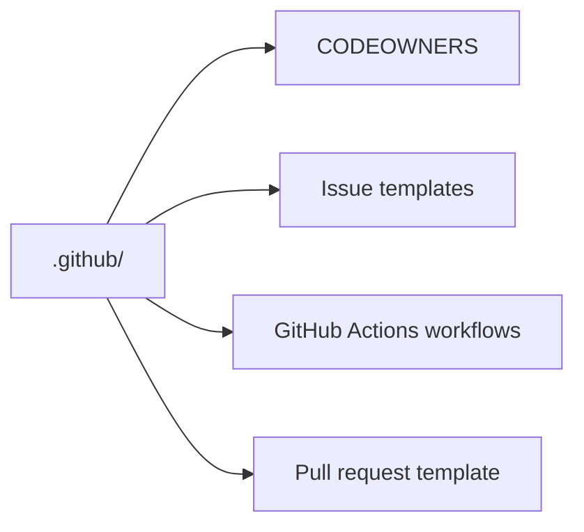

# GitHub Repository Files

This folder contains the GitHub-only files for this repo.

These files control reviews, issue forms, and automated checks.

## What is in this folder

| File or folder | Plain meaning |
| --- | --- |
| `CODEOWNERS` | Who GitHub asks to review changes |
| `ISSUE_TEMPLATE/` | The issue forms people fill in |
| `workflows/` | The automated checks and publish jobs |
| `pull_request_template.md` | The default pull request checklist |
| `dependabot.yml` | GitHub dependency update settings |
| `release.yml` | GitHub release-note category settings |

## When you can ignore this folder

You can ignore this folder if you only want to install or use the chart.

You need this folder when you are changing review rules, issue intake, or CI.

## Common mistake

Do not change a workflow without also checking the matching local script in
`hack/`.
