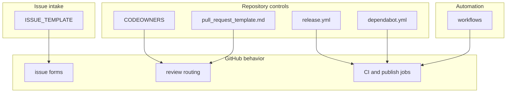

# GitHub Repository Files

This folder contains the GitHub-only files for this repository.

Nothing here changes the runtime behavior of the Helm chart directly. Instead,
this folder controls how GitHub behaves around the repo.

## Who Should Read This

| Reader | Why this guide matters |
| --- | --- |
| maintainer | to understand review routing, release-note categories, and dependency automation |
| contributor | to understand CI and issue intake boundaries |
| reviewer | to see where ownership and workflow rules actually live |

## What Lives In This Folder

| File or folder | What it does |
| --- | --- |
| `CODEOWNERS` | defines who GitHub requests for review |
| `ISSUE_TEMPLATE/` | controls the issue forms users see |
| `workflows/` | GitHub Actions jobs for lint, smoke install, and publish |
| `pull_request_template.md` | the default pull request checklist |
| `dependabot.yml` | weekly GitHub Actions dependency update automation |
| `release.yml` | release-note categories for GitHub release tooling |
| `OVERVIEW.md` | this guide |

## How This Folder Fits Into The Repo

This folder answers repo-governance questions such as:

- who should review a change
- how users are routed when they open an issue
- what CI runs on pull requests and `main`
- how publish and smoke-install workflows are triggered
- how release notes are grouped

The repo's local scripts live in `scripts/`. This folder points GitHub at those
scripts rather than duplicating the logic conceptually.

## Important Behavior By File

### `CODEOWNERS`

Current behavior:

- all paths default to the
  `@sanger-pathogens/data-engineering-and-integration-sanger` team

Change this when:

- stewardship changes
- review routing needs to become more specific

### `pull_request_template.md`

This shapes what a contributor sees when opening a PR on GitHub.

Change this when:

- reviewer expectations changed
- you need contributors to supply new kinds of evidence

### `dependabot.yml`

Current behavior:

- manages the `github-actions` ecosystem
- scans the repo root weekly
- limits open pull requests
- adds dependency and security labels

It does not manage Helm chart dependencies. Those are maintained through
`Chart.yaml`, `Chart.lock`, and the packaging flow.

### `release.yml`

This file groups changes into release-note categories such as:

- platform features
- bug fixes
- dependency and packaging work
- documentation and handover
- maintenance

Change it when:

- label taxonomy changes
- release-note grouping becomes misleading

### `ISSUE_TEMPLATE/`

This subfolder defines the public intake experience for bugs, doc problems, and
feature requests. The detailed guide lives in
[ISSUE_TEMPLATE/README.md](ISSUE_TEMPLATE/README.md).

### `workflows/`

This subfolder contains the actual CI, smoke-test, and publish workflows. The
job-by-job guide lives in [workflows/README.md](workflows/README.md).

## Common Tasks

If you need to:

- change who reviews the repo: edit `CODEOWNERS`
- change public issue intake: edit `ISSUE_TEMPLATE/`
- change CI or publishing: edit `workflows/`
- change GitHub release-note grouping: edit `release.yml`
- change how GitHub nudges contributors in PRs: edit `pull_request_template.md`

## Validation

After changing this folder:

- run the relevant local scripts from `scripts/` that the workflow mirrors
- run `./scripts/repo/docs-check.sh` if you changed guide text here
- inspect workflow YAML carefully because GitHub-only failures are easy to miss

## Common Mistakes

- changing a workflow without checking the matching local script
- assuming Dependabot manages Helm dependencies in `Chart.yaml`
- changing labels in issue or release config without considering downstream
  release-note grouping

## When You Can Ignore This Folder

You can ignore this folder if you only want to install or consume the chart.

If you maintain the repo, this folder defines the GitHub-facing operating model
and should not be ignored.
