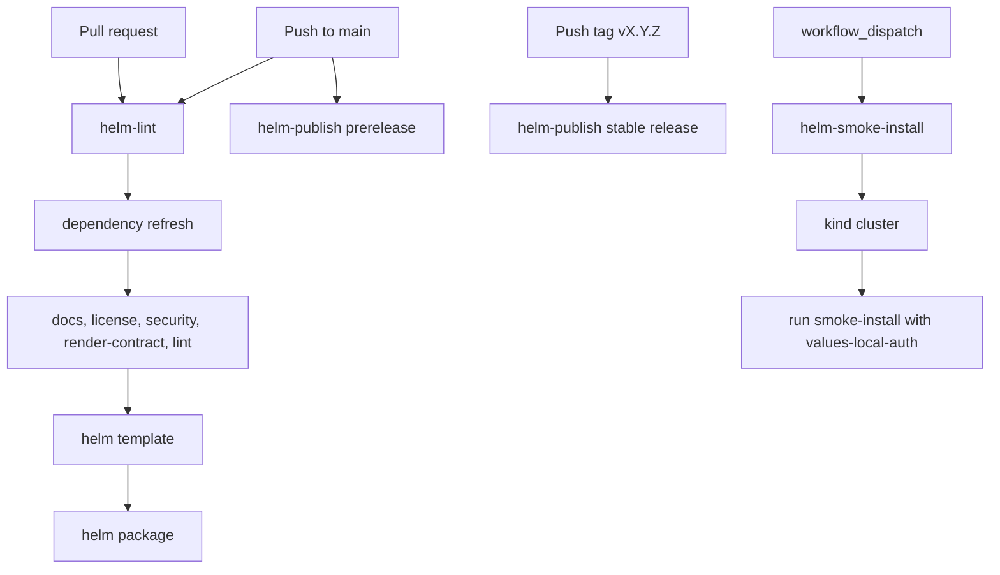

# GitHub Actions Workflows

This directory contains the automation that validates and publishes the chart.

Use the local scripts under [`../../hack/README.md`](../../hack/README.md) when
you want the same logic outside GitHub Actions.

Audience: collaborators who need to understand how CI maps to the local
maintainer workflow.

What you will learn: which workflow runs when, how it relates to the local
scripts, and which workflow covers the auth-enabled smoke path.

Read next: [../../hack/README.md](../../hack/README.md) for the local script
equivalents, or [../../docs/release-playbook.md](../../docs/release-playbook.md)
for release-specific steps.

## Workflow inventory

| Workflow | Trigger | Purpose |
| --- | --- | --- |
| `helm-lint.yaml` | `push` to `main`, `pull_request` | Refresh dependencies, run validation, render, and package the chart |
| `helm-smoke-install.yaml` | `workflow_dispatch` | Run the auth-enabled local smoke path in a disposable kind cluster |
| `helm-publish.yaml` | `push` to `main`, `push` tags `v*`, `workflow_dispatch` | Resolve the publish version, package the chart, and push it to GHCR |

## Workflow lifecycle

## Publication behavior

- `main` publishes a unique prerelease version:
  `<base-version>-main.<run-number>.<run-attempt>.<short-sha>`
- `vX.Y.Z` tags publish the stable `X.Y.Z` version and fail if the Git tag does
  not match `charts/dlh-in-a-box/Chart.yaml`
- GHCR authentication uses `GITHUB_TOKEN` by default, with optional
  `GHCR_TOKEN` and `GHCR_USERNAME` overrides if organization policy requires them

## Operational expectations

- `helm-lint.yaml` should stay aligned with `./hack/lint.sh`.
- `helm-smoke-install.yaml` should stay aligned with `./hack/smoke-install.sh`.
- the smoke workflow intentionally uses `examples/values-local-auth.yaml`,
  because that overlay exercises the auth-enabled local path and the smoke
  script seeds the demo Secrets it needs.
- local Mermaid rendering in `docs-check.sh` needs Docker; GitHub Actions runs
  in an environment where that full check can execute.
