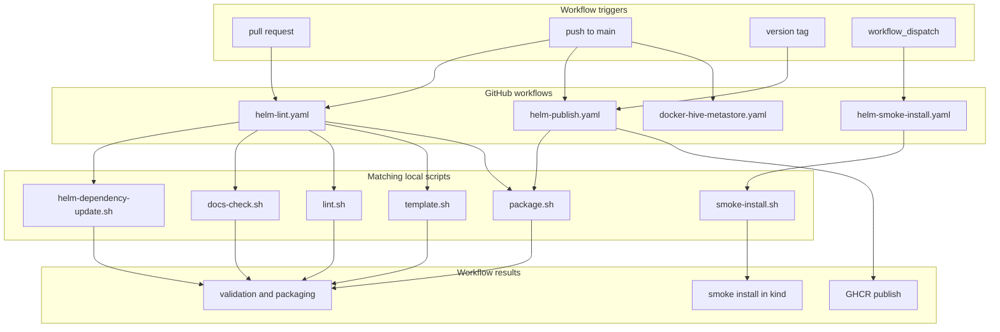

# GitHub Actions Workflows

This folder contains the GitHub Actions jobs for this repository.

These workflows do not invent a second validation system. They mostly call the
local scripts under `hack/` so CI and local maintainer workflows stay aligned.

## Who Should Read This

| Reader | Why this guide matters |
| --- | --- |
| maintainer | to understand what GitHub runs automatically |
| contributor | to understand what a PR or push will trigger |
| release steward | to understand prerelease and tagged publish behavior |

## Workflow Inventory

| Workflow | Trigger | What it really does |
| --- | --- | --- |
| `helm-lint.yaml` | `pull_request`, push to `main` | refresh deps, run validation, render, and package |
| `helm-smoke-install.yaml` | `workflow_dispatch` | create a disposable kind cluster and run the auth-heavy smoke path |
| `helm-publish.yaml` | `workflow_dispatch`, push to `main`, push tags `v*` | resolve publish version, package the chart, and push to GHCR |
| `docker-hive-metastore.yaml` | push to `main` affecting `docker/hive-metastore/**`, `workflow_dispatch` | build the custom Hive metastore image and push it to GHCR |

## What Lives In This Folder

| File | What it does |
| --- | --- |
| `helm-lint.yaml` | main validation workflow |
| `helm-publish.yaml` | package and publish workflow |
| `helm-smoke-install.yaml` | disposable kind smoke-test workflow |
| `docker-hive-metastore.yaml` | build and push the custom Hive metastore image |
| `README.md` | this guide |

## Workflow-By-Workflow Detail

### `helm-lint.yaml`

Trigger:

- pull requests
- pushes to `main`

Steps:

- checkout
- install Helm `v3.12.0`
- run `./hack/helm-dependency-update.sh`
- run `./hack/lint.sh`
- run `./hack/template.sh`
- run `./hack/package.sh`

Why it matters:

- this is the closest CI equivalent of the normal local maintainer path

### `helm-smoke-install.yaml`

Trigger:

- manual only with `workflow_dispatch`

Steps:

- checkout
- install Helm
- create a kind cluster
- run `./hack/smoke-install.sh charts/dlh-in-a-box examples/values-local-auth.yaml`
- upload diagnostics on failure

Why it matters:

- it proves the auth-heavy local path still works in a disposable cluster
- it is intentionally separated from the ordinary lint workflow because it is
  slower and cluster-based
- on failure it uploads the artifact bundle as
  `kind-smoke-install-diagnostics`

### `helm-publish.yaml`

Trigger:

- pushes to `main`
- pushes of tags matching `v*`
- manual runs

Main behavior:

- reads `charts/dlh-in-a-box/Chart.yaml`
- derives a prerelease version for `main` pushes
- requires tag version and chart version to match for tagged releases
- refreshes dependencies
- runs `./hack/lint.sh`
- packages the chart with explicit version overrides
- logs into GHCR
- pushes the chart package if it does not already exist
- writes a step summary with copy-paste install and dependency snippets

Release channel rules:

- `main` publishes prerelease-style versions with run metadata and SHA suffixes
- a `vX.Y.Z` tag publishes the stable `X.Y.Z` chart version

Credential behavior:

- if `GHCR_TOKEN` is present, the workflow prefers that token
- if `GHCR_USERNAME` is also set, it uses that explicit username
- otherwise it falls back to the GitHub Actions actor plus `GITHUB_TOKEN`

## Local Parity

The workflows are meant to mirror these local commands:

- `helm-lint.yaml` mirrors `make deps`, `make lint`, `make template`,
  and `make package`
- `helm-smoke-install.yaml` mirrors `make smoke-install`
- `helm-publish.yaml` mirrors dependency refresh, lint, and package, then adds
  registry login and push

If the workflow and local behavior diverge, maintainers usually debug the local
script first and then bring the YAML back into sync.

## Important Operational Rules

- third-party actions are pinned to immutable SHAs
- publish uses `ghcr.io/<owner>/charts` as the OCI registry path
- the publish workflow will skip pushing if the exact chart version already
  exists
- the smoke workflow saves diagnostics under `artifacts/kind-smoke-install`
- publish and smoke workflows use workflow-level concurrency groups so the same
  ref does not race itself
- publish requires `packages: write`, while the lint and smoke workflows use
  read-only repository permissions
  when the install fails

## Common Tasks

If you need to:

- change validation or package steps: start with `helm-lint.yaml`
- change release versioning or GHCR behavior: start with `helm-publish.yaml`
- change the disposable-cluster smoke path: start with
  `helm-smoke-install.yaml` and `hack/smoke-install.sh`

## Validation

When you change a workflow:

- run the matching local script first
- run `./hack/docs-check.sh` if you edited this guide
- pay attention to pinned action SHAs and environment variables

## Common Mistakes

- changing workflow intent without updating the matching script
- forgetting that `main` publishes prereleases, not stable versions
- changing the smoke workflow values file away from
  `examples/values-local-auth.yaml`

## When You Can Ignore This Folder

You can ignore this folder if you only want to use the chart.

If you maintain CI, releases, or the smoke-install path, this folder is one of
the highest-leverage places in the repo.
