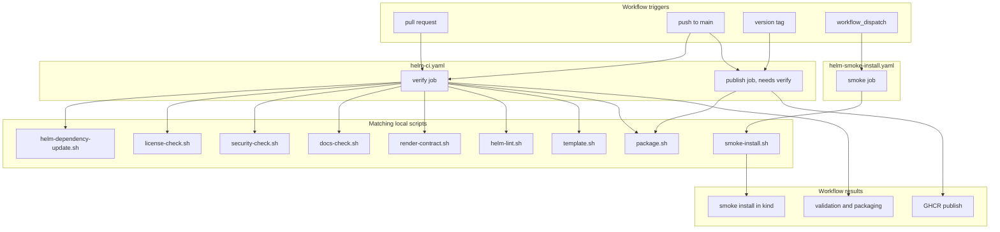

# GitHub Actions Workflows

This folder contains the GitHub Actions jobs for this repository.

These workflows do not invent a second validation system. They mostly call the
local scripts under `scripts/` so CI and local maintainer workflows stay aligned.

## Who Should Read This

| Reader | Why this guide matters |
| --- | --- |
| maintainer | to understand what GitHub runs automatically |
| contributor | to understand what a PR or push will trigger |
| release steward | to understand prerelease and tagged publish behavior |

## Workflow Inventory

| Workflow | Trigger | What it really does |
| --- | --- | --- |
| `helm-ci.yaml` | `pull_request`, push to `main`, push tags `v*` | `verify` job: refresh deps, license/security/docs checks, test, lint, render, and package. `publish` job (skipped on `pull_request`, requires `verify` to pass first): resolve publish version, package the chart, and push to GHCR |
| `helm-smoke-install.yaml` | `workflow_dispatch` | create a disposable kind cluster and run the auth-heavy smoke path |

## What Lives In This Folder

| File | What it does |
| --- | --- |
| `helm-ci.yaml` | validation (`verify`) and release (`publish`) workflow |
| `helm-smoke-install.yaml` | disposable kind smoke-test workflow |
| `README.md` | this guide |

## Workflow-By-Workflow Detail

### `helm-ci.yaml`

Trigger:

- pull requests
- pushes to `main`
- pushes of tags matching `v*`

**`verify` job** steps:

- checkout
- install Helm `v3.12.0`
- set up Node and install script dependencies (`scripts/package-lock.json`)
- run `./scripts/helm/helm-dependency-update.sh`
- run `./scripts/repo/license-check.sh`
- run `./scripts/repo/security-check.sh`
- run `./scripts/repo/docs-check.sh`
- run `./test/render-contract.sh`
- run `./scripts/helm/helm-lint.sh`
- run `./scripts/helm/template.sh`
- run `./scripts/helm/package.sh`

**`publish` job** (`needs: verify`, skipped on `pull_request`):

- checkout, install Helm
- reads `charts/dlh-in-a-box/Chart.yaml`
- derives a prerelease version for `main` pushes
- requires tag version and chart version to match for tagged releases
- refreshes dependencies (`./scripts/helm/helm-dependency-update.sh`)
- packages the chart with explicit version overrides
  (`./scripts/helm/package.sh`)
- logs into GHCR
- pushes the chart package if it does not already exist
- writes a step summary with copy-paste install and dependency snippets

Why it matters:

- this is the closest CI equivalent of the normal local maintainer path, and
  a broken `verify` job blocks `publish` from ever running (they're one
  workflow, with `publish` gated on `verify` succeeding first)

Release channel rules:

- `main` publishes prerelease-style versions with run metadata and SHA suffixes
- a `vX.Y.Z` tag publishes the stable `X.Y.Z` chart version

Credential behavior:

- if `GHCR_TOKEN` is present, the workflow prefers that token
- if `GHCR_USERNAME` is also set, it uses that explicit username
- otherwise it falls back to the GitHub Actions actor plus `GITHUB_TOKEN`

### `helm-smoke-install.yaml`

Trigger:

- manual only with `workflow_dispatch`

Steps:

- checkout
- install Helm
- create a kind cluster
- run `./scripts/helm/smoke-install.sh charts/dlh-in-a-box examples/values-local-auth.yaml`
- upload diagnostics on failure

Why it matters:

- it proves the auth-heavy local path still works in a disposable cluster
- it is intentionally separated from `helm-ci.yaml` because it is slower and
  cluster-based
- on failure it uploads the artifact bundle as
  `kind-smoke-install-diagnostics`

## Local Parity

The workflows are meant to mirror these local commands:

- `helm-ci.yaml`'s `verify` job mirrors `make deps`, `make lint`,
  `make template`, and `make package` (plus the license/security/docs/
  render-contract checks it also runs)
- `helm-ci.yaml`'s `publish` job mirrors dependency refresh and package, then
  adds registry login and push
- `helm-smoke-install.yaml` mirrors `make smoke-install`

If the workflow and local behavior diverge, maintainers usually debug the local
script first and then bring the YAML back into sync.

## Important Operational Rules

- third-party actions are pinned to versioned releases
- publish uses `ghcr.io/<owner>/charts` as the OCI registry path
- the publish job will skip pushing if the exact chart version already exists
- the smoke workflow saves diagnostics under `artifacts/kind-smoke-install`
- `helm-ci.yaml` uses a workflow-level concurrency group so the same ref does
  not race itself
- the `publish` job requires `packages: write`; `verify` and the smoke
  workflow use read-only repository permissions

## Common Tasks

If you need to:

- change validation or package steps: start with `helm-ci.yaml`'s `verify` job
- change release versioning or GHCR behavior: start with `helm-ci.yaml`'s
  `publish` job
- change the disposable-cluster smoke path: start with
  `helm-smoke-install.yaml` and `scripts/helm/smoke-install.sh`

## Validation

When you change a workflow:

- run the matching local script first
- run `./scripts/repo/docs-check.sh` if you edited this guide
- pay attention to pinned action versions and environment variables

## Common Mistakes

- changing workflow intent without updating the matching script
- forgetting that `main` publishes prereleases, not stable versions
- changing the smoke workflow values file away from
  `examples/values-local-auth.yaml`
- assuming lint and publish are separate workflows — they are jobs within
  the same `helm-ci.yaml`, with `publish` depending on `verify`

## When You Can Ignore This Folder

You can ignore this folder if you only want to use the chart.

If you maintain CI, releases, or the smoke-install path, this folder is one of
the highest-leverage places in the repo.