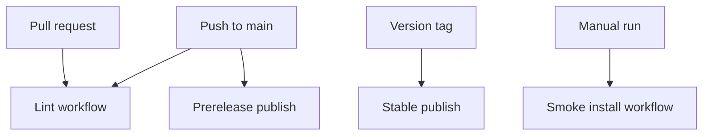

# GitHub Actions Workflows

This folder contains the GitHub Actions jobs for this repo.

These jobs check the chart and publish it.

## Workflow inventory

| Workflow | Trigger | Purpose |
| --- | --- | --- |
| `helm-lint.yaml` | `push` to `main`, `pull_request` | Refresh dependencies, run validation, render, and package the chart |
| `helm-smoke-install.yaml` | `workflow_dispatch` | Run the auth-enabled local smoke path in a disposable kind cluster |
| `helm-publish.yaml` | `push` to `main`, `push` tags `v*`, `workflow_dispatch` | Resolve the publish version, package the chart, and push it to GHCR |

## Workflow lifecycle

## What each workflow really means

- `helm-lint.yaml`
  runs the main check path
- `helm-smoke-install.yaml`
  runs the local auth-heavy test path in a throwaway cluster
- `helm-publish.yaml`
  builds and pushes the chart package to GHCR

## When you can ignore this folder

You can ignore this folder if you only use the chart.

You need this folder when you are changing CI, publish behavior, or the smoke
test path.

## Common mistakes

- Keep these workflows aligned with the local scripts in `hack/`.
- The smoke workflow is supposed to use `examples/values-local-auth.yaml`.
- Local Mermaid checking needs Docker even though GitHub Actions can run it.
