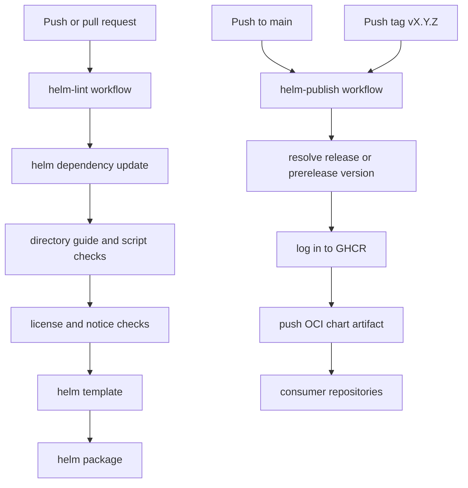

# GitHub Actions Workflows

This directory contains the automation that validates and publishes the chart.

## Workflow inventory

| Workflow | Trigger | Purpose |
| --- | --- | --- |
| `helm-lint.yaml` | `push`, `pull_request` | Dependency refresh, docs checks, schema validation, lint, render, and package verification |
| `helm-publish.yaml` | `push` to `main`, `push` tags `v*`, `workflow_dispatch` | Version resolution, packaging, GHCR login, and OCI publication |

## Workflow lifecycle

## Publication behavior

- `main` publishes a unique prerelease version:
  `<base-version>-main.<run-number>.<run-attempt>.<short-sha>`
- `vX.Y.Z` tags publish the stable `X.Y.Z` version and fail if the Git tag does
  not match `charts/dlh-in-a-box/Chart.yaml`
- GHCR authentication uses `GITHUB_TOKEN` by default, with optional `GHCR_TOKEN`
  and `GHCR_USERNAME` overrides if organization policy requires them

## Operational expectations

- Keep workflow logic aligned with the scripts under [`../../hack/README.md`](../../hack/README.md)
  so local validation and CI validation do not drift apart.
- If new example overlays are added, they should be covered by the maintainer
  scripts and therefore by `helm-lint`.
- If package publication rules change, update the root README and
  [`../../charts/dlh-in-a-box/README.md`](../../charts/dlh-in-a-box/README.md)
  so downstream consumers see the same contract.
