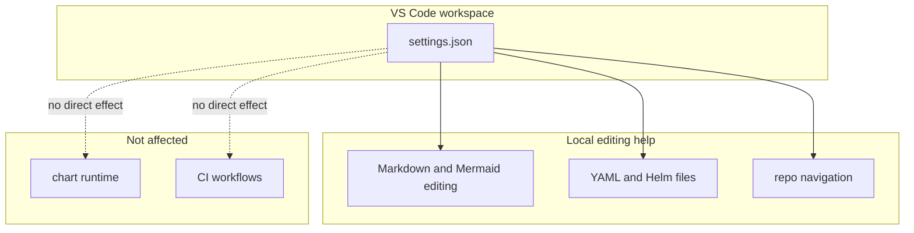

# VS Code Workspace Settings

This folder contains optional VS Code workspace settings for people editing the
repo locally.

It is intentionally tiny.



## What Lives In This Folder

| File | What it does |
| --- | --- |
| `settings.json` | applies workspace-local editor settings when supported by VS Code |

## What `settings.json` Currently Changes

Right now the file contains one setting:

- `chat.agent.maxRequests`

In plain language, this increases the request budget for the chat or agent
experience in editors that understand that setting.

It does not:

- change Helm output
- change chart packaging
- affect GitHub Actions
- affect the published chart

## When To Edit This Folder

Edit this folder only when you are trying to improve the local editing
experience for repo maintainers.

Good reasons include:

- smoothing Markdown or Mermaid authoring
- improving editor behavior for Helm or YAML work
- raising or lowering repo-specific assistant/editor limits

## Validation

There is no runtime validation path for this folder.

If you change the guide, run:

```bash
./hack/docs-check.sh
```

## Common Mistakes

- assuming editor settings belong in the chart
- assuming a VS Code setting affects contributors who use another editor

## When You Can Ignore This Folder

Almost everyone can ignore this folder.

It is convenience-only.
