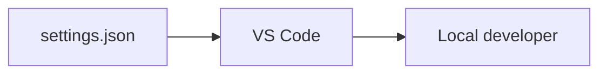

# VS Code Workspace Settings

This folder contains optional VS Code settings for people editing the repo.

## What is in this folder

| File | Plain meaning |
| --- | --- |
| `settings.json` | Small editor convenience settings |

## When you can ignore this folder

Almost everyone can ignore this folder.

It does not change chart behavior, CI, packaging, or releases.
