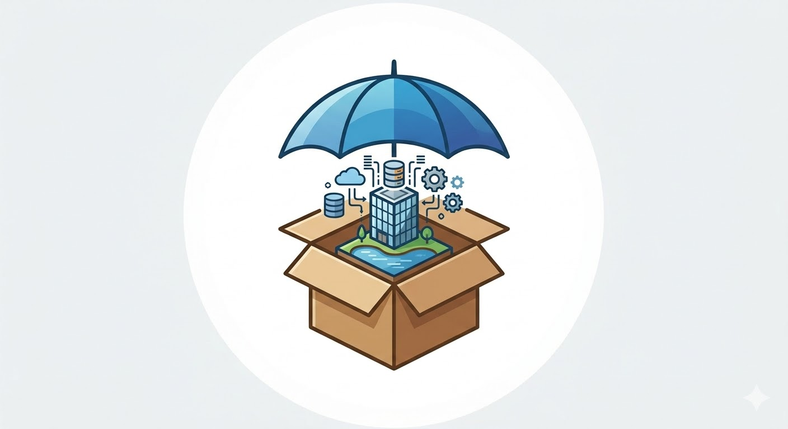
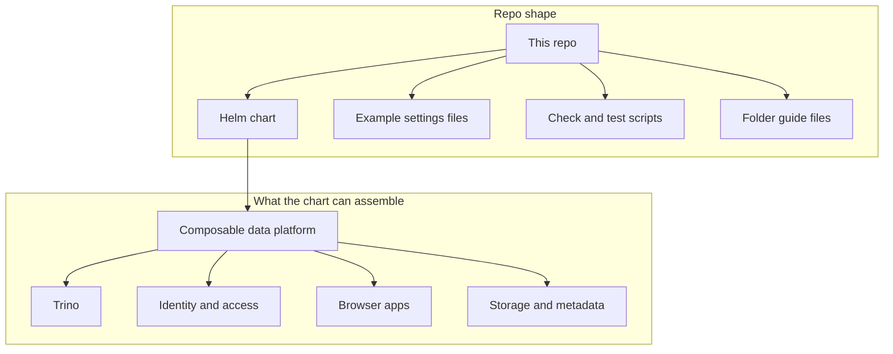
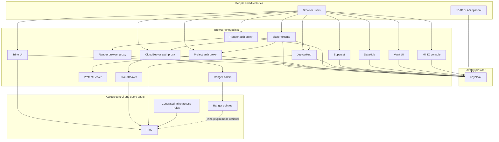

# dlh-in-a-box: a research data lakehouse on Kubernetes

[](https://github.com/sanger-pathogens/dlh-in-a-box-umbrella-helm-chart/actions/workflows/helm-ci.yaml)
[](https://doi.org/10.5281/zenodo.20731685)

<p align="center">
  
</p>

`dlh-in-a-box` is an open-source Helm chart for deploying a modern research
data platform on Kubernetes.

It is built for a common failure mode in data-intensive research: data becomes
FAIR only at publication or archive deposit time, after the active scientific
context has already scattered across storage locations, notebooks, pipelines,
databases, spreadsheets, and local conventions. The result is data that exists,
but is harder than it should be to discover, govern, trust, query, and reuse.

`dlh-in-a-box` gives research organisations a practical middle path between
buying a managed commercial lakehouse and hand-assembling a complex open-source
stack. It packages mature components for object storage, table metadata,
distributed SQL, workflow orchestration, notebooks, dashboards, catalogue and
lineage, identity, access policy, secrets management, health checks, and portal
access behind one versioned, values-driven deployment interface.

Use it to build research data infrastructure that is:

- operationally FAIR, so selected outputs can be discoverable, governed,
  queryable, and reusable while studies are still in progress
- deployable where data is allowed to live, including on-premises clusters,
  private clouds, sovereign clouds, or public cloud Kubernetes environments
- modular enough to start small, grow over time, or reuse existing object
  stores, identity providers, notebook services, dashboard services, databases,
  and secrets systems
- practical for teams that need lakehouse capabilities without committing to a
  single vendor, hosting model, or governance posture

If you know nothing about this repo yet, start with this file. It explains:

- why the platform exists
- what you need before you can try it
- which install path to use first
- how the major platform pieces fit together
- where to go in the repo when you want to change something

## Start Here

| If you are trying to... | Read this first | Then go to |
| --- | --- | --- |
| understand what the repo is | this file | [charts/dlh-in-a-box/README.md](charts/dlh-in-a-box/README.md) |
| get one local install working | this file's first-success path | [examples/README.md](examples/README.md) |
| understand the chart internals | [charts/dlh-in-a-box/README.md](charts/dlh-in-a-box/README.md) | [charts/dlh-in-a-box/templates/_README.txt](charts/dlh-in-a-box/templates/_README.txt) |
| change example overlays | [examples/README.md](examples/README.md) | `examples/*.yaml` |
| run maintainer checks | [hack/README.md](scripts/README.md) | `make help` |
| understand repo automation | [.github/OVERVIEW.md](.github/OVERVIEW.md) | [.github/workflows/README.md](.github/workflows/README.md) |
| reuse agent-maintainer workflows | [skills/README.md](skills/README.md) | `skills/*/SKILL.md` |

## Why dlh-in-a-box Exists

Modern research produces datasets whose value often extends far beyond their
first analysis. The same outputs may later support cross-study synthesis, AI
model development, public-health surveillance, operational decision-making, or
integration with climate, demographic, clinical, genomic, laboratory, or survey
context.

That value is easy to lose. Research organisations are usually decentralised by
design: groups need autonomy, collaborations move quickly, and local practices
emerge around the work. Over time, that can leave institutions with duplicated
effort, fragmented data estates, and reusable analytical assets that are too
dependent on informal knowledge.

`dlh-in-a-box` exists to make that next layer easier to operate.

| Research data challenge | What this chart helps provide |
| --- | --- |
| outputs are scattered across buckets, notebooks, pipelines, databases, and local conventions | a shared platform pattern for storage, metadata, query, catalogue, workflow, and browser access |
| provenance, quality status, ownership, and access rules live in people's heads | governance, identity, policy, lineage, secrets, and health-check wiring as deployable configuration |
| commercial platforms may not fit fixed-term grants, data-residency rules, ethical approvals, or existing institutional infrastructure | an open-source stack that can run where the organisation is allowed to store and process data |
| open-source components are mature but costly to integrate securely | one umbrella Helm chart with a consolidated values interface and first-party integration glue |

In practical terms, without this chart a team would need to decide:

- how browser users sign in
- how SQL tools and notebooks share identity
- where object storage lives
- how table metadata is exposed
- where access rules are enforced
- how optional apps such as workflow UIs or metadata catalogues fit in

This repo gives you one install surface for those decisions, while still
letting each deployment enable, disable, or replace components according to its
local infrastructure and governance requirements.

It is not a full platform product on its own. It does not create your
Kubernetes cluster, your real production secrets, your DNS, or your
organisation's approval process. What it does provide is the packaging and
repo structure for deploying the platform components together in a consistent
way.

## What This Repo Does

At full strength, the chart assembles a Kubernetes-native research data
lakehouse from established open-source components rather than introducing a new
monolithic platform. It is the packaging, integration, validation, and
configuration layer that makes those components deployable as one coherent
platform.



## Who This Repo Is For

| Reader | What they need from the docs |
| --- | --- |
| platform evaluator | a clear picture of what the chart can install and what it does not handle |
| deployer or operator | the first-success path, overlay selection, and secret expectations |
| contributor | a map from desired change to the right folder and validation path |
| maintainer | local scripts, CI parity, dependency ownership, and release flow |

## What This Repo Does Not Do

This repo does not:

- create a Kubernetes cluster for you
- provision real cloud resources such as buckets, DNS records, or certificates
- generate safe production secrets
- decide whether your organization should approve a dataset
- replace the upstream documentation for vendored projects such as Trino

## A Few Terms In Plain English

| Term | Meaning in this repo |
| --- | --- |
| Kubernetes cluster | the environment where the platform runs |
| Helm chart | the install package Helm reads to create Kubernetes resources |
| umbrella chart | one chart that installs several tools together |
| values file | YAML that tells the chart what to enable and how to configure it |
| overlay | a values file that changes the default chart behavior for a specific scenario |
| subchart | a chart nested inside the umbrella chart |
| vendored source | upstream chart source copied into this repo so it can be patched or packaged reproducibly |
| packaged archive | a `.tgz` dependency bundle stored under `charts/dlh-in-a-box/charts/` |

## One True First-Success Path

The safest first manual path is `examples/values-local.yaml`.

That path is intentionally simpler than the auth-heavy smoke test. It does not
exercise every browser-facing feature, but it gets the core local stack
rendering and installing with the fewest moving parts.

### Prerequisites

Before you run anything, make sure you have:

- a working Kubernetes cluster and a current `kubectl` context
- `helm` installed
- `kubectl` installed
- enough cluster capacity for several services, jobs, and at least one local
  database-backed component
- Docker running if you want to use kind locally or render-check Mermaid docs

Known repo facts:

- CI uses Helm `v3.12.0`
- the smoke workflow uses a disposable kind cluster, so kind is a known-good
  local test shape
- this repo does not pin a single `kubectl` version, so use one compatible with
  your cluster

### Install

From the repository root:

```bash
./scripts/helm-dependency-update.sh
helm upgrade --install dlh charts/dlh-in-a-box \
  -n data-lakehouse-local \
  --create-namespace \
  -f examples/values-local.yaml
kubectl get pods -n data-lakehouse-local
```

Equivalent convenience target:

```bash
make local-install
```

That target is a thin wrapper around `helm upgrade --install` with
`examples/values-local-auth.yaml` as its default values file from `Makefile`.
It is useful for quick iteration, but it does not create demo secrets, reset
the namespace, or wait through the full smoke lifecycle the way
`make smoke-install` does.

### Success Looks Like

For this first path, success means:

- `helm upgrade --install` exits successfully
- `kubectl get pods -n data-lakehouse-local` shows the local stack progressing
  to `Running` or `Completed`
- `helm status dlh -n data-lakehouse-local` reports a healthy release
- you can inspect services with `kubectl get svc -n data-lakehouse-local`

Typical local services in this path include:

- Trino
- Prefect server and worker
- MinIO
- Hive Metastore plus its PostgreSQL backing service
- Vault in dev mode
- Spark Operator

### Common First-Time Failures

If the first install does not work, the most common reasons are:

- dependencies were not refreshed first, so packaged chart archives or
  `Chart.lock` are stale
- your current kube context points at the wrong cluster
- the cluster is too small for the local overlay
- you used `values-local-auth.yaml` manually without the demo Secrets that
  `make smoke-install` creates for you

## When To Use The Smoke Path Instead

Use:

```bash
make smoke-install
```

That path is different from the manual first-success path.

It intentionally exercises:

- bundled Keycloak
- OIDC client wiring
- oauth2-proxy in front of Prefect and CloudBeaver
- Ranger bootstrap and local-user sync
- the `platformHome` landing page

It also creates demo Secrets, resets the namespace by default, waits for jobs
and Deployments to finish, and captures diagnostics on failure. That is why it
is the right path for validating identity and access changes, but not the
easiest possible newcomer install.

## How To Think About The Platform

The chart can install many optional tools, but the easiest mental model is:

- Trino is the SQL engine
- Hive Metastore is the table metadata service
- MinIO or external S3 stores lakehouse objects
- Keycloak or an external OIDC provider handles browser sign-in
- Ranger stores governance and authorization data
- Prefect, CloudBeaver, JupyterHub, Superset, DataHub, Vault, and
  `platformHome` are optional surrounding apps

You do not need every component turned on.

The documented default shared-environment story in this repo is:

- bundled Keycloak for browser SSO
- LDAP or AD federation for users and groups
- Trino as the main query engine
- Ranger for policy administration
- browser tools layered around that core

The local auth-heavy example is different:

- Keycloak stores local demo users itself
- Ranger usersync is disabled
- the chart can still create and test browser auth flows locally

### All Components Enabled

```mermaid
flowchart TD
  subgraph Entry["Browser entrypoints"]
    Portal[platformHome optional]
    TrinoUi[Trino UI]
    CloudBeaverProxy[CloudBeaver auth proxy optional]
    PrefectProxy[Prefect auth proxy optional]
    RangerProxy[Ranger auth proxy optional]
    JupyterUi[JupyterHub optional]
    SupersetUi[Superset optional]
    DataHubUi[DataHub optional]
    VaultUi[Vault UI optional]
    MinioUi[MinIO console optional]
  end

  subgraph Identity["Identity"]
    LDAP[LDAP or AD optional]
    Keycloak[Bundled Keycloak]
  end

  subgraph Governance["Governance and policy"]
    RangerAdmin[Ranger Admin optional]
    RangerJobs[Ranger automation and usersync optional]
  end

  subgraph Query["Query and metadata"]
    Trino[Trino]
    Hive[Hive Metastore optional]
    CloudBeaver[CloudBeaver optional]
    JupyterHub[JupyterHub optional]
    Superset[Superset optional]
    DataHub[DataHub optional]
    DataHubDeps[DataHub prerequisites optional]
  end

  subgraph Orchestration["Orchestration and compute"]
    PrefectServer[Prefect Server optional]
    PrefectWorkers[Prefect Workers optional]
    SparkOperator[Spark Operator optional]
  end

  subgraph Storage["Storage and secrets"]
    MinIO[MinIO optional]
    Vault[Vault optional]
  end

  subgraph Backing["Backing services"]
    KeycloakDb[Keycloak PostgreSQL optional]
    RangerDb[Ranger PostgreSQL optional]
    HiveDb[Hive PostgreSQL optional]
    PrefectDb[Prefect PostgreSQL optional]
    SupersetDb[Superset PostgreSQL and Redis optional]
    DataHubBacking[DataHub backing services optional]
  end

  LDAP --> Keycloak
  Portal --> Keycloak
  TrinoUi --> Keycloak
  CloudBeaverProxy --> Keycloak
  PrefectProxy --> Keycloak
  RangerProxy --> Keycloak
  JupyterUi --> Keycloak
  SupersetUi --> Keycloak
  DataHubUi --> Keycloak
  VaultUi --> Keycloak
  MinioUi --> Keycloak

  Portal --> CloudBeaverProxy
  Portal --> PrefectProxy
  Portal --> JupyterUi
  Portal --> VaultUi

  TrinoUi --> Trino
  CloudBeaverProxy --> CloudBeaver
  CloudBeaver --> Trino
  PrefectProxy --> PrefectServer
  RangerProxy --> RangerAdmin
  JupyterUi --> JupyterHub
  JupyterHub --> Trino
  SupersetUi --> Superset
  DataHubUi --> DataHub
  VaultUi --> Vault
  MinioUi --> MinIO

  Hive --> Trino
  MinIO --> Hive
  MinIO --> Trino
  RangerAdmin --> RangerJobs
  RangerAdmin --> RangerDb
  Keycloak --> KeycloakDb
  Hive --> HiveDb
  PrefectServer --> PrefectDb
  PrefectServer --> PrefectWorkers
  Superset --> SupersetDb
  DataHub --> DataHubDeps
  DataHubDeps --> DataHubBacking
```



### Auth And Control Flow



Important nuance:

- enabling Ranger does not automatically move Trino onto the Ranger plugin
- the chart can still generate file-based Trino access rules
- the Trino plugin path only becomes real when
  `global.authorization.ranger.trino.enabled=true` and the Trino image actually
  contains the Ranger plugin

The detailed explanation of that distinction lives in
[charts/dlh-in-a-box/README.md](charts/dlh-in-a-box/README.md).

## Repo Map: If You Need To Change X

| If you need to change... | Start here | Why |
| --- | --- | --- |
| chart metadata, dependencies, default values | `charts/dlh-in-a-box/` | this is the published chart |
| shared validation rules | `charts/dlh-in-a-box/templates/identity-validation.yaml` or `authorization-validation.yaml` | these files fail bad combinations before render |
| `platformHome` UI or admin API behavior | `charts/dlh-in-a-box/templates/platform-home.yaml` | most of the page and embedded API live inline there |
| CloudBeaver bootstrap or proxy wiring | `charts/dlh-in-a-box/templates/cloudbeaver.yaml` | the repo owns the extra behavior here |
| Ranger roles, policies, usersync, or audits | `charts/dlh-in-a-box/templates/ranger-automation.yaml` | that file contains the heavy reconciliation logic |
| Hive-specific render logic | `charts/dlh-in-a-box/charts/hive/` | local subchart owned by this repo |
| Trino patch points | `charts/dlh-in-a-box/charts/trino/OVERVIEW.md` then `templates/_README.txt` | most Trino code is upstream, only a few files are locally patched |
| example install profiles | `examples/` | each overlay is documented there |
| local validation or smoke scripts | `scripts/` | scripts and their test fixtures live there |
| GitHub review, CI, or release flow | `.github/` | ownership, issue forms, and workflows live there |
| documentation support assets | `docs/assets/` | chart icon and similar shared assets live there |

## What Lives At The Repository Root

| Path | What it is for | Notes |
| --- | --- | --- |
| `charts/` | chart source tree | includes the published chart, local subcharts, vendored Trino source, and packaged archives |
| `examples/` | example values overlays | the best place to learn install profiles |
| `scripts/` | local maintainer scripts | CI mirrors these scripts closely |
| `.github/` | GitHub-only repo automation | review routing, issue forms, and workflows |
| `.vscode/` | optional editor settings | convenience only, no runtime effect |
| `docs/` | small doc support area | not the main home for platform docs |
| `CONTRIBUTING.md` | collaborator workflow guide | out of scope for the folder-guide system, but still important |
| `SUPPORT.md` | support boundary | where users should ask for help |
| `SECURITY.md` | security reporting path | use this for vulnerability handling |
| `LICENSE` | Apache-2.0 for repo-owned code | does not replace third-party notices |
| `THIRD_PARTY_NOTICES.md` | top-level dependency notice summary | the chart folder has a chart-specific notice file too |
| `CODE_OF_CONDUCT.md` | collaboration expectations | repo-level policy |
| `Makefile` | convenience targets | wraps the common maintainer scripts |
| `.editorconfig` | editor defaults | root housekeeping |
| `.gitignore` | ignored paths | root housekeeping |
| `dist/` | generated chart packages | build output, not source of truth |
| `artifacts/` | generated diagnostics or CI-style artifacts | build output, not source of truth |
| `references/` | reference material outside the published chart | useful for context, not part of the guide scope |

## Common Local Commands

From the repository root:

```bash
make verify
```

Convenience targets from `Makefile`:

```bash
make help
make deps
make docs-check
make render-contract
make lint
make template
make package
make local-install
make smoke-install
```

What these do:

- `verify` runs all the other targets except actual installation steps
- `deps` refreshes dependency archives and `Chart.lock`
- `docs-check` verifies guide coverage, local links, and Mermaid rendering
- `render-contract` proves supported render combinations still succeed and bad
  inputs still fail
- `lint` runs the main validation path
- `template` renders the chart against the tracked overlays
- `package` builds the chart package under `dist/`
- `local-install` runs a plain local `helm upgrade --install` using the
  Makefile defaults
- `smoke-install` runs the auth-heavy local install and waits for workloads

## Where To Look Next

The next most useful guides are:

- [charts/dlh-in-a-box/README.md](charts/dlh-in-a-box/README.md)
  for the chart's values, dependency ownership, auth model, and runtime rules
- [examples/README.md](examples/README.md)
  for install profiles and overlay selection
- [hack/README.md](scripts/README.md)
  for scripts, CI parity, and local validation
- [charts/dlh-in-a-box/templates/_README.txt](charts/dlh-in-a-box/templates/_README.txt)
  for the repo-owned render logic
- [charts/dlh-in-a-box/charts/hive/README.md](charts/dlh-in-a-box/charts/hive/README.md)
  for the local Hive subchart
- [charts/dlh-in-a-box/charts/trino/OVERVIEW.md](charts/dlh-in-a-box/charts/trino/OVERVIEW.md)
  for the boundary between upstream Trino material and local patches

## Contribution Boundary

This repo may be public to read, but pull requests are mainly limited to
repository collaborators.

If you are not a collaborator:

- treat this repo as something you can read and use
- use the support and issue paths instead of assuming write access
- treat the docs as public guidance, not as an invitation to edit the repo

## License

The repo-owned chart code in this repository is Apache-2.0 licensed.

Some bundled third-party chart material uses different upstream licenses. That
inventory is tracked in [THIRD_PARTY_NOTICES.md](THIRD_PARTY_NOTICES.md) and in
[charts/dlh-in-a-box/THIRD_PARTY_NOTICES.md](charts/dlh-in-a-box/THIRD_PARTY_NOTICES.md).
