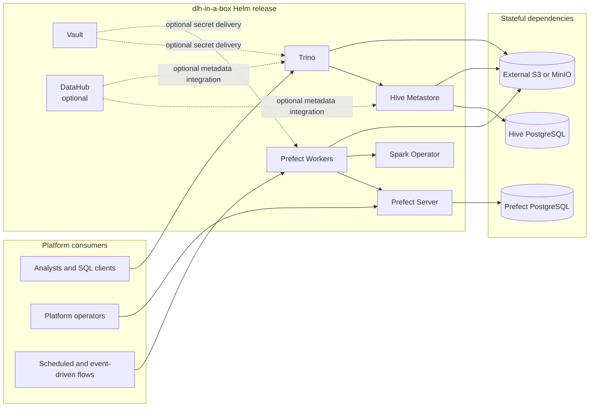
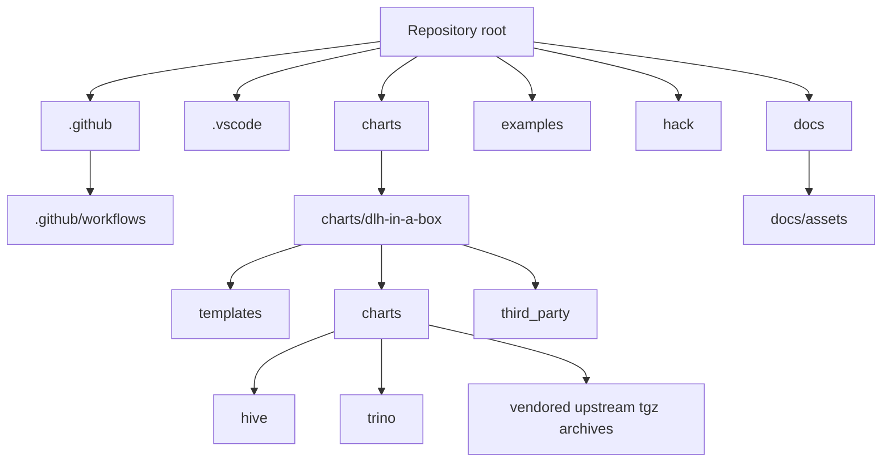
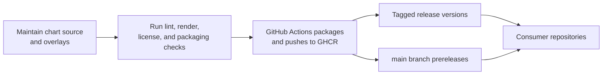

# dlh-in-a-box-umbrella-helm-chart

[](https://github.com/sanger-pathogens/dlh-in-a-box-umbrella-helm-chart/actions/workflows/helm-lint.yaml)
[](https://github.com/sanger-pathogens/dlh-in-a-box-umbrella-helm-chart/actions/workflows/helm-publish.yaml)

`dlh-in-a-box` packages a modular lakehouse control plane as a single OCI
Helm chart. This repository is the source of truth for the chart itself, the
small amount of local composition logic that sits around upstream components,
the validation overlays used to prove it works, and the GitHub Actions flow
that publishes it for downstream consumers.

## Quick links

- chart consumer guide: [charts/dlh-in-a-box/README.md](charts/dlh-in-a-box/README.md)
- first five minutes: [docs/quickstart.md](docs/quickstart.md)
- release playbook: [docs/release-playbook.md](docs/release-playbook.md)
- example overlays: [examples/README.md](examples/README.md)
- maintainer scripts: [hack/README.md](hack/README.md)
- contribution workflow: [CONTRIBUTING.md](CONTRIBUTING.md)
- support policy: [SUPPORT.md](SUPPORT.md)
- security reporting: [SECURITY.md](SECURITY.md)
- conduct expectations: [CODE_OF_CONDUCT.md](CODE_OF_CONDUCT.md)

## Handover summary

This repository exists to do four things well:

- define a reusable Helm-packaged platform baseline
- keep the dependency surface pinned and reviewable
- validate the chart locally and in CI with realistic overlays
- publish a consumable OCI artifact to GitHub Container Registry

It is intentionally not the home for pipelines, Spark applications, or
environment-specific business logic.

## Platform architecture



## Repository architecture



## Delivery lifecycle



## Design principles

- Upstream first: Trino, Prefect, Spark Operator, MinIO, Vault, PostgreSQL, and
  DataHub stay upstream wherever possible.
- Minimal local ownership: local templates are only added for cross-component
  composition, not to replace entire upstream charts.
- OCI-native distribution: other repositories should consume the chart from a
  registry, not by copying source directories around.
- Pinned inputs: `Chart.yaml` and `Chart.lock` are treated as release inputs.
- Operational clarity: the repo keeps examples, scripts, publication metadata,
  licensing, and governance explicit.

## Locally owned logic

These are the main behaviors that are authored here rather than delegated to an
upstream dependency:

- Trino catalog generation from `global.dataCatalogs`
- Trino access-control generation from catalog ACLs
- Hive metastore provisioning for one metastore per catalog
- DataHub prerequisite service compatibility shims
- local, layered, and production-shaped example overlays
- packaging, publication, and licensing automation

## Component inventory

| Component | Role in the platform | Default state | Ownership model |
| --- | --- | --- | --- |
| Trino | Interactive SQL query engine over object storage and Hive metadata | Enabled | Vendored upstream chart with local patches |
| Prefect Server | Flow API and UI | Enabled | Upstream chart |
| Prefect Workers | Flow execution workers | Enabled | Upstream chart |
| Spark Operator | Spark workload controller | Enabled | Upstream chart |
| Hive Metastore | Per-catalog metadata service for Trino and Spark-compatible engines | Disabled by default | Local subchart |
| Vault | Secrets platform for cluster-native workflows | Enabled | Upstream chart |
| MinIO | Self-contained S3-compatible storage for local or demo deployments | Disabled by default | Upstream chart |
| DataHub | Optional metadata governance and discovery layer | Disabled by default | Upstream chart |
| PostgreSQL | Stateful dependency for Hive metastore | Enabled when Hive is enabled | Upstream chart |

## Deployment and consumption

### First five minutes

If you are new to the repository, start with
[docs/quickstart.md](docs/quickstart.md). It covers:

- inspecting the published chart
- deploying the validated local overlay
- consuming the package from another repository
- the fastest route into the deeper docs

### Local validation

The canonical local proof point is `examples/values-local.yaml`, which enables
MinIO, Hive, Prefect, Spark Operator, and Vault with laptop-sized Trino
settings.

```bash
./hack/helm-dependency-update.sh
./hack/lint.sh
helm upgrade --install dlh charts/dlh-in-a-box \
  -n data-lakehouse-local \
  --create-namespace \
  -f examples/values-local.yaml
```

If you prefer task aliases, use:

```bash
make lint
make template
make package
make local-install
```

### Example overlays

The full overlay catalog is documented in [examples/README.md](examples/README.md).
In brief:

- `values-local.yaml` is the validated kind deployment path
- `values-local-layers.yaml` shows a richer multi-catalog local topology
- `values-dev.yaml` is a lightweight shared-development baseline
- `values-prod.yaml` is a minimal production-shaped baseline
- `values-prod-layers.yaml` shows layered production catalog patterns
- `values-external-s3.yaml` is the simplest external object-storage starting point
- `values-minio.yaml` isolates the in-cluster MinIO scenario

### Install from GHCR

```bash
helm install dlh \
  oci://ghcr.io/sanger-pathogens/charts/dlh-in-a-box \
  --version <chart-version> \
  -n data-lakehouse \
  --create-namespace \
  -f my-values.yaml
```

### Consume from another repository

Use the chart as a dependency:

```yaml
dependencies:
  - name: dlh-in-a-box
    version: <chart-version>
    repository: oci://ghcr.io/sanger-pathogens/charts
```

`main` publishes prerelease versions in this form:

```text
<base-version>-main.<run-number>.<run-attempt>.<short-sha>
```

Tagged releases publish stable `X.Y.Z` versions that must match
`charts/dlh-in-a-box/Chart.yaml`.

### Same-organization consumer repositories

For a consumer repository inside the same GitHub organization:

1. ensure the package exists at `ghcr.io/sanger-pathogens/charts/dlh-in-a-box`
2. if package permissions are not inherited automatically, add the consumer
   repository under `Manage Actions access`
3. grant that repository at least `Read` access

In the consumer workflow:

```yaml
permissions:
  contents: read
  packages: read

steps:
  - uses: actions/checkout@v4
  - uses: azure/setup-helm@v4
  - name: Log in to GHCR
    run: |
      printf '%s' "${{ secrets.GITHUB_TOKEN }}" | \
        helm registry login ghcr.io -u "${{ github.actor }}" --password-stdin
  - name: Build chart dependencies
    run: helm dependency build
```

For manual local access outside GitHub Actions, use a personal access token
classic with `read:packages`:

```bash
export GHCR_TOKEN=YOUR_CLASSIC_PAT
printf '%s' "$GHCR_TOKEN" | helm registry login ghcr.io -u YOUR_GITHUB_USERNAME --password-stdin
```

## Directory guides

Every maintained directory in the repository now carries its own guide so a
new maintainer can navigate the tree top-down. Helm template directories are
the one exception: those use `_README.txt` because source-based `helm lint` and
`helm template` cannot tolerate Markdown files inside `templates/`.

| Path | Guide | Purpose |
| --- | --- | --- |
| `.github/` | [.github/README.md](.github/README.md) | Ownership model, repository automation, and CI/CD entry points |
| `.github/ISSUE_TEMPLATE/` | [.github/ISSUE_TEMPLATE/README.md](.github/ISSUE_TEMPLATE/README.md) | Public issue intake, contact routing, and support forms |
| `.github/workflows/` | [.github/workflows/README.md](.github/workflows/README.md) | Lint and publish workflow behavior |
| `.vscode/` | [.vscode/README.md](.vscode/README.md) | Optional workspace settings for maintainers |
| `charts/` | [charts/README.md](charts/README.md) | Chart source tree and packaging map |
| `charts/dlh-in-a-box/` | [charts/dlh-in-a-box/README.md](charts/dlh-in-a-box/README.md) | Umbrella chart API, values surface, and runtime composition |
| `charts/dlh-in-a-box/charts/` | [charts/dlh-in-a-box/charts/README.md](charts/dlh-in-a-box/charts/README.md) | Local subcharts, vendored chart source, and dependency archives |
| `charts/dlh-in-a-box/charts/hive/` | [charts/dlh-in-a-box/charts/hive/README.md](charts/dlh-in-a-box/charts/hive/README.md) | Local Hive subchart ownership and design |
| `charts/dlh-in-a-box/charts/hive/templates/` | [charts/dlh-in-a-box/charts/hive/templates/_README.txt](charts/dlh-in-a-box/charts/hive/templates/_README.txt) | Hive template-by-template implementation guide |
| `charts/dlh-in-a-box/charts/trino/` | [charts/dlh-in-a-box/charts/trino/README.md](charts/dlh-in-a-box/charts/trino/README.md) | Vendored upstream Trino chart documentation |
| `charts/dlh-in-a-box/charts/trino/templates/` | [charts/dlh-in-a-box/charts/trino/templates/_README.txt](charts/dlh-in-a-box/charts/trino/templates/_README.txt) | Local Trino patch points and generated resources |
| `charts/dlh-in-a-box/charts/trino/templates/tests/` | [charts/dlh-in-a-box/charts/trino/templates/tests/_README.txt](charts/dlh-in-a-box/charts/trino/templates/tests/_README.txt) | Helm test coverage bundled with the vendored Trino chart |
| `charts/dlh-in-a-box/templates/` | [charts/dlh-in-a-box/templates/_README.txt](charts/dlh-in-a-box/templates/_README.txt) | Umbrella-only glue templates |
| `charts/dlh-in-a-box/third_party/` | [charts/dlh-in-a-box/third_party/README.md](charts/dlh-in-a-box/third_party/README.md) | Bundled notice material and provenance |
| `charts/dlh-in-a-box/third_party/datahub/` | [charts/dlh-in-a-box/third_party/datahub/README.md](charts/dlh-in-a-box/third_party/datahub/README.md) | DataHub `NOTICE` provenance |
| `charts/dlh-in-a-box/third_party/gcloud-sqlproxy/` | [charts/dlh-in-a-box/third_party/gcloud-sqlproxy/README.md](charts/dlh-in-a-box/third_party/gcloud-sqlproxy/README.md) | MIT license provenance for bundled `gcloud-sqlproxy` material |
| `docs/` | [docs/README.md](docs/README.md) | Static documentation assets and documentation strategy |
| `docs/assets/` | [docs/assets/README.md](docs/assets/README.md) | Brand and package assets used by the chart |
| `docs/quickstart.md` | [docs/quickstart.md](docs/quickstart.md) | First-run onboarding for new consumers |
| `docs/release-playbook.md` | [docs/release-playbook.md](docs/release-playbook.md) | Stable and prerelease publication runbook |
| `examples/` | [examples/README.md](examples/README.md) | Overlay selection and configuration patterns |
| `hack/` | [hack/README.md](hack/README.md) | Maintainer scripts for validation and release tasks |

## Governance and operating expectations

- Pull requests are restricted to repository collaborators even if the
  repository is publicly visible.
- Repository ownership is managed through `.github/CODEOWNERS`.
- Contributor workflow and release expectations are documented in
  [CONTRIBUTING.md](CONTRIBUTING.md).
- Operational and user-facing support guidance is documented in
  [SUPPORT.md](SUPPORT.md).
- Security reporting guidance is documented in [SECURITY.md](SECURITY.md).
- Community interaction expectations are documented in
  [CODE_OF_CONDUCT.md](CODE_OF_CONDUCT.md).
- Third-party redistribution obligations are tracked in
  [THIRD_PARTY_NOTICES.md](THIRD_PARTY_NOTICES.md).

## Out of scope

- pipeline code and application logic
- Spark application definitions
- business-specific schemas and datasets
- one-off environment customization that belongs in a consumer repository

## License

This repository is licensed under Apache-2.0. See `LICENSE`.
Third-party dependency notices and bundled notice material are documented in
[THIRD_PARTY_NOTICES.md](THIRD_PARTY_NOTICES.md).
