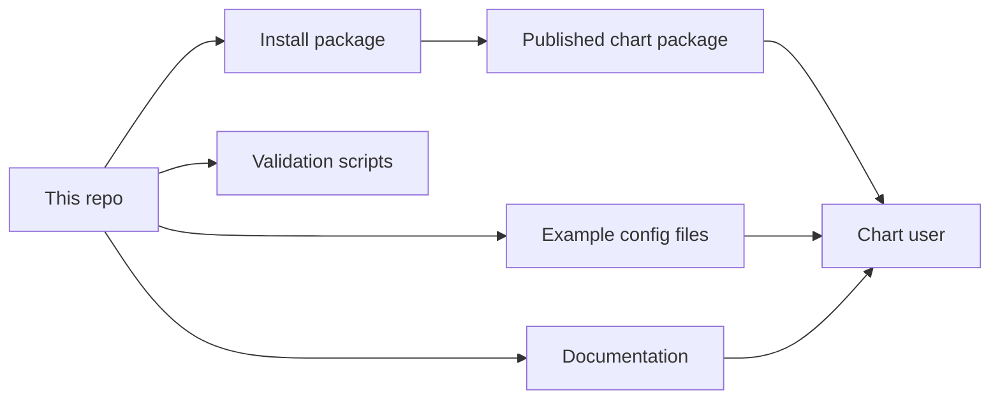

# dlh-in-a-box Umbrella Helm Chart

[](https://github.com/sanger-pathogens/dlh-in-a-box-umbrella-helm-chart/actions/workflows/helm-lint.yaml)
[](https://github.com/sanger-pathogens/dlh-in-a-box-umbrella-helm-chart/actions/workflows/helm-publish.yaml)

This repository contains a Helm chart called `dlh-in-a-box`.

If you do not know Helm yet, the simple version is:

- Helm is a way to install apps on Kubernetes
- Kubernetes is the system that runs containers in a cluster
- a Helm chart is a reusable install package

So this repository is basically a reusable install package for a data platform.

That platform can include tools such as:

- Trino for running SQL queries
- Hive Metastore for table metadata
- Keycloak for login
- Ranger for access rules
- Prefect for workflows
- CloudBeaver for browser-based SQL
- DataHub for metadata
- JupyterHub for notebooks
- Vault for secrets
- MinIO for object storage

You do not need every one of those tools turned on. The chart lets you enable
the parts you need.

## Start Here

- If you want the simplest explanation of the chart:
  [charts/dlh-in-a-box/README.md](charts/dlh-in-a-box/README.md)
- If you want the fastest way to try it locally:
  [docs/quickstart.md](docs/quickstart.md)
- If you do not know the terms used in the docs:
  [docs/glossary.md](docs/glossary.md)
- If you need to understand login and access:
  [docs/auth-architecture.md](docs/auth-architecture.md)
- If you need to understand the data approval rules:
  [docs/data-governance.md](docs/data-governance.md)
- If you want example values files:
  [examples/README.md](examples/README.md)
- If you maintain this repository:
  [hack/README.md](hack/README.md),
  [docs/release-playbook.md](docs/release-playbook.md),
  [CONTRIBUTING.md](CONTRIBUTING.md)

## Repository Mental Model



The shortest way to think about the repository is:

- `charts/dlh-in-a-box/`
  the actual chart you install
- `examples/`
  example config files you can copy from
- `docs/`
  explanation and background
- `hack/`
  helper scripts used by maintainers and CI

## Default Platform Model

If you are brand new, this is the easiest mental model:

- users sign in through `Keycloak`
- shared development and production examples use an external company or lab
  directory for users and groups
- `platformHome` is the optional home page people land on in the browser
- `Prefect` and `CloudBeaver` sit behind a login proxy so they reuse the same
  browser sign-in
- `Ranger` stores access rules and role information
- `Trino` is the SQL engine that users query

There is also a simpler local auth mode where Keycloak stores users itself.
That is what the local auth example uses.

## What This Repo Owns

- the chart itself
- the default values and schema
- the chart-specific templates that tie multiple tools together
- the example config files
- the chart documentation
- the validation, packaging, and publish scripts

## What This Repo Does Not Own

- your production secrets
- your cluster setup
- your DNS and TLS certificates
- your organization’s branding
- your local infrastructure repository
- your human approval process for who should get access to what

## Validation Model

These are the main repo checks:

```bash
./hack/helm-dependency-update.sh
SKIP_MERMAID_CHECK=1 ./hack/docs-check.sh
./hack/lint.sh
./hack/template.sh
./hack/package.sh
./hack/smoke-install.sh
```

What those mean in simple terms:

- `docs-check.sh`
  checks links, headings, and doc rules
- `lint.sh`
  checks the chart and the example config files
- `template.sh`
  makes sure the chart can render into Kubernetes YAML
- `package.sh`
  builds the chart package
- `smoke-install.sh`
  does a real local install of the auth-enabled example

Full Mermaid diagram checking needs Docker. If Docker is not running locally,
`SKIP_MERMAID_CHECK=1` is the deliberate way to skip that one part.

## Reference Map

- chart guide:
  [charts/dlh-in-a-box/README.md](charts/dlh-in-a-box/README.md)
- long-form docs:
  [docs/README.md](docs/README.md)
- example config files:
  [examples/README.md](examples/README.md)
- maintainer scripts:
  [hack/README.md](hack/README.md)
- release and workflow docs:
  [docs/release-playbook.md](docs/release-playbook.md),
  [.github/workflows/README.md](.github/workflows/README.md)
- repo support docs:
  [CONTRIBUTING.md](CONTRIBUTING.md),
  [SUPPORT.md](SUPPORT.md),
  [SECURITY.md](SECURITY.md),
  [CODE_OF_CONDUCT.md](CODE_OF_CONDUCT.md)

## License

The chart code in this repository uses the Apache-2.0 license.

Some bundled third-party chart material uses its own licenses. That is listed
in [THIRD_PARTY_NOTICES.md](THIRD_PARTY_NOTICES.md).
