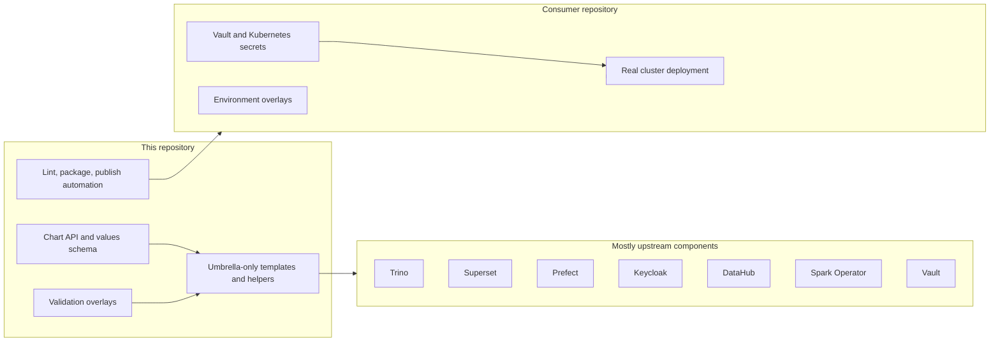

# dlh-in-a-box Umbrella Helm Chart

[](https://github.com/sanger-pathogens/dlh-in-a-box-umbrella-helm-chart/actions/workflows/helm-lint.yaml)
[](https://github.com/sanger-pathogens/dlh-in-a-box-umbrella-helm-chart/actions/workflows/helm-smoke-install.yaml)
[](https://github.com/sanger-pathogens/dlh-in-a-box-umbrella-helm-chart/actions/workflows/helm-publish.yaml)

This repository is the source of truth for the `dlh-in-a-box` chart itself.
It owns the chart API, the small amount of umbrella-only composition logic
around upstream components, the example overlays used for validation, and the
release automation that publishes the OCI package.

It does not own environment-specific infrastructure, live cluster operations,
institution-specific secret material, or organization-specific portal branding.
Those live in the downstream infra repository.

## Start Here

Choose the path that matches what you are trying to do:

- New chart consumer:
  [`charts/dlh-in-a-box/README.md`](charts/dlh-in-a-box/README.md)
- Need the fastest install/evaluation path:
  [`docs/quickstart.md`](docs/quickstart.md)
- Need the default identity and access model:
  [`docs/auth-architecture.md`](docs/auth-architecture.md)
- Need the data-governance and Ranger model:
  [`docs/data-governance.md`](docs/data-governance.md)
- Need terminology explained first:
  [`docs/glossary.md`](docs/glossary.md)
- Need example values:
  [`examples/README.md`](examples/README.md)
- Need maintainer and release tasks:
  [`hack/README.md`](hack/README.md),
  [`docs/release-playbook.md`](docs/release-playbook.md)

## Repository Mental Model



## Default Platform Model

The default documented model is now:

- `platformHome` is the browser launchpad and the default entrypoint for human users.
- `Keycloak` is the platform OIDC provider.
- `externalLdap` remains the default shared-environment identity mode, with
  `keycloakLocal` available when an institution wants Keycloak to own human
  accounts directly.
- temporary `bootstrapUsers` are allowed only for local or dev browser-flow
  validation while real directory bind details are still pending.
- `Ranger` remains the live policy and role-management plane. Trino only uses
  the Ranger plugin when `global.authorization.ranger.trino.enabled=true` is
  paired with a Ranger-capable Trino image.
- `oauth2-proxy` sits in front of Prefect, CloudBeaver, and Ranger so those
  tools can reuse the central Keycloak session.
- `JupyterHub` is an optional analysis surface that can reuse the same
  Keycloak realm and forward the resulting access token into notebook servers.
- the umbrella chart owns the reusable portal UX, the dedicated `Access
  Control` workspace, and the health aggregation API, while downstream repos
  own logos, fonts, favicons, color palettes, and environment-specific extra
  tools. The portal is the primary admin UX for routine role membership
  changes; Ranger remains the deeper policy and audit surface.
- `global.dataCatalogs.*.governance` is the chart-side governance contract used
  to stop unclassified or unapproved datasets from being exposed by accident.

The older `external OIDC + LDAP/AD` path still exists, but it is now the
escape hatch, not the main story.

## What This Repo Owns

- The chart values contract, including identity, authorization, and governance
  metadata.
- Trino catalog generation and Ranger bootstrap glue.
- Keycloak and Ranger composition for chart-managed deployments.
- The lightweight platform launchpad, dedicated access-control workspace,
  health aggregation API, the chart-owned CloudBeaver deployment, and optional
  JupyterHub integration.
- Example overlays that prove local, development, and production-shaped
  installs render cleanly.
- Documentation for the chart API and architecture.

## What This Repo Does Not Own

- Real production secrets.
- Institution-specific LDAP/AD endpoint values and trust material.
- Institution-specific portal branding, such as logos, fonts, colors, favicons,
  and extra organization-owned admin tools.
- Bastion workflows, kubeconfigs, Vault operations, or cluster access.
- Dataset approval decisions, PI sign-off, DCC/DRC process, or IRB process.

The platform can enforce approved access. It does not replace institutional
governance.

## Documentation Philosophy

The docs in this repository follow four rules:

1. Route first, explain second.
2. Define terms before assuming them.
3. Keep primary docs separate from vendored or reference-only material.
4. Be explicit about what the chart enforces versus what operators must do
   outside Helm.

Vendored upstream READMEs under `charts/dlh-in-a-box/charts/` are reference
material, not the primary onboarding path.

## Validation Model

The main validation commands are:

```bash
./hack/helm-dependency-update.sh
./hack/lint.sh
./hack/template.sh
./hack/package.sh
./hack/smoke-install.sh
```

`./hack/lint.sh` now validates chart structure, docs guardrails, the values
schema, security checks, and every example overlay.

## Reference Map

- Chart source:
  [`charts/dlh-in-a-box/README.md`](charts/dlh-in-a-box/README.md)
- Long-form docs:
  [`docs/README.md`](docs/README.md)
- Example overlays:
  [`examples/README.md`](examples/README.md)
- Maintainer scripts:
  [`hack/README.md`](hack/README.md)
- Contribution and support:
  [`CONTRIBUTING.md`](CONTRIBUTING.md),
  [`SUPPORT.md`](SUPPORT.md),
  [`SECURITY.md`](SECURITY.md),
  [`CODE_OF_CONDUCT.md`](CODE_OF_CONDUCT.md)

## License

Apache-2.0 applies to the umbrella chart itself. Third-party notices are listed
in [`THIRD_PARTY_NOTICES.md`](THIRD_PARTY_NOTICES.md).
