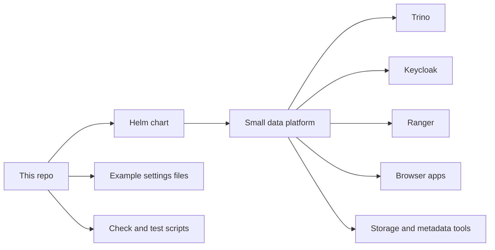

# dlh-in-a-box Umbrella Helm Chart

[](https://github.com/sanger-pathogens/dlh-in-a-box-umbrella-helm-chart/actions/workflows/helm-lint.yaml)
[](https://github.com/sanger-pathogens/dlh-in-a-box-umbrella-helm-chart/actions/workflows/helm-publish.yaml)

This repo contains one Helm chart named `dlh-in-a-box`.

If those words are new:

- Kubernetes runs apps in a cluster
- Helm installs apps into Kubernetes
- a Helm chart is the install package Helm uses
- an umbrella chart is one chart that installs several tools together

So this repo is the install package for a small data platform.

The chart can install tools such as:

- Trino for SQL queries
- Hive Metastore for table metadata
- Keycloak for sign-in
- Ranger for access rules
- Prefect for workflows
- CloudBeaver for browser SQL
- DataHub for metadata
- JupyterHub for notebooks
- MinIO for object storage
- Vault for secrets

You do not need to turn on every tool.

This repo is for:

- people who want to try or deploy the chart
- collaborators who maintain the chart

This repo is not for:

- creating your Kubernetes cluster
- creating your real production secrets
- creating your DNS names or TLS certificates
- deciding your organization's data approval rules

## What This Repo Does



The shortest way to think about the repo is:

- `charts/dlh-in-a-box/`
  the chart itself
- `examples/`
  example settings files you can start from
- `hack/`
  local scripts that check, render, package, and smoke-test the chart
- `.github/`
  GitHub workflows, issue forms, and ownership settings
- `docs/`
  small support files used by the docs, not the main place to learn the repo

## Big Picture

For the shared development and production examples, the big picture is:

- people sign in through Keycloak
- the user list usually comes from a company or lab directory service
- Ranger stores access rules
- Trino runs SQL queries
- Prefect and CloudBeaver can sit behind the same browser sign-in
- `platformHome` can act as a simple landing page

There is also a simpler local auth mode where Keycloak stores users itself.
That is the mode used by `examples/values-local-auth.yaml`.

## Easiest First Try

If you already have:

- a working Kubernetes cluster
- `kubectl`
- `helm`

then the easiest first try is the simplest local example file:

```bash
./hack/helm-dependency-update.sh
helm upgrade --install dlh charts/dlh-in-a-box \
  -n data-lakehouse-local \
  --create-namespace \
  -f examples/values-local.yaml
kubectl get pods -n data-lakehouse-local
```

If you want the login-heavy local test instead, use:

```bash
make smoke-install
```

That path uses `examples/values-local-auth.yaml` and creates the demo Secrets
that file needs.

## Main Checks

These are the main local checks and scripts:

```bash
./hack/helm-dependency-update.sh
SKIP_MERMAID_CHECK=1 ./hack/docs-check.sh
./hack/lint.sh
./hack/template.sh
./hack/package.sh
./hack/smoke-install.sh
```

- `docs-check.sh`
  checks local guide files, links, and Mermaid diagrams
- `lint.sh`
  checks the chart and the example settings files
- `template.sh`
  renders the chart into Kubernetes YAML
- `package.sh`
  builds the chart package
- `smoke-install.sh`
  runs the auth-heavy local smoke test

Full Mermaid diagram checking needs Docker. If Docker is not running locally,
`SKIP_MERMAID_CHECK=1` is the deliberate way to skip that one part.

## Where To Look Next

Every important folder in this repo has its own guide file.

The most useful ones are:

- [charts/dlh-in-a-box/README.md](charts/dlh-in-a-box/README.md)
  if you want to understand the chart itself
- [examples/README.md](examples/README.md)
  if you want help choosing an example settings file
- [hack/README.md](hack/README.md)
  if you maintain the repo and need the local scripts
- [CONTRIBUTING.md](CONTRIBUTING.md)
  if you are a collaborator preparing a change
- [SUPPORT.md](SUPPORT.md)
  if you need help

## Contribution Boundary

This repo may be public to read, but pull requests are mainly limited to
repository collaborators.

If you are not a collaborator, treat the repo as a chart you can read and use.
If you need help, open the right issue or use the support path instead of
assuming you can send a pull request.

## License

The chart code in this repository uses the Apache-2.0 license.

Some bundled third-party chart material uses its own licenses. That is listed
in [THIRD_PARTY_NOTICES.md](THIRD_PARTY_NOTICES.md).
