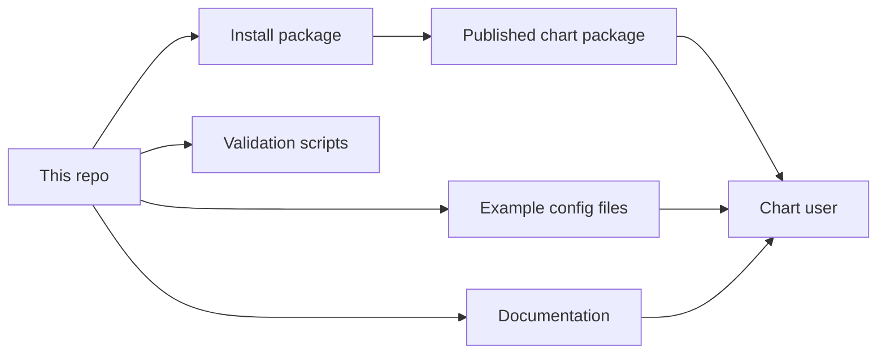

# dlh-in-a-box Umbrella Helm Chart

[](https://github.com/sanger-pathogens/dlh-in-a-box-umbrella-helm-chart/actions/workflows/helm-lint.yaml)
[](https://github.com/sanger-pathogens/dlh-in-a-box-umbrella-helm-chart/actions/workflows/helm-publish.yaml)

This repository publishes a Helm chart called `dlh-in-a-box`.

In plain language:

- Kubernetes is the system that runs apps in a cluster
- Helm is a tool for installing apps on Kubernetes
- a Helm chart is the install package Helm uses

So this repository is an install package for a small data platform.

That platform can include a SQL engine, login system, workflow UI, browser SQL
tool, metadata tools, object storage, and a few other optional pieces. You do
not need to know those tools yet to start using this repository.

Audience: people who want to understand or deploy the chart, plus internal
collaborators who maintain it.

What you will learn: what this repository is, what it deploys, what it does
not do for you, and where to start.

Read next: [docs/prerequisites.md](docs/prerequisites.md) if you are brand
new, or [docs/quickstart.md](docs/quickstart.md) if you already have a
Kubernetes cluster and want the simplest local install.

## Start Here

- I am new here:
  start with [docs/prerequisites.md](docs/prerequisites.md), then follow
  [docs/quickstart.md](docs/quickstart.md).
- I want to understand the chart before I install it:
  read [charts/dlh-in-a-box/README.md](charts/dlh-in-a-box/README.md).
- I want help choosing an example values file:
  read [examples/README.md](examples/README.md).
- I want to understand login and access:
  read [docs/auth-architecture.md](docs/auth-architecture.md).
- I want to understand the data approval rules:
  read [docs/data-governance.md](docs/data-governance.md).
- I maintain this repository:
  start with [docs/contributor-map.md](docs/contributor-map.md), then use
  [CONTRIBUTING.md](CONTRIBUTING.md) and [hack/README.md](hack/README.md).
- I hit an unfamiliar word:
  use the optional reference page at [docs/glossary.md](docs/glossary.md).

## Repository Mental Model



The shortest way to think about the repository is this:

- `charts/dlh-in-a-box/`
  the actual chart Helm installs
- `examples/`
  example values files you can start from
- `docs/`
  plain-English explanation
- `hack/`
  local validation and smoke-install scripts

This repository is not your cluster, your real secrets store, your DNS setup,
or your environment-specific infrastructure repository.

## Default Platform Model

If you are brand new, this is the easiest mental model for the shared
development and production examples:

- people sign in through `Keycloak`
- the shared examples read users and groups from an external LDAP or Active
  Directory service
- `platformHome` is an optional browser landing page
- `Prefect` and `CloudBeaver` sit behind a browser login proxy so people do
  not sign in separately to each tool
- `Ranger` stores access rules
- `Trino` is the SQL engine people query

There is also a simpler local-only auth mode where Keycloak stores users
itself. That is the mode used by `examples/values-local-auth.yaml`.

## What This Repo Owns

- the chart itself
- the default values and schema
- the chart templates that wire multiple tools together
- the example values files
- the chart documentation
- the local validation, packaging, and publish scripts

## What This Repo Does Not Own

- your production secrets
- your cluster setup
- your DNS and TLS certificates
- your organization’s branding
- your local infrastructure repository
- your human approval process for who should get access to what

## Validation Model

These are the main local checks:

```bash
./hack/helm-dependency-update.sh
SKIP_MERMAID_CHECK=1 ./hack/docs-check.sh
./hack/lint.sh
./hack/template.sh
./hack/package.sh
./hack/smoke-install.sh
```

What they mean in simple terms:

- `docs-check.sh`
  checks links, headings, and doc rules
- `lint.sh`
  checks the chart and the example config files
- `template.sh`
  makes sure the chart can render into Kubernetes YAML
- `package.sh`
  builds the chart package
- `smoke-install.sh`
  does a real local install of the auth-enabled smoke path

Full Mermaid diagram checking needs Docker. If Docker is not running locally,
`SKIP_MERMAID_CHECK=1` is the deliberate way to skip that one part.

## Reference Map

- newcomer path:
  [docs/prerequisites.md](docs/prerequisites.md),
  [docs/quickstart.md](docs/quickstart.md)
- chart guide:
  [charts/dlh-in-a-box/README.md](charts/dlh-in-a-box/README.md)
- examples chooser:
  [examples/README.md](examples/README.md)
- deeper reference docs:
  [docs/README.md](docs/README.md)
- collaborator docs:
  [docs/contributor-map.md](docs/contributor-map.md),
  [CONTRIBUTING.md](CONTRIBUTING.md),
  [hack/README.md](hack/README.md),
  [docs/release-playbook.md](docs/release-playbook.md),
  [.github/workflows/README.md](.github/workflows/README.md)
- support and policy docs:
  [SUPPORT.md](SUPPORT.md),
  [SECURITY.md](SECURITY.md),
  [CODE_OF_CONDUCT.md](CODE_OF_CONDUCT.md)

## License

The chart code in this repository uses the Apache-2.0 license.

Some bundled third-party chart material uses its own licenses. That is listed
in [THIRD_PARTY_NOTICES.md](THIRD_PARTY_NOTICES.md).
