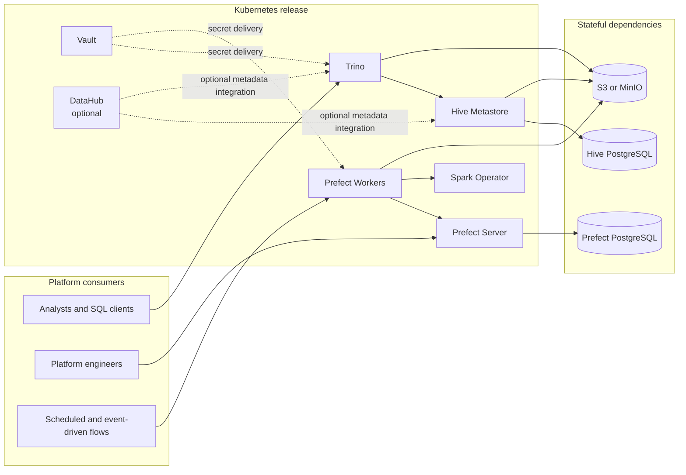
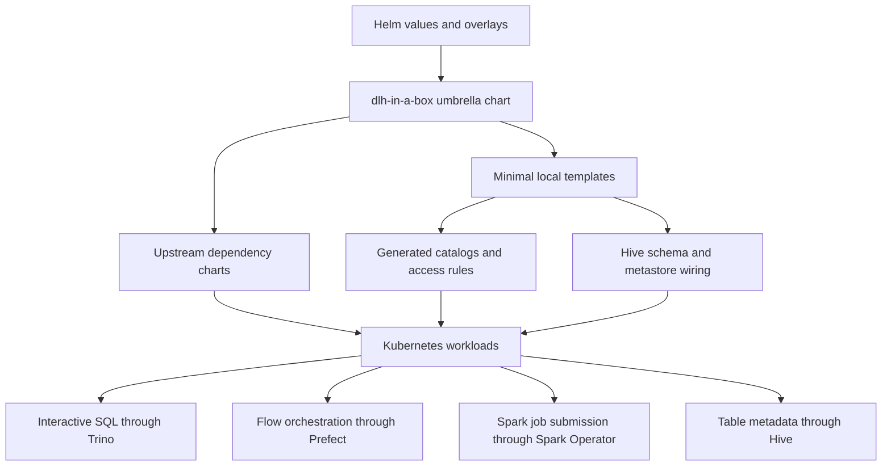
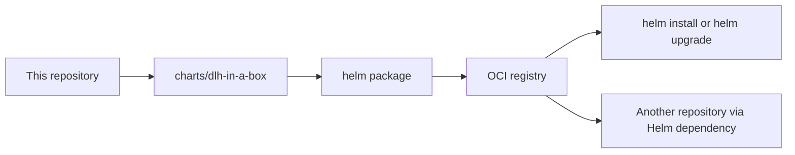

# dlh-in-a-box-umbrella-helm-chart

`dlh-in-a-box` is a production-oriented umbrella Helm chart for deploying a modular lakehouse control plane on Kubernetes.

It packages a working combination of Trino, Prefect, Spark Operator, Hive Metastore, Vault, and optional MinIO and DataHub into a single Helm release, while keeping local chart logic deliberately small and focused on cross-component composition.

## What this repo is for

This repository exists to solve one specific problem well:

- package a coherent lakehouse platform baseline as a single installable Helm chart
- keep upstream services upstream wherever possible
- provide working local and cluster overlays without burying the repo in environment-specific clutter
- publish the chart as an OCI artifact so other repositories can consume it cleanly

This repository is intentionally **not** where pipelines, Spark applications, or business logic live.

## Architecture

### Platform topology



### Control and data flow



### Packaging and consumption



## Design principles

- **Upstream first:** Trino, Prefect, Spark Operator, MinIO, Vault, DataHub, and PostgreSQL come from upstream charts.
- **Minimal local ownership:** local templates only exist where cross-component composition is required.
- **Pinned dependencies:** the published chart is built from pinned dependency versions, not floating ranges.
- **OCI-native distribution:** consumers should install from a registry, not by copying chart directories around.
- **Operational clarity:** local development, example overlays, package metadata, and registry-facing docs are all kept explicit.

## What remains locally owned

The umbrella chart keeps only the pieces that do not exist upstream or that need release-specific composition:

- Trino catalog generation from `global.dataCatalogs`
- Trino access-control generation from catalog ACLs
- Hive metastore bootstrapping for per-catalog databases
- local environment overlays for kind-based validation
- umbrella-level packaging, release notes, and publication metadata

## Component model

| Component | Role in the platform | Default state | Ownership model |
|---|---|---|---|
| Trino | Interactive SQL query engine over object storage and Hive metadata | Enabled | Upstream chart with local catalog wiring |
| Prefect Server | Flow API and UI | Enabled | Upstream chart |
| Prefect Workers | Flow execution workers | Enabled | Upstream chart |
| Spark Operator | Spark workload controller | Enabled | Upstream chart |
| Hive Metastore | Table metadata service for Trino and Spark-compatible engines | Disabled by default | Local subchart |
| Vault | Secrets platform for cluster-native secret workflows | Enabled | Upstream chart |
| MinIO | In-cluster S3-compatible object store for development and demos | Disabled by default | Upstream chart |
| DataHub | Optional metadata governance and discovery layer | Disabled by default | Upstream chart |
| PostgreSQL | Stateful dependency for Hive metastore | Enabled when Hive is enabled | Upstream chart |

## Repository layout

- `charts/dlh-in-a-box/`: the installable umbrella chart
- `charts/dlh-in-a-box/charts/hive/`: local Hive subchart used to create metastore instances per catalog
- `charts/dlh-in-a-box/charts/trino/`: locally patched Trino chart source used to build the vendored Trino dependency
- `examples/`: environment and scenario overlays
- `hack/`: repeatable lint, render, dependency, and packaging helpers
- `.github/workflows/helm-publish.yaml`: GitHub Actions workflow that packages and publishes the chart to GHCR

## Deployment modes

### Local validation

The local overlay is the canonical proof that the chart works end-to-end on kind:

- kind cluster
- in-cluster MinIO
- Hive enabled
- Prefect enabled
- Vault in dev mode
- reduced Trino footprint for laptop use

Use:

```bash
./hack/helm-dependency-update.sh
./hack/lint.sh
helm upgrade --install dlh charts/dlh-in-a-box \
  -n data-lakehouse-local \
  --create-namespace \
  -f examples/values-local.yaml
```

### External object storage

Use `examples/values-external-s3.yaml` as a starting point when object storage is external and MinIO is disabled.

### Production baseline

Use `examples/values-prod.yaml` as a skeletal production overlay, then layer in:

- real ingress and DNS
- secret delivery strategy
- resource requests and limits
- storage and PostgreSQL durability requirements
- organization-specific network policies and security controls

## Consuming the chart from another repository

Install directly from OCI:

```bash
helm install dlh \
  oci://ghcr.io/sanger-pathogens/charts/dlh-in-a-box \
  --version <chart-version> \
  -n data-lakehouse \
  --create-namespace \
  -f my-values.yaml
```

Or declare it as a dependency:

```yaml
dependencies:
  - name: dlh-in-a-box
    version: <chart-version>
    repository: oci://ghcr.io/sanger-pathogens/charts
```

Then run:

```bash
helm dependency build
```

## Production and operations guidance

### Secrets

- Do not commit real secrets to tracked values files.
- Use environment-specific secret delivery outside Git wherever possible.
- Treat the example values as scaffolding, not as production secret management.

### Stateful services

- Hive metadata depends on PostgreSQL durability.
- Query data durability depends on the external object store or MinIO persistence configuration.
- Local overlays intentionally trade durability for reproducibility and speed.

### Dependency management

- `Chart.yaml` uses pinned dependency versions.
- `Chart.lock` is committed and should be treated as release input.
- `./hack/helm-dependency-update.sh` is the explicit place where dependency upgrades happen.

### Publication

- the chart package includes a dedicated chart README and license for registry consumers
- OCI publication is handled by `.github/workflows/helm-publish.yaml`
- the intended package target is `ghcr.io/sanger-pathogens/charts/dlh-in-a-box`
- the workflow uses `GITHUB_TOKEN`, which is the GitHub-recommended approach for publishing packages from the workflow repository itself
- a personal access token classic is still useful for local manual login and troubleshooting against GHCR

For local manual GHCR access:

```bash
export GHCR_TOKEN=YOUR_CLASSIC_PAT
printf '%s' "$GHCR_TOKEN" | helm registry login ghcr.io -u YOUR_GITHUB_USERNAME --password-stdin
```

## Examples

- `examples/values-local.yaml`: validated local kind deployment
- `examples/values-dev.yaml`: lightweight shared development baseline
- `examples/values-prod.yaml`: production-shaped baseline overlay
- `examples/values-external-s3.yaml`: external object storage baseline
- `examples/values-minio.yaml`: in-cluster MinIO scenario

## Third-party licensing

This repository redistributes upstream Helm charts as packaged dependencies and
vendors a locally modified copy of the Trino chart source.

See `THIRD_PARTY_NOTICES.md` for the dependency inventory, upstream license
sources reviewed, and the extra notice material carried in this repository for
public release hygiene.

## Out of scope

- pipeline code and application logic
- Spark application definitions
- business-specific schemas and datasets
- one-off environment customization that belongs in a consumer repo

## License

This project is licensed under Apache-2.0. See `LICENSE`.
Third-party dependency notices are documented in `THIRD_PARTY_NOTICES.md`.
