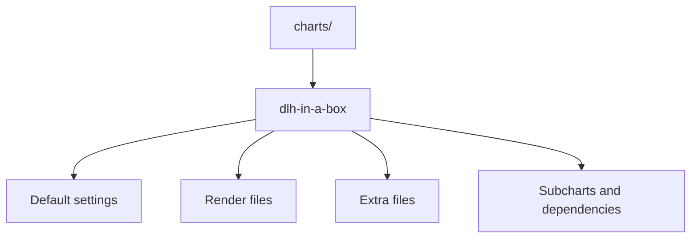

# Chart Source Tree

This folder contains the chart source code for this repo.

The main thing in here is `charts/dlh-in-a-box/`.

## What is in this folder

| Path | Plain meaning |
| --- | --- |
| `dlh-in-a-box/` | The chart this repo publishes |
| `dlh-in-a-box/templates/` | Files that turn chart settings into Kubernetes YAML |
| `dlh-in-a-box/files/` | Extra files copied into rendered objects |
| `dlh-in-a-box/charts/` | Local subcharts, vendored chart source, and packaged archives |
| `dlh-in-a-box/third_party/` | License and notice files that must ship with the chart |

## When you can ignore this folder

You can ignore most of this folder if you only want to use the published chart
package.

You need this folder when you are changing the chart itself.

## Common mistake

This tree mixes local chart code with vendored material and packaged archives.
Do not assume every file here should be edited by hand.
