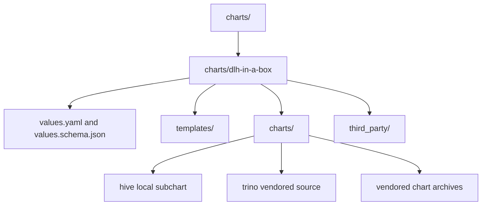

# Chart Source Tree

This directory contains the installable umbrella chart and its supporting
subdirectories.

## Structure

## What lives here

| Path | Purpose |
| --- | --- |
| `charts/dlh-in-a-box/` | The installable umbrella chart published to GHCR |
| `charts/dlh-in-a-box/charts/` | Local subcharts, vendored chart source, and chart archives |
| `charts/dlh-in-a-box/templates/` | Umbrella-specific helper and compatibility templates |
| `charts/dlh-in-a-box/third_party/` | Bundled notice material required for redistribution hygiene |

## Child guides

| Path | Guide | Purpose |
| --- | --- | --- |
| `charts/dlh-in-a-box/` | [dlh-in-a-box/README.md](dlh-in-a-box/README.md) | Chart API, values surface, and runtime composition |
| `charts/dlh-in-a-box/charts/` | [dlh-in-a-box/charts/README.md](dlh-in-a-box/charts/README.md) | Local and vendored subchart inventory |
| `charts/dlh-in-a-box/templates/` | [dlh-in-a-box/templates/_README.txt](dlh-in-a-box/templates/_README.txt) | Umbrella-only glue templates |
| `charts/dlh-in-a-box/third_party/` | [dlh-in-a-box/third_party/README.md](dlh-in-a-box/third_party/README.md) | Notice and license provenance |

## Maintainer note

The chart root mixes authored source, generated lock data, and vendored chart
artifacts on purpose. That is how the repository keeps publication
reproducible while still making the locally owned composition logic easy to
review.
