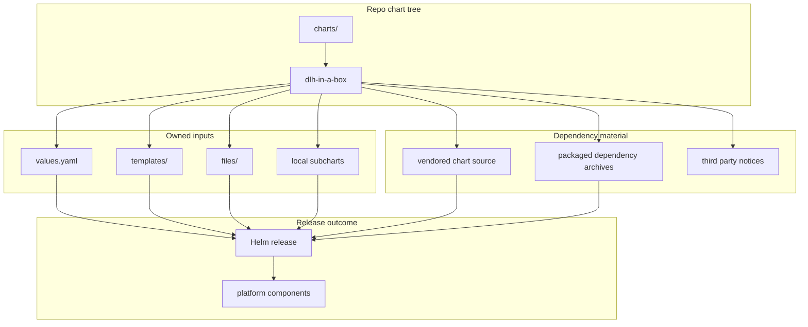

# Chart Source Tree

This folder contains the chart source code for this repo.

The main thing in here is `charts/dlh-in-a-box/`, because that is the chart the
repository publishes.

## Who Should Read This

| Reader | Why this guide matters |
| --- | --- |
| deployer reading source | to know where the published chart actually lives |
| contributor | to understand the difference between owned source, vendored source, and packaged archives |
| maintainer | to understand dependency refresh and packaging flow |



## What Lives In This Folder

| Path | Ownership | What it is for |
| --- | --- | --- |
| `dlh-in-a-box/` | repo-owned chart | the chart this repository publishes |
| `dlh-in-a-box/templates/` | repo-owned | umbrella-specific render logic |
| `dlh-in-a-box/files/` | repo-owned | static payload files copied into runtime objects |
| `dlh-in-a-box/charts/` | mixed | local subcharts, vendored Trino source, packaged dependency archives |
| `dlh-in-a-box/third_party/` | repo-owned provenance | bundled notice and license copies |

This folder does not contain several independently published local charts. It
contains one published umbrella chart plus the material needed to package it
reproducibly.

## Ownership Boundaries

This tree mixes four kinds of material:

- repo-owned umbrella-chart source
- repo-owned local subchart source
- vendored upstream source with local patch points
- packaged dependency archives generated from dependency refresh

That distinction matters because the edit strategy is different for each class.

## How Dependency Updates Move Through This Folder

When a dependency version changes:

1. update `charts/dlh-in-a-box/Chart.yaml`
2. run `./hack/helm-dependency-update.sh`
3. review the refreshed `Chart.lock`
4. review the packaged `.tgz` archives under `charts/dlh-in-a-box/charts/`
5. review licensing and notice files

This folder is the physical home of those artifacts, even though the dependency
decision itself starts in `Chart.yaml`.

## Common Tasks

If you need to:

- change default chart behavior: go to `dlh-in-a-box/`
- understand why a dependency archive changed: inspect
  `dlh-in-a-box/Chart.yaml`, `Chart.lock`, and `dlh-in-a-box/charts/`
- change local Hive behavior: go to `dlh-in-a-box/charts/hive/`
- change repo-specific Trino behavior: go to
  `dlh-in-a-box/charts/trino/OVERVIEW.md`

## Validation

After changing anything in this tree, the normal checks are:

```bash
./scripts/helm-dependency-update.sh
./scripts/lint.sh
./scripts/template.sh
./scripts/package.sh
```

## Common Mistakes

- assuming every file here should be edited by hand
- forgetting that packaged `.tgz` archives are generated artifacts with a
  deliberate place in the repo
- editing vendored upstream material without understanding ownership

## When You Can Ignore This Folder

You can ignore most of this folder only if you consume the already-published
chart package and do not work from source.
