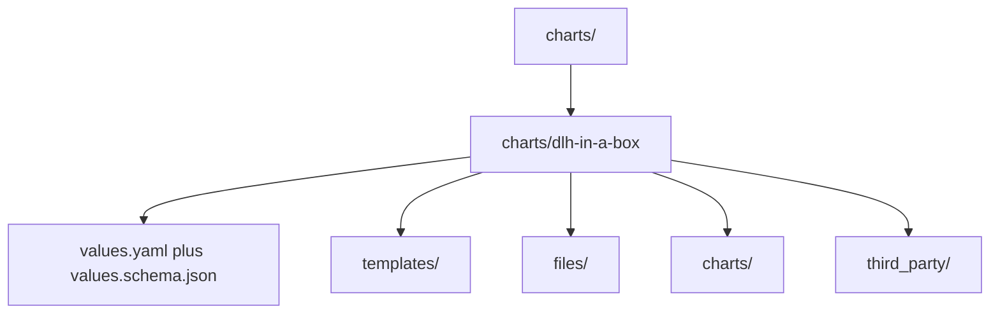

# Chart Source Tree

This directory contains the installable chart and the local or vendored chart
material it depends on.

Most readers should start with
[../README.md](../README.md) or
[dlh-in-a-box/README.md](dlh-in-a-box/README.md) first. Come here when you
need to understand how the chart source tree is laid out.

## Structure

## What lives here

| Path | Purpose |
| --- | --- |
| `charts/dlh-in-a-box/` | Installable umbrella chart published to GHCR |
| `charts/dlh-in-a-box/charts/` | Local subcharts, vendored source, and packaged dependency archives |
| `charts/dlh-in-a-box/templates/` | Chart-owned templates that glue multiple components together |
| `charts/dlh-in-a-box/files/` | Static assets embedded into rendered Kubernetes objects |
| `charts/dlh-in-a-box/third_party/` | Bundled license and notice material required for redistribution |

## Child guides

| Path | Guide | Purpose |
| --- | --- | --- |
| `charts/dlh-in-a-box/` | [dlh-in-a-box/README.md](dlh-in-a-box/README.md) | Main consumer-facing chart guide |
| `charts/dlh-in-a-box/charts/` | [dlh-in-a-box/charts/README.md](dlh-in-a-box/charts/README.md) | Local and vendored subchart inventory |
| `charts/dlh-in-a-box/templates/` | [dlh-in-a-box/templates/_README.txt](dlh-in-a-box/templates/_README.txt) | Local chart-owned templates |
| `charts/dlh-in-a-box/files/` | [dlh-in-a-box/files/README.md](dlh-in-a-box/files/README.md) | Embedded static asset inventory |
| `charts/dlh-in-a-box/third_party/` | [dlh-in-a-box/third_party/README.md](dlh-in-a-box/third_party/README.md) | Notice and license provenance |

## Maintainer note

This tree intentionally mixes authored source, generated lock data, and
vendored dependency material so releases stay reproducible.
