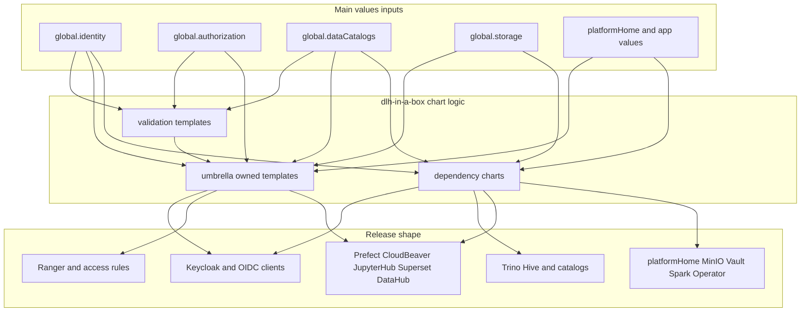

# dlh-in-a-box Chart Guide

This folder contains the Helm chart that this repository publishes.

If you only read one folder guide after the root README, read this one. It is
the source-of-truth guide for:

- what the chart owns directly
- which dependencies are bundled or vendored
- how values are organized
- how identity, governance, storage, and browser tools fit together
- where the important hidden behavior lives

## Who Should Read This

| Reader | Why this guide matters |
| --- | --- |
| deployer | to understand which values matter and which install profile to start from |
| operator | to understand secrets, auth modes, and runtime expectations |
| contributor | to know where to change defaults, validation, templates, or dependencies |
| maintainer | to understand packaging, ownership boundaries, and validation flow |

## What This Chart Does

This chart installs a modular data platform as one Helm release.

In practice, that means the chart can combine:

- shared identity wiring
- storage and catalog wiring
- query services
- policy and governance services
- browser-facing applications

It does not force every optional component on. The install shape is driven by
values files and feature toggles.



## What Lives In This Folder

| Path | Ownership | What it is for |
| --- | --- | --- |
| `Chart.yaml` | repo-owned | chart metadata, dependency list, publish version, dependency conditions |
| `Chart.lock` | generated but committed | locked dependency versions and digests after dependency refresh |
| `values.yaml` | repo-owned | default values, shared identity contract, app defaults, dependency pass-throughs |
| `values.schema.json` | repo-owned | allowed values shape used during validation and linting |
| `templates/` | repo-owned | umbrella-specific logic that upstream dependencies do not own |
| `files/` | repo-owned | static payloads copied into rendered objects |
| `charts/` | mixed | local Hive subchart, vendored Trino chart source, packaged dependency archives |
| `third_party/` | repo-owned provenance | bundled notice and license copies that must ship with the chart |
| `THIRD_PARTY_NOTICES.md` | repo-owned notice document | chart-specific summary of bundled third-party material |
| `LICENSE` | repo-owned license file | Apache-2.0 for the umbrella chart code |
| `.helmignore` | repo-owned packaging control | excludes files from the packaged chart archive |
| `README.md` | repo-owned guide | this document |

## Dependency Ownership

The most important thing to understand in this chart is that not everything in
the folder is equally owned by this repo.

### Fully owned here

This repo directly owns:

- the umbrella chart metadata and defaults
- the validation rules in `templates/`
- `platformHome`, CloudBeaver, Ranger, and DataHub helper templates
- the local Hive subchart
- the repo-specific Trino patch points documented around the vendored Trino
  chart

### Upstream but bundled here

This repo bundles upstream charts for reproducibility and packaging, including:

- Keycloak
- Superset
- Prefect server and worker
- oauth2-proxy
- Spark Operator
- MinIO
- DataHub and DataHub prerequisites
- Vault
- JupyterHub
- PostgreSQL variants

### Vendored source with local patch points

Trino is special:

- most of `charts/trino/` is upstream source
- only a small set of files are locally modified
- the local Trino guides explain which files are safe to edit for repo-specific
  behavior

## Dependency Inventory

The dependency list in `Chart.yaml` is the publish-time source of truth.

Important dependencies and what they are used for:

| Dependency | Alias or key | When it is used |
| --- | --- | --- |
| Trino | `trino` | main SQL engine |
| Hive | `hive` | local subchart for Hive Metastore generation |
| Keycloak | `keycloak` | default bundled identity provider |
| Ranger PostgreSQL | `rangerPostgresql` | backing database for Ranger Admin |
| Hive PostgreSQL | `hivePostgresql` | backing database for the local Hive subchart |
| Prefect server | `prefectServer` | self-hosted Prefect UI and API |
| Prefect worker | `prefectWorker` | worker process for Prefect jobs |
| oauth2-proxy | `prefect-auth-proxy`, `cloudbeaver-auth-proxy`, `ranger-auth-proxy` | browser auth boundary in front of selected apps |
| Spark Operator | `sparkOperator` | optional Spark CRD/operator support |
| MinIO | `minio` | in-cluster S3-compatible object store |
| DataHub | `datahub` | metadata catalog and discovery UI |
| DataHub prerequisites | `datahubPrerequisites` | bundled Kafka, Zookeeper, MySQL-facing prerequisite wiring |
| Vault | `vault` | optional secrets tooling and browser UI |
| JupyterHub | `jupyterhub` | notebook environment with OIDC login |
| Superset | `superset` | optional BI application |

Whenever you change a dependency version, you must treat these together as one
change:

- `Chart.yaml`
- `Chart.lock`
- the packaged archives under `charts/`
- `THIRD_PARTY_NOTICES.md`
- any provenance files under `third_party/`

## How Values Are Organized

`values.yaml` is large because it serves two jobs at once:

- it defines the shared cross-component contract owned by this repo
- it passes settings through to upstream dependencies

The easiest way to read it is by category.

### Shared cross-component contract

These sections define behavior shared across multiple components:

| Values path | What it controls |
| --- | --- |
| `global.identity` | identity provider mode, directory mode, OIDC clients, shared group naming |
| `global.authorization` | platform roles, exception roles, Ranger defaults, governance expectations |
| `global.storage` | object-store backend and shared S3 settings |
| `global.dataCatalogs` | the catalogs that become Trino and Hive resources |

### App-specific values owned here

These sections configure repo-owned or heavily wrapped features:

| Values path | What it controls |
| --- | --- |
| `platformHome` | landing page, launchers, health checks, and admin UI |
| `cloudbeaver` | CloudBeaver image, bootstrap secrets, auth-proxy headers, trust store wiring |
| `prefect` | high-level Prefect toggles and optional flow-run job-runner Kubernetes primitives |
| `prefect-auth-proxy` | oauth2-proxy in front of Prefect |
| `cloudbeaver-auth-proxy` | oauth2-proxy in front of CloudBeaver |
| `ranger-auth-proxy` | oauth2-proxy in front of Ranger browser access |

### Dependency value pass-throughs

These sections are mostly upstream chart values exposed at the umbrella level:

- `keycloak`
- `prefectServer`
- `prefectWorker`
- `sparkOperator`
- `minio`
- `datahub`
- `datahubPrerequisites`
- `superset`
- `jupyterhub`
- `vault`
- `hivePostgresql`
- `rangerPostgresql`

### Prefect Job Runner Pull Identity

`prefect.jobRunner` can create a lightweight Kubernetes service account for
Prefect flow-run Jobs and optionally create a `kubernetes.io/dockerconfigjson`
pull secret for private registries.

Use `prefect.jobRunner.serviceAccount.imagePullSecrets` when another controller
creates the secret, such as an external secret operator. Use
`prefect.jobRunner.pullSecret.create=true` only when Helm should own the registry
Secret directly.

The chart also creates a `prefect-worker-base-job-template` ConfigMap from the
packaged Prefect Kubernetes base job template and wires the upstream worker
chart to use it. When `prefect.jobRunner.enabled=true`, the base job template
defaults Prefect flow-run Jobs to `prefect.jobRunner.serviceAccount.name`.

## Identity Model

The identity model has two independent axes. This is one of the most important
things the old docs under-explained.

### Axis 1: who acts as the OIDC provider

| Setting | Meaning |
| --- | --- |
| `global.identity.provider.mode=bundledKeycloak` | this chart deploys Keycloak and manages clients for supported apps |
| `global.identity.provider.mode=externalOidc` | an external OIDC provider already exists, so the chart consumes it instead of deploying Keycloak as the source of browser login |

### Axis 2: where users and groups come from

| Setting | Meaning |
| --- | --- |
| `global.identity.directory.mode=externalLdap` | users and groups come from LDAP or AD; this is the main shared-environment model |
| `global.identity.directory.mode=keycloakLocal` | Keycloak manages local users directly; this is the local auth-heavy model |

### Supported combinations that matter most here

| Provider mode | Directory mode | Typical use |
| --- | --- | --- |
| `bundledKeycloak` | `externalLdap` | default shared dev or prod pattern |
| `bundledKeycloak` | `keycloakLocal` | local smoke or demo auth pattern |
| `externalOidc` | `externalLdap` | escape hatch when an external IdP already exists |

Important restrictions encoded by the chart:

- `platformHome` currently requires `bundledKeycloak` because it uses the
  Keycloak JavaScript adapter directly
- local Keycloak-managed users and LDAP-backed Ranger usersync are mutually
  exclusive
- many browser clients require redirect URIs and web origins when bundled
  Keycloak is creating the client

## Storage Model

The chart supports two broad storage shapes:

| Backend | Meaning |
| --- | --- |
| `minio` | deploy an in-cluster S3-compatible object store |
| `externalS3` | point the platform at an existing S3-compatible service |

What that affects:

- Trino catalog configuration
- Hive object-store credentials
- example overlays and secret expectations
- whether MinIO browser login and console wiring matter at all

The simplest local examples use MinIO. The shared overlays use external S3.

## Governance And Authorization Model

The platform governance model is centered around four related concepts.

### `global.dataCatalogs`

This describes the data sources the platform should expose. It is the seed for:

- Trino catalog files
- Hive resources where needed
- governance checks
- imported or bootstrapped access rules

### `global.authorization.platformRoles`

These are the durable named roles the platform cares about.

They are used to describe:

- who should have which app access
- which directory groups map to those roles
- which Ranger roles should exist

### `global.authorization.platformRoleExceptions`

These are controlled, direct-user exceptions for unusual cases. They are not
the normal access-management path.

The chart expects extra metadata such as:

- approval reference
- reason
- granted by
- expiry

### `global.authorization.ranger.bootstrapPolicies`

These are the policies the chart can reconcile into Ranger.

They can be used for:

- coarse catalog access
- write access
- fine-grained masking
- row filtering

## Where Access Control Actually Happens

This is the most subtle part of the chart.

Ranger can be enabled in the platform without Trino necessarily using the
Ranger plugin for query-time enforcement.

### Trino/Ranger control matrix

| Situation | What you get |
| --- | --- |
| Ranger disabled | Trino uses generated file-based access rules only |
| Ranger enabled, `global.authorization.ranger.trino.enabled=false` | Ranger Admin, roles, policies, and sync can still exist, but Trino remains on generated file-based rules |
| Ranger enabled, `global.authorization.ranger.trino.enabled=true`, compatible Trino image | Trino can use the Ranger plugin and fetch policy data from Ranger Admin |

This distinction exists in the actual code:

- `identity-validation.yaml` and `governance-validation.yaml` guard the
  supported combinations
- the Trino chart patch points generate file access rules by default
- the Trino Ranger plugin path is only configured when the explicit flag is on

If you change authorization behavior, always verify which control plane is
actually authoritative for the path you are testing.

## Secrets The Chart Expects

The chart does not create your real shared-environment secrets for you.

Examples of expected secret categories:

- OIDC client secrets
- directory bind passwords
- Keycloak admin password
- Ranger admin and database credentials
- MinIO or external object-store credentials
- CloudBeaver bootstrap data
- Prefect and CloudBeaver oauth2-proxy cookies and client secrets

The local auth smoke script is special because it creates demo secrets for
`values-local-auth.yaml`. Shared examples assume those secrets already exist.

## Render-Time Lookups And Upgrade-Sensitive Behavior

Some of the chart's behavior depends on Helm `lookup`, not just on the values
file.

That matters because `lookup` can read already-existing Kubernetes resources at
render time, which means:

- an in-cluster upgrade can behave differently from a completely offline
  `helm template`
- some generated secrets are deliberately preserved across upgrades instead of
  rotating every render
- some checksums only change when the referenced Secret already exists in the
  cluster

Important places this happens:

- `templates/cloudbeaver.yaml` reads existing bootstrap, workspace-seed, and
  trust-store secrets for rollout checksums
- `templates/datahub-auth-secrets.yaml` preserves existing generated signing
  material
- `templates/datahub-prerequisites-compat.yaml` can mirror an existing MySQL
  secret into the shape DataHub expects
- `charts/trino/templates/_helpers.tpl` can read S3 credentials from an
  existing secret when generated Trino catalogs use secret-backed storage

If a render looks surprising, always ask whether the template path is using
`lookup` and whether the referenced secret actually exists in the cluster you
rendered against.

## Behavior That Lives In Large Repo-Owned Files

Several important behaviors are easy to miss because they live in large files
rather than obvious small templates.

| File | Why it matters |
| --- | --- |
| `values.yaml` | defines the shared contract across identity, governance, storage, browser tools, and dependency pass-throughs |
| `values.schema.json` | formalizes valid input shape and helps catch broken values early |
| `templates/identity-validation.yaml` | blocks unsupported identity combinations before resources render |
| `templates/governance-validation.yaml` | blocks incomplete or unsafe governed-data setups |
| `templates/platform-home.yaml` | contains the landing page, embedded JavaScript, embedded Python helper API, launcher logic, health checks, and access-control UI |
| `templates/cloudbeaver.yaml` | contains CloudBeaver bootstrap, proxy-header expectations, trust-store creation, and optional shared-connection seeding |
| `templates/ranger-admin.yaml` | builds the Ranger Admin deployment and bootstraps it against PostgreSQL |
| `templates/ranger-automation.yaml` | embeds the large Python reconciliation logic for roles, policies, usersync, local-user sync, and exception audits |
| `templates/ranger-browser-proxy.yaml` | adds the browser-facing reverse proxy layer in front of Ranger Admin |

The detailed per-template explanation lives in
[templates/_README.txt](templates/_README.txt).

## Choose An Install Path

| Path | Use it when | What it is proving |
| --- | --- | --- |
| `examples/values-local.yaml` | you want the simplest manual first install | core local platform wiring without the full auth-heavy stack |
| `make smoke-install` with `examples/values-local-auth.yaml` | you want the strongest local auth and access smoke test | bundled Keycloak, proxies, Ranger, and platform-home |
| `examples/values-dev.yaml` | you want the shared development baseline | bundled Keycloak plus LDAP, shared browser stack, governed external S3 |
| `examples/values-prod.yaml` | you want the production-shaped baseline | stricter shared browser stack and shared-environment assumptions |
| `examples/values-shared-auth.yaml` | you already have an external OIDC provider | external IdP plus LDAP-backed shared auth pattern |

## Common Change Recipes

If you need to:

- add or change a data catalog: start with `global.dataCatalogs`, then check
  Hive, Trino, and governance behavior
- tighten or loosen validation: change the validation templates before changing
  the examples
- change the login story for a browser app: follow the relevant OIDC client
  settings in `values.yaml`, then the app template, then the example overlays
- add a new dependency version: update `Chart.yaml`, refresh dependencies,
  review notices, and validate packaging
- change `platformHome`: use `templates/platform-home.yaml` and the
  `files/platform-home/` guide together because the UI and API mostly live
  inline
- change Trino runtime behavior: check whether the change belongs in a local
  Trino patch point or in upstream values first

## How To Validate Changes

From the repository root:

```bash
./hack/helm-dependency-update.sh
./hack/docs-check.sh
./hack/lint.sh
./hack/template.sh
./hack/package.sh
make smoke-install
```

How to choose the right checks:

- doc-only or guide-structure changes: `docs-check.sh`
- values, validation, or dependency changes: `lint.sh` and `template.sh`
- chart packaging or dependency changes: `helm-dependency-update.sh` and
  `package.sh`
- auth, Ranger, browser proxy, or `values-local-auth.yaml` changes:
  `make smoke-install`

## Common Mistakes

- assuming the chart has only one auth mode
- treating `global.identity.provider.mode` and
  `global.identity.directory.mode` as if they were the same setting
- assuming Ranger automatically becomes the Trino enforcement engine
- changing a vendored upstream Trino file without checking whether it is
  actually part of the local patch set
- using shared examples as if they were self-contained local demos
- forgetting that shared examples require real secrets, hostnames, and storage
  credentials
- upgrading dependencies without updating notices and packaged archives

## When You Can Ignore This Folder

You can ignore most of this folder only if you are consuming a published chart
package and do not need to understand how it is built.

If you are changing repo behavior, this folder is the center of gravity and
should not be ignored.
