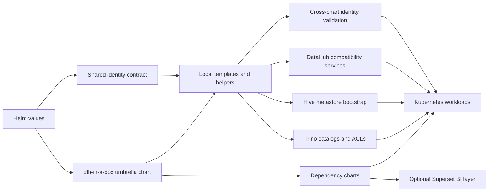
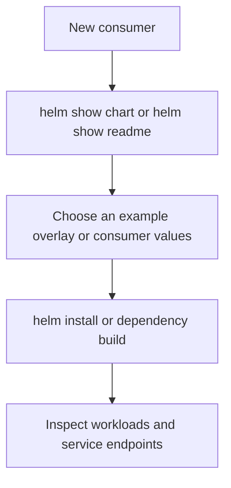
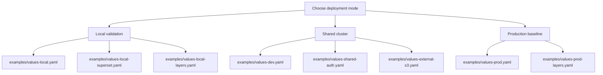

# dlh-in-a-box Helm Chart

`dlh-in-a-box` is an umbrella Helm chart for deploying a modular lakehouse
control plane on Kubernetes. It packages upstream services where possible and
keeps local templates deliberately narrow: catalog generation, access-control
generation, Hive metastore wiring, and release-level compatibility glue.

The chart also carries the phase-1 shared identity model for external OIDC,
LDAP-backed Trino group resolution, Superset role sync, DataHub policy
scaffolding, and Prefect protection through `oauth2-proxy`.

## Chart architecture



## What this chart includes

| Component | Purpose | Source |
| --- | --- | --- |
| Trino | Query engine for lakehouse data access | Vendored upstream chart with local patches |
| Superset | Optional business-intelligence and dashboard layer over Trino | Upstream chart |
| Prefect Server | API and UI for orchestration | Upstream chart |
| Prefect Workers | Flow execution workers | Upstream chart |
| Spark Operator | Spark workload controller | Upstream chart |
| Hive Metastore | Per-catalog metadata service | Local subchart |
| Vault | Secret-management platform integration point | Upstream chart |
| MinIO | Optional self-contained S3-compatible object store | Upstream chart |
| DataHub | Optional metadata governance layer | Upstream chart |
| PostgreSQL | Hive metastore backing database | Upstream chart |
| oauth2-proxy | Optional OIDC reverse proxy for Prefect | Upstream chart |

## Quick start

If you are evaluating the chart for the first time, pair this guide with
[../../docs/quickstart.md](../../docs/quickstart.md) for a shorter path from
inspection to installation, and
[../../docs/auth-architecture.md](../../docs/auth-architecture.md) for the
shared identity and access model.

Install directly from GHCR:

```bash
helm install dlh \
  oci://ghcr.io/sanger-pathogens/charts/dlh-in-a-box \
  --version <chart-version> \
  -n data-lakehouse \
  --create-namespace \
  -f my-values.yaml
```

Validate locally from the source repository root:

```bash
./hack/helm-dependency-update.sh
./hack/lint.sh
helm upgrade --install dlh charts/dlh-in-a-box \
  -n data-lakehouse-local \
  --create-namespace \
  -f examples/values-local.yaml
```

Or use the CI-like local smoke target:

```bash
make smoke-install
```

Stable releases are published from tags in the form `vX.Y.Z`. Pushes to
`main` publish uniquely versioned prereleases so downstream repositories can
test the latest chart state without waiting for a formal release.

## First-run checklist



Recommended first steps:

1. Inspect the published package with `helm show chart` and `helm show readme`.
2. Decide whether you are validating locally or consuming from another repo.
3. Start from one of the example overlays instead of building values from scratch.
4. Verify package permissions in GHCR before troubleshooting Helm.

## Security notes

- Trino catalog properties and Hive metastore runtime configuration are mounted
  from Kubernetes `Secret` resources because they can contain object-store and
  database credentials.
- Trino OIDC client secrets, Trino internal shared secrets, LDAP bind
  credentials, and OIDC proxy credentials should be delivered through existing
  Kubernetes secrets rather than tracked values files.
- If Superset is enabled, set a real `extraSecretEnv.SUPERSET_SECRET_KEY` and
  deliver admin and metadata-database credentials outside tracked non-local
  overlays.
- Non-local example overlays are intentionally kept free of inline credentials.
- Shared environments should enable available upstream network-policy controls
  where the cluster networking plugin supports them.
- The local kind overlays contain disposable demo credentials for laptop
  validation only and should never be promoted into shared environments.
- Prefer deploy-time secret injection or external secret delivery over tracked
  values files for real credentials.

## Key values surface

| Top-level values key | Responsibility | Notes |
| --- | --- | --- |
| `global.storage` | Object-store endpoint, bucket, and path-style settings | Used by local composition logic and downstream services |
| `identity` | Human-facing shared identity declaration | Usually defined once and mirrored into `global.identity`, often with a YAML anchor |
| `global.identity` | Runtime identity contract | Used by Trino and templated downstream auth integrations |
| `global.dataCatalogs` | Catalog definitions plus preferred group ACLs | Drives generated Trino and Hive resources |
| `trino` | Upstream Trino settings | Includes locally generated catalog and access-control resources |
| `superset` | Upstream Apache Superset settings | Optional dashboarding layer, including built-in PostgreSQL and Redis dependencies |
| `prefect` | Feature toggles for Prefect server and workers | Simple umbrella enablement surface |
| `prefectServer` | Direct pass-through to upstream Prefect Server chart | Includes PostgreSQL settings |
| `prefectWorker` | Direct pass-through to upstream Prefect Worker chart | Includes worker config and API connection |
| `prefect-auth-proxy` | Upstream oauth2-proxy settings | Used when protecting Prefect with external OIDC |
| `sparkOperator` | Upstream Spark Operator settings | Feature toggle plus pass-through |
| `minio` | Upstream MinIO settings | Usually enabled for local deployments only |
| `datahub` | Upstream DataHub settings | Optional metadata layer |
| `datahubPrerequisites` | Upstream prerequisites chart values | Used only when DataHub is enabled |
| `hive` | Local metastore image, database, S3, and ingress settings | Powers one metastore per catalog |
| `vault` | Upstream Vault settings | Enabled by default |
| `postgresql` | Upstream PostgreSQL settings for Hive | Used when Hive is enabled |

## Deployment patterns



See [../../examples/README.md](../../examples/README.md) for the overlay
catalog and selection guidance.

The umbrella chart also applies small compatibility defaults for Superset by
pointing its bundled PostgreSQL and Redis dependencies at the legacy Bitnami
image repositories used by the published chart tags and by installing the
missing PostgreSQL runtime driver during bootstrap.

The shared-auth reference overlay in `examples/values-shared-auth.yaml` lives
in the source repository rather than the packaged OCI artifact. Treat it as
maintainer-facing scaffolding for composing your own consumer values, not as a
file that ships inside the published chart.

## Consuming from another repository

For repositories in the same GitHub organization:

1. make sure the package `ghcr.io/sanger-pathogens/charts/dlh-in-a-box` exists
2. if package access is not inherited automatically, add the consumer
   repository under `Manage Actions access`
3. grant that repository `Read` access

In the consumer chart:

```yaml
dependencies:
  - name: dlh-in-a-box
    version: <chart-version>
    repository: oci://ghcr.io/sanger-pathogens/charts
```

In the consumer workflow:

```yaml
permissions:
  contents: read
  packages: read

steps:
  - uses: actions/checkout@v4
  - uses: azure/setup-helm@v4
  - name: Log in to GHCR
    run: |
      printf '%s' "${{ secrets.GITHUB_TOKEN }}" | \
        helm registry login ghcr.io -u "${{ github.actor }}" --password-stdin
  - name: Build chart dependencies
    run: helm dependency build
```

For prerelease integration builds, use the published
`-main.<run>.<attempt>.<sha>` version instead of a stable tag.

## Directory guides

| Path | Guide | Purpose |
| --- | --- | --- |
| `charts/` | [charts/README.md](../README.md) | Chart source tree overview |
| `charts/dlh-in-a-box/charts/` | [charts/dlh-in-a-box/charts/README.md](charts/README.md) | Local and vendored subchart inventory |
| `charts/dlh-in-a-box/charts/hive/` | [charts/dlh-in-a-box/charts/hive/README.md](charts/hive/README.md) | Hive subchart handover guide |
| `charts/dlh-in-a-box/charts/trino/` | [charts/dlh-in-a-box/charts/trino/README.md](charts/trino/README.md) | Vendored upstream Trino chart documentation |
| `charts/dlh-in-a-box/templates/` | [charts/dlh-in-a-box/templates/_README.txt](templates/_README.txt) | Umbrella-only glue templates |
| `charts/dlh-in-a-box/third_party/` | [charts/dlh-in-a-box/third_party/README.md](third_party/README.md) | Bundled notice material and provenance |

## Operational expectations

- do not commit real secrets to tracked values files
- treat example values as scaffolding rather than production-ready secret handling
- pin and review dependency changes deliberately
- treat `Chart.lock` as a release input, not generated noise
- use the maintainer scripts under `hack/` for repeatable validation

## Third-party licensing

This chart package redistributes upstream Helm charts under their own licenses.
See [THIRD_PARTY_NOTICES.md](THIRD_PARTY_NOTICES.md) for the dependency
inventory and bundled notice material that ships with the package.

## License

Apache-2.0 applies to the umbrella chart itself. Third-party dependency notices
are documented in [THIRD_PARTY_NOTICES.md](THIRD_PARTY_NOTICES.md).
