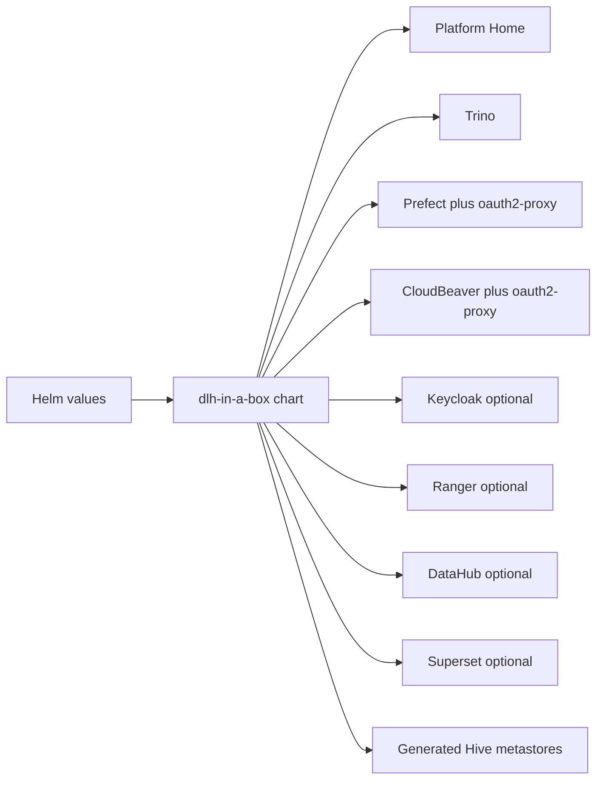

# dlh-in-a-box Chart Guide

This guide is for people who consume or maintain the `dlh-in-a-box` Helm
chart. If you need environment-specific deployment steps, use the downstream
infra repository instead.

## What This Chart Does

`dlh-in-a-box` packages a modular lakehouse platform as one Helm release. It
prefers upstream charts and keeps local logic limited to the places where the
components need to be composed together.



## Default Architecture

The default documented shared-environment model is:

- `Keycloak` issues OIDC tokens.
- `Organizational LDAP or Active Directory` supplies users and groups in every environment.
- `Active Directory over LDAPS` supplies users and groups in production.
- `Trino` authenticates with OIDC and optional file-based or LDAP password
  auth. File-based Trino access rules remain the default unless
  `global.authorization.ranger.trino.enabled=true` is set for a Ranger-capable
  Trino image.
- `Superset`, `DataHub`, and the `Prefect` proxy trust the same OIDC issuer.
- `Ranger`, `CloudBeaver`, and `Prefect` reuse that same browser session
  through chart-managed auth proxies.
- deployment-owned admin tools such as `MinIO Console`, standalone `Vault`,
  and `Headlamp` can reuse the same Keycloak realm through reusable OIDC
  client blocks owned by the umbrella chart.
- `platformHome` is the default browser entrypoint, renders grouped launch
  cards, exposes health/status information, and only hides links based on
  Keycloak group claims.
- `platformHome` also exposes an admin-only `/access-control` destination for
  LDAP-backed role assignment and governed direct-user exceptions, with Ranger
  as the live membership backend when enabled.
- `oauth2-proxy` protects Prefect, CloudBeaver, and the Ranger browser path
  because all three are front-door integrations around the same Keycloak
  session.

The chart still supports an externally managed OIDC provider, but that is the
escape hatch, not the main reference architecture.

## Start With These Docs

- Fast evaluation path:
  [../../docs/quickstart.md](../../docs/quickstart.md)
- Identity, LDAP/AD, Ranger, and Prefect access model:
  [../../docs/auth-architecture.md](../../docs/auth-architecture.md)
- Governance metadata, Ranger policy expectations, and new data source rules:
  [../../docs/data-governance.md](../../docs/data-governance.md)
- Terminology:
  [../../docs/glossary.md](../../docs/glossary.md)
- Example values files:
  [../../examples/README.md](../../examples/README.md)

## Values You Will Touch Most Often

| Values path | Why it exists |
| --- | --- |
| `global.identity` | Shared identity contract. Define the issuer, clients, directory settings, and Keycloak bootstrap secret here. |
| `global.authorization` | Ranger contract and bootstrap policy surface. |
| `global.authorization.platformRoles` | Git-managed data-access roles that map directory groups or approved direct users into Ranger roles. |
| `global.dataCatalogs` | Catalog definitions, access groups, and governance metadata. |
| `global.dataCatalogs.*.governance` | Required non-local dataset classification and approval metadata. |
| `platformHome` | Lightweight launchpad UI served by NGINX plus a small same-origin API for health aggregation and the dedicated `/access-control` admin workspace. |
| `cloudbeaver` and `cloudbeaver-auth-proxy` | CloudBeaver Community Edition plus its Keycloak-backed reverse-proxy front door. |
| `prefect.authProxy` and `prefect-auth-proxy` | Prefect front-door protection with OIDC. |
| `keycloak` | Bundled Keycloak deployment settings, including trusted CA input for LDAPS federation. |

## Governance And Policy

Every non-local catalog now needs a `governance` block. That block exists to
stop the chart from exposing a dataset before it has been classified and tied
to an approval path.

At a minimum, the chart expects:

- data classification
- whether the dataset contains direct or quasi identifiers
- IRB state
- sharing state
- PI owner and data steward
- source system
- approval reference
- retention notes

The chart can enforce approved access patterns. It cannot decide whether a
dataset should be approved in the first place. Those approvals still belong to
your institutional governance process.

## Platform Roles And Exceptions

The chart now has a first-class platform-role contract under
`global.authorization.platformRoles`.

Use it for the long-lived baseline:

- map institutional directory groups to named Ranger roles
- add direct service users when a policy genuinely needs them
- compose additive bundles with nested roles

Then point `global.authorization.ranger.bootstrapPolicies` at those roles.

If one person needs extra access temporarily, do not silently broaden the base
role. Create a short-lived exception role with approval metadata and expiry.
The bundled exception-audit CronJob can then flag or delete expired exceptions.

## Prefect Authentication

Use `oauth2-proxy` in front of Prefect and let it redirect to Keycloak. Do not
rely on Prefect OSS native login as the real security boundary.

If you want a branded login experience, customize the Keycloak theme and set
`global.identity.provider.keycloak.loginTheme`. Do not build a custom Prefect login
page.

The Keycloak login-page header text can be set separately with
`global.identity.provider.keycloak.displayName`.

## Portal And CloudBeaver

`platformHome` is the default browser entrypoint. It uses a public Keycloak
client, reads `groups` claims in the browser, and shows only the grouped app
cards the user should see after sign-in. Anonymous users only see the product
branding and a sign-in action. It does not replace downstream authorization.

Platform administrators also get a first-class portal administration
experience:

- grouped admin-tool launch cards
- a dedicated `Access Control` route backed by the same-origin admin API
- LDAP-backed discovery of users and groups, with Ranger as the live write
  target for role membership
- governed direct-user exceptions with stored metadata and expiry
- optional links to downstream admin tools such as Ranger Admin, which reuses
  the same browser session as the portal

Portal role management and Ranger policy/bootstrap remain reusable chart
features even when Trino itself stays on file-based access-control. Enable
`global.authorization.ranger.trino.enabled=true` only when the Trino image also
ships the Ranger plugin.

Git remains the source of truth for role definitions, app entitlements, and
nested role topology. When
`global.authorization.platformRoleMembershipSource=ranger`, the portal writes
live user or group membership to Ranger so those changes survive later chart
reconciliation.

When `cloudbeaver.bootstrap.sharedConnectionSeed.enabled=true` and
`cloudbeaver.app.adminCredentialsSaveEnabled=true`, the chart can also persist
managed shared datasource credentials into the seeded workspace so approved
browser users do not see a second manual Trino login prompt.

## Portal Theming And Branding

The umbrella chart owns the reusable portal behavior. Consumer repositories own
deployment-specific branding.

That split is intentional:

- keep structure, auth flow, app grouping, health rendering, and admin UX in
  this chart
- keep organization-specific titles, logos, colors, fonts, favicons, and any
  one-off visual polish in downstream values overlays

The main values surface is:

| Values path | Purpose |
| --- | --- |
| `platformHome.branding.title` | Portal title shown in the page and browser chrome. |
| `platformHome.branding.subtitle` | Optional subtitle below the title. |
| `platformHome.branding.logoUrl` | Optional logo image. |
| `platformHome.branding.logoAlt` | Accessible text for the logo. |
| `platformHome.branding.faviconUrl` | Optional favicon for browser tabs. |
| `platformHome.theme.metaThemeColor` | Browser theme color for mobile/browser UI. |
| `platformHome.theme.colors.*` | CSS custom properties for background, surface, brand, accent, and line tokens. |
| `platformHome.theme.fonts.bodyFamily` | Body font-family stack. |
| `platformHome.theme.fonts.headingFamily` | Heading font-family stack. |
| `platformHome.theme.fonts.preloads[]` | Optional preload links for remote or hosted font assets. |
| `platformHome.theme.fonts.fontFaces[]` | Optional `@font-face` declarations emitted by the template. |
| `platformHome.theme.customCss` | Small deployment-specific CSS escape hatch. |

Minimal neutral example:

```yaml
platformHome:
  enabled: true
  branding:
    title: Data Platform
    subtitle: Shared analytics environment
  theme:
    colors:
      brand: "#1f5f7a"
      accent: "#e58a18"
```

Branded example:

```yaml
platformHome:
  enabled: true
  branding:
    title: Example Institute Data Platform
    subtitle: Secure access to approved tools and services
    logoUrl: https://example.org/assets/platform-logo.svg
    logoAlt: Example Institute logo
    faviconUrl: https://example.org/assets/favicon.ico
  theme:
    metaThemeColor: "#7a1331"
    fonts:
      bodyFamily: '"Source Sans Pro", sans-serif'
      headingFamily: '"Example Serif", Georgia, serif'
      preloads:
        - href: https://example.org/assets/fonts/example-serif.woff2
          as: font
          type: font/woff2
          crossorigin: anonymous
      fontFaces:
        - family: Example Serif
          src: 'url("https://example.org/assets/fonts/example-serif.woff2") format("woff2")'
          weight: "700"
          style: normal
    colors:
      brand: "#7a1331"
      brandDeep: "#571024"
      accent: "#cf8d2e"
```

## Portal Icons And Health

Each portal item can now carry icon and health metadata through values so the
reusable chart can render a polished launchpad without hard-coding any
institution-specific assets.

Use `platformHome.itemMeta.<id>` for chart-owned items such as `superset`,
`datahub`, `prefect`, `cloudbeaver`, `trino`, `ranger-admin`, or
`keycloak-admin`, and set equivalent fields directly on
`platformHome.adminTools[]` for custom admin cards.

If the consumer repo also needs Keycloak-managed OIDC clients for external
portal-linked tools, the umbrella chart now exposes reusable client blocks for:

- `global.identity.external.clients.minio`
- `global.identity.external.clients.vault`
- `global.identity.external.clients.headlamp`

Supported fields are:

| Values path | Purpose |
| --- | --- |
| `iconUrl` | Optional image URL or hosted asset path for the card icon. |
| `iconAlt` | Accessible text for the icon image. |
| `iconBackground` | Optional background color behind the icon. |
| `iconText` | Fallback initials when no image is configured. |
| `health.targetUrl` | Endpoint checked by the same-origin portal backend. |
| `health.expectedStatusCodes[]` | Allowed HTTP codes for a healthy or degraded response. |
| `health.bodyIncludes` | Optional response-body marker for lightweight content checks. |
| `health.timeoutSeconds` | Per-probe timeout. |
| `health.public` | Whether the target is intended to be browser-public. |

When `platformHome.health.enabled=true`, the portal exposes `GET /api/health`
and renders periodic status badges such as `Healthy`, `Degraded`, `Down`, or
`Unknown` on the launch cards.

CloudBeaver is intentionally different from the browser-only apps:

- browser access goes through `oauth2-proxy` and Keycloak
- downstream repos can optionally seed a default CloudBeaver workspace and
  datasource set through `cloudbeaver.bootstrap.workspaceSeedExistingSecret`
- downstream repos can mount a database CA into a generated JVM trust store
  through `cloudbeaver.trustedCa.*` when the saved datasource should verify TLS
- the reusable chart only provides the workspace-seed contract; the actual
  datasource definitions and any development-only stored credentials live in
  consumer repos
- Ranger still decides what data the resulting Trino session may read or mask

## LDAPS And Trust Material

When the chart talks to LDAP or AD over LDAPS, use one of these trust modes:

1. provide a custom CA Secret through
   `global.identity.directory.ldap.trustedCaExistingSecret`
2. mirror that same Secret to `keycloak.trustedCertsExistingSecret`
3. or, when the directory already chains to a public CA trusted by the base
   images, set `global.identity.directory.ldap.useSystemTrustStore=true`

The chart validates that Keycloak, Trino, and Ranger all use the same trust
mode.

## Keycloak Client Secret Contract

When bundled Keycloak is enabled, the chart expects one Kubernetes Secret to
provide the config-cli environment variables consumed during realm bootstrap.

- Values path:
  `global.identity.provider.keycloak.configCliEnvExistingSecret`
- Default Secret name:
  `dlh-keycloak-config-cli-env`
- Required keys:
  `LDAP_BIND_PASSWORD`
  `KC_TRINO_CLIENT_SECRET`
  `KC_SUPERSET_CLIENT_SECRET`
  `KC_DATAHUB_CLIENT_SECRET`
  `KC_CLOUDBEAVER_CLIENT_SECRET`
  `KC_PREFECT_CLIENT_SECRET`
- Optional local/dev-only keys:
  any `passwordEnvVar` referenced by
  `global.identity.provider.keycloak.bootstrapUsers`, for example
  `KC_BOOTSTRAP_ADMIN_PASSWORD`

Only include the client secret keys for the clients you actually enable, but
the secret name itself is now part of the supported contract.

## Example Overlays

- `examples/values-dev.yaml`
  Bundled Keycloak + external LDAP/AD + Ranger development pattern with the
  portal and CloudBeaver enabled.
- `examples/values-prod.yaml`
  Bundled Keycloak + external LDAPS + Ranger production-shaped pattern with the
  portal and CloudBeaver enabled.
- `examples/values-shared-auth.yaml`
  External OIDC escape hatch with CloudBeaver still behind `oauth2-proxy`.

## Reference-Only Material

The vendored upstream Trino chart and other dependency archives under
`charts/dlh-in-a-box/charts/` are reference-only. They are useful when you
need to inspect upstream behavior, but the primary chart API is documented in
this guide and the docs linked above.

## Validation

Validate from the repository root:

```bash
./hack/helm-dependency-update.sh
./hack/lint.sh
./hack/template.sh
```

For a rendered local install proof point, use:

```bash
make smoke-install
```
