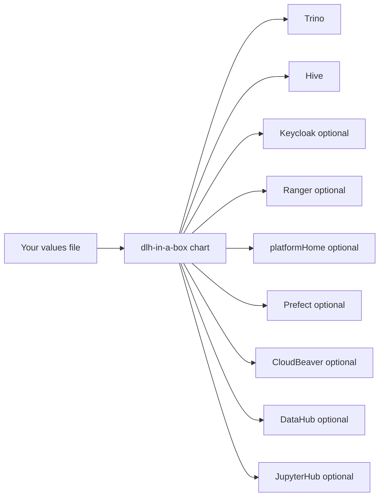

# dlh-in-a-box Chart Guide

This is the main guide for the chart itself.

If you only read one file before trying to use the chart, read this one.

## What This Chart Does

This chart installs a group of data-platform tools together.

You can think of it as one install package that can turn on some or all of
these:

- Trino for SQL queries
- Hive Metastore for table metadata
- Keycloak for login
- Ranger for access rules
- Prefect for workflows
- CloudBeaver for browser SQL
- DataHub for metadata
- JupyterHub for notebooks
- Vault for secrets
- MinIO for object storage



You do not need every component turned on.

## Supported Identity Modes

There are two main ways to handle users:

| Mode | Simple meaning |
| --- | --- |
| `externalLdap` | Keycloak handles login, but users and groups come from LDAP or Active Directory |
| `keycloakLocal` | Keycloak stores the users itself |

## Default Architecture

The shared development and production examples in this repository use this
general model:

- Keycloak handles browser login
- users and groups come from LDAP or Active Directory
- Ranger stores access rules and role information
- `platformHome` is the optional browser home page
- Prefect and CloudBeaver sit behind auth proxies

One important detail:

Trino does not automatically use the Ranger plugin just because Ranger is
enabled elsewhere in the chart. Trino only switches to that plugin when
`global.authorization.ranger.trino.enabled=true` and the Trino image supports
that plugin.

The auth-enabled local example uses the simpler `keycloakLocal` mode instead.

## Start With These Docs

- repo overview:
  [../../README.md](../../README.md)
- quickstart:
  [../../docs/quickstart.md](../../docs/quickstart.md)
- glossary:
  [../../docs/glossary.md](../../docs/glossary.md)
- auth guide:
  [../../docs/auth-architecture.md](../../docs/auth-architecture.md)
- data governance guide:
  [../../docs/data-governance.md](../../docs/data-governance.md)
- example values files:
  [../../examples/README.md](../../examples/README.md)

## Choose An Install Path

| Path | Use this when |
| --- | --- |
| `examples/values-local.yaml` | You want the easiest local install |
| `make smoke-install` with `examples/values-local-auth.yaml` | You want the local auth-enabled test install |
| `examples/values-dev.yaml` | You want the main shared development example |
| `examples/values-prod.yaml` | You want the main production-shaped example |
| `examples/values-shared-auth.yaml` | You use an external OIDC provider instead of bundled Keycloak |

## Values You Will Touch Most Often

If you are new, these are the main values areas to know:

| Values path | Simple meaning |
| --- | --- |
| `global.identity` | Login settings |
| `global.authorization` | Access and role settings |
| `global.dataCatalogs` | Data source definitions |
| `platformHome` | Browser home page settings |
| `cloudbeaver` | CloudBeaver settings |
| `prefect` | Prefect settings |
| `jupyterhub` | JupyterHub settings |
| `keycloak` | Keycloak deployment settings |

## Governance And Policy

For non-local datasets, the chart expects extra metadata that explains what the
data is and why it is allowed on the platform.

In simple terms, the chart wants to know:

- what kind of data this is
- how sensitive it is
- whether it contains identifying information
- who owns it
- what approval record allows it to be used

The chart can check that this information exists.

The chart cannot decide whether your organization should approve the dataset in
the first place.

## Platform Roles And Exceptions

The chart uses platform roles as the normal long-term access model.

In plain language, a platform role is a named bundle of access.

Use platform roles for:

- normal team access
- normal app access
- normal long-term permissions

If one person needs extra access for a short time, use an exception role
instead of changing the normal role for everyone.

## Browser Apps And Access Paths

The chart can expose browser apps such as:

- `platformHome`
- `Prefect`
- `CloudBeaver`
- `JupyterHub`

These can share the same sign-in story.

For CloudBeaver, remember:

- browser sign-in goes through the auth proxy
- the saved datasource can be pre-created by admins
- that datasource may use a shared service account

For Prefect, the recommended pattern is to keep the auth proxy in front of it.

## Keycloak Local Users Mode

Use `keycloakLocal` when you want Keycloak to store users itself.

That usually means:

- no LDAP connection
- no Ranger usersync
- a more self-contained setup

The main example for that mode in this repository is:

- [`../../examples/values-local-auth.yaml`](../../examples/values-local-auth.yaml)

## Portal Branding, Icons, And Health

`platformHome` is the optional browser home page.

The most common settings are:

| Values path | Simple meaning |
| --- | --- |
| `platformHome.branding.title` | Main title on the page |
| `platformHome.branding.subtitle` | Smaller text under the title |
| `platformHome.branding.logoUrl` | Logo image |
| `platformHome.branding.faviconUrl` | Browser tab icon |
| `platformHome.theme.*` | Colors and fonts |
| `platformHome.health.enabled` | Turn on built-in health checks for the UI |

## CloudBeaver Seeded Datasources And Trust Material

CloudBeaver can be set up so admins pre-create the connection information for
users.

The most important settings are:

| Values path | Simple meaning |
| --- | --- |
| `cloudbeaver.bootstrap.workspaceSeedExistingSecret` | Secret with saved connection data |
| `cloudbeaver.trustedCa.*` | TLS trust settings for secure database connections |

## LDAPS And Trust Material

If you use secure LDAP, the chart needs certificate trust settings so services
know which LDAP certificate to trust.

Main values:

- `global.identity.directory.ldap.trustedCaExistingSecret`
- `keycloak.trustedCertsExistingSecret`

## Keycloak Client Secret Contract

When Keycloak creates OIDC clients, it reads secret values from one Kubernetes
Secret.

The main setting is:

- `global.identity.provider.keycloak.configCliEnvExistingSecret`

Default name:

- `dlh-keycloak-config-cli-env`

## Example Overlays

- `examples/values-local.yaml`
  simplest local install
- `examples/values-local-auth.yaml`
  local install with login and access pieces turned on
- `examples/values-dev.yaml`
  shared development example
- `examples/values-prod.yaml`
  shared production-shaped example
- `examples/values-shared-auth.yaml`
  shared example using an external OIDC provider

## Reference-Only Material

Some docs under `charts/dlh-in-a-box/charts/` come from upstream projects.

Those are reference docs, not the main starting point for this chart.

## Validation

From the repository root:

```bash
./hack/helm-dependency-update.sh
SKIP_MERMAID_CHECK=1 ./hack/docs-check.sh
./hack/lint.sh
./hack/template.sh
./hack/package.sh
make smoke-install
```
