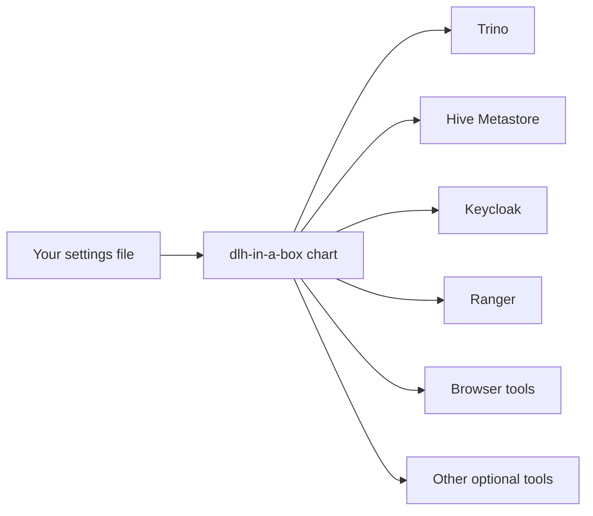

# dlh-in-a-box Chart Guide

This folder contains the Helm chart that this repo publishes.

## What This Chart Does

This chart installs a small data platform as one Helm release.

In plain language, it is one install package that can turn on several tools at
once.



Main tools this chart can install:

| Tool | Plain meaning |
| --- | --- |
| `Trino` | The SQL engine |
| `Hive Metastore` | The place where table metadata is stored |
| `Keycloak` | The sign-in system |
| `Ranger` | The access-rule system |
| `Prefect` | The workflow UI and workers |
| `CloudBeaver` | Browser SQL |
| `DataHub` | Metadata and discovery |
| `JupyterHub` | Notebooks |
| `MinIO` | Object storage |
| `Vault` | Optional secrets tooling |

## Sign-In Options

This chart has two main ways to handle sign-in:

| Mode | Plain meaning |
| --- | --- |
| `externalLdap` | Keycloak handles browser sign-in, but the real user list still comes from a company or lab directory service. This is the shared development and production model in this repo. |
| `keycloakLocal` | Keycloak stores users itself. This is the local auth model used by `examples/values-local-auth.yaml`. |

## Default Architecture

For the shared development and production examples, the normal model is:

- Keycloak handles browser sign-in.
- A company or lab directory service supplies users and groups.
- Ranger stores access rules.
- `platformHome` can act as a simple landing page.
- Prefect and CloudBeaver can sit behind the same browser sign-in.
- Trino is the main SQL engine.

The local auth example uses `keycloakLocal` instead.

One important detail:

Trino does not automatically use the Ranger plugin just because Ranger is
enabled elsewhere in the chart. Trino only switches to that plugin when
`global.authorization.ranger.trino.enabled=true` and the Trino image supports
that plugin.

## What Is In This Folder

| File or folder | Plain meaning |
| --- | --- |
| `Chart.yaml` | Chart metadata and dependency list |
| `values.yaml` | Default settings |
| `values.schema.json` | The file that says which settings are allowed |
| `templates/` | Render files that turn settings into Kubernetes YAML |
| `files/` | Extra files copied into rendered objects |
| `charts/` | Local subcharts, vendored chart source, and packaged dependency archives |
| `third_party/` | License and notice files that must ship with the chart |

## Choose An Install Path

| Path | Plain meaning | Use this when |
| --- | --- | --- |
| `examples/values-local.yaml` | Simplest local install | You want the easiest manual first install. |
| `make smoke-install` with `examples/values-local-auth.yaml` | Auth-heavy smoke test | You want a local path that also exercises sign-in, browser proxies, and Ranger. |
| `examples/values-dev.yaml` | Shared development example | You want the main shared development baseline. |
| `examples/values-prod.yaml` | Production-shaped example | You want the main shared production baseline. |
| `examples/values-shared-auth.yaml` | Shared example with an external sign-in provider | You already have an external sign-in provider and do not want bundled Keycloak. |

## Values You Will Touch Most Often

| Values path | Plain meaning |
| --- | --- |
| `global.identity` | Sign-in settings |
| `global.authorization` | Access and role settings |
| `global.dataCatalogs` | Data source definitions |
| `platformHome` | Browser home page settings |
| `cloudbeaver` | CloudBeaver settings |
| `prefect` | Prefect settings |
| `jupyterhub` | JupyterHub settings |
| `keycloak` | Bundled Keycloak deployment settings |

## Governance And Policy

For shared development and production environments, the chart expects extra
data-approval details for non-local datasets.

In simple terms, it wants to know:

- what kind of data this is
- how sensitive it is
- whether it contains identifying information
- who owns it
- who looks after it
- which approval record allows it to be used

The chart can check that those fields exist and that the access rules are not
obviously unsafe.

The chart cannot decide whether your organization should approve a dataset in
the first place.

## Access Model

This chart has something called a platform role.

In plain language, it is a named bundle of access.

Use these named access bundles for:

- normal team access
- normal app access
- normal long-term permissions

If one person needs extra access for a short time, use an exception role
instead of changing the normal role for everyone.

## Browser Tools

The chart can expose browser apps such as:

- `platformHome`
- `Prefect`
- `CloudBeaver`
- `JupyterHub`

These can share the same sign-in story.

For CloudBeaver, remember:

- browser sign-in goes through the auth proxy
- admins can pre-make the saved database connection
- that saved connection may use a shared service account

For Prefect, the normal pattern is to keep the auth proxy in front of it.

## Common Extra Settings

| Setting | Plain meaning |
| --- | --- |
| `platformHome.branding.*` | Text, logo, and look of the home page |
| `cloudbeaver.bootstrap.workspaceSeedExistingSecret` | Pre-made CloudBeaver connection details |
| `global.identity.directory.ldap.trustedCaExistingSecret` | The certificate trust Secret for a secure directory connection |
| `keycloak.trustedCertsExistingSecret` | The certificate trust Secret for Keycloak when it talks to a secure directory |
| `global.identity.provider.keycloak.configCliEnvExistingSecret` | The Secret Keycloak reads when it creates app clients |

## Reference-Only Material

Some parts of `charts/` come from upstream projects.

Treat those as reference material. The local guide files around them explain
how this repo uses them.

## Validation

From the repository root:

```bash
./hack/helm-dependency-update.sh
SKIP_MERMAID_CHECK=1 ./hack/docs-check.sh
./hack/lint.sh
./hack/template.sh
./hack/package.sh
make smoke-install
```

`make smoke-install` is the normal way to exercise
`examples/values-local-auth.yaml`, because the smoke script seeds the demo
Secrets that file expects.

## When You Can Ignore This Folder

If you are only reading a published chart package, you may never open this
folder.

If you are working from source, this is the main chart folder and you should
not ignore it.

## Common Mistakes

- assuming Ranger automatically controls Trino just because Ranger is enabled
- using `examples/values-local-auth.yaml` in a manual install without the demo
  Secrets it expects
- treating shared development or production examples as if they were
  self-contained local demos
