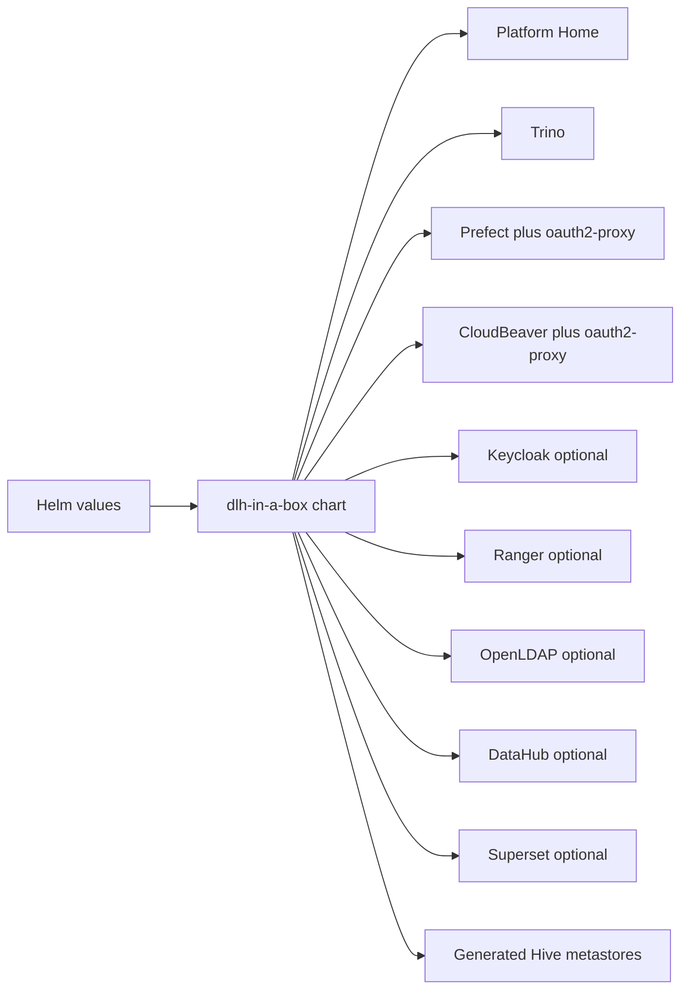

# dlh-in-a-box Chart Guide

This guide is for people who consume or maintain the `dlh-in-a-box` Helm
chart. If you need environment-specific deployment steps, use the downstream
infra repository instead.

## What This Chart Does

`dlh-in-a-box` packages a modular lakehouse platform as one Helm release. It
prefers upstream charts and keeps local logic limited to the places where the
components need to be composed together.



## Default Architecture

The default documented shared-environment model is:

- `Keycloak` issues OIDC tokens.
- `LDAP/OpenLDAP` supplies users and groups in development.
- `Active Directory over LDAPS` supplies users and groups in production.
- `Trino` authenticates with OIDC and optional LDAP password auth, and
  authorizes with `Ranger`.
- `Superset`, `DataHub`, and the `Prefect` proxy trust the same OIDC issuer.
- `platformHome` is the default browser entrypoint and only hides links based
  on Keycloak group claims.
- `oauth2-proxy` protects Prefect and CloudBeaver because both tools are
  front-door integrations around the same Keycloak session.

The chart still supports an externally managed OIDC provider, but that is the
escape hatch, not the main reference architecture.

## Start With These Docs

- Fast evaluation path:
  [../../docs/quickstart.md](../../docs/quickstart.md)
- Identity, LDAP/AD, Ranger, and Prefect access model:
  [../../docs/auth-architecture.md](../../docs/auth-architecture.md)
- Governance metadata, Ranger policy expectations, and new data source rules:
  [../../docs/data-governance.md](../../docs/data-governance.md)
- Terminology:
  [../../docs/glossary.md](../../docs/glossary.md)
- Example values files:
  [../../examples/README.md](../../examples/README.md)

## Values You Will Touch Most Often

| Values path | Why it exists |
| --- | --- |
| `global.identity` | Shared identity contract. Define the issuer, clients, directory settings, and Keycloak bootstrap secret here. |
| `global.authorization` | Ranger contract and bootstrap policy surface. |
| `global.authorization.platformRoles` | Git-managed data-access roles that map directory groups or approved direct users into Ranger roles. |
| `global.dataCatalogs` | Catalog definitions, access groups, and governance metadata. |
| `global.dataCatalogs.*.governance` | Required non-local dataset classification and approval metadata. |
| `platformHome` | Lightweight launchpad UI served by NGINX. |
| `cloudbeaver` and `cloudbeaver-auth-proxy` | CloudBeaver Community Edition plus its Keycloak-backed reverse-proxy front door. |
| `prefect.authProxy` and `prefect-auth-proxy` | Prefect front-door protection with OIDC. |
| `keycloak` | Bundled Keycloak deployment settings, including trusted CA input for LDAPS federation. |
| `openldap` | Bundled OpenLDAP settings for development or demo environments. |

## Governance And Policy

Every non-local catalog now needs a `governance` block. That block exists to
stop the chart from exposing a dataset before it has been classified and tied
to an approval path.

At a minimum, the chart expects:

- data classification
- whether the dataset contains direct or quasi identifiers
- IRB state
- sharing state
- PI owner and data steward
- source system
- approval reference
- retention notes

The chart can enforce approved access patterns. It cannot decide whether a
dataset should be approved in the first place. Those approvals still belong to
your institutional governance process.

## Platform Roles And Exceptions

The chart now has a first-class platform-role contract under
`global.authorization.platformRoles`.

Use it for the long-lived baseline:

- map institutional directory groups to named Ranger roles
- add direct service users when a policy genuinely needs them
- compose additive bundles with nested roles

Then point `global.authorization.ranger.bootstrapPolicies` at those roles.

If one person needs extra access temporarily, do not silently broaden the base
role. Create a short-lived exception role with approval metadata and expiry.
The bundled exception-audit CronJob can then flag or delete expired exceptions.

## Prefect Authentication

Use `oauth2-proxy` in front of Prefect and let it redirect to Keycloak. Do not
rely on Prefect OSS native login as the real security boundary.

If you want a branded login experience, customize the Keycloak theme and set
`global.identity.provider.keycloak.loginTheme`. Do not build a custom Prefect login
page.

## Portal And CloudBeaver

`platformHome` is the default browser entrypoint. It uses a public Keycloak
client, reads `groups` claims in the browser, and shows only the cards the user
should see. It does not replace downstream authorization.

Platform administrators also get an Access Admin section in the portal. That
section is read-only and shows:

- the Git-managed platform roles
- the directory groups mapped into them
- app entitlements per role
- any Git-declared direct-user exceptions

If `global.authorization.ranger.admin.browserUrl` is set, the portal also
links to Ranger Admin as the writable UI for short-lived data-access
exceptions.

CloudBeaver is intentionally different from the browser-only apps:

- browser access goes through `oauth2-proxy` and Keycloak
- SQL execution still uses the user’s LDAP or AD username and password when
  connecting to Trino
- Ranger still decides what data the resulting Trino session may read or mask

## LDAPS And Trust Material

When the chart talks to LDAP or AD over LDAPS, three things need to agree:

1. `global.identity.directory.ldap.trustedCaExistingSecret`
2. `keycloak.trustedCertsExistingSecret`
3. the secret mounted for Trino and Ranger usersync

The chart validates that alignment so Keycloak, Trino, and Ranger trust the
same CA chain.

## Keycloak Client Secret Contract

When bundled Keycloak is enabled, the chart expects one Kubernetes Secret to
provide the config-cli environment variables consumed during realm bootstrap.

- Values path:
  `global.identity.provider.keycloak.configCliEnvExistingSecret`
- Default Secret name:
  `dlh-keycloak-config-cli-env`
- Required keys:
  `LDAP_BIND_PASSWORD`
  `KC_TRINO_CLIENT_SECRET`
  `KC_SUPERSET_CLIENT_SECRET`
  `KC_DATAHUB_CLIENT_SECRET`
  `KC_CLOUDBEAVER_CLIENT_SECRET`
  `KC_PREFECT_CLIENT_SECRET`

Only include the client secret keys for the clients you actually enable, but
the secret name itself is now part of the supported contract.

## Example Overlays

- `examples/values-dev.yaml`
  Bundled Keycloak + OpenLDAP + Ranger development pattern with the portal and
  CloudBeaver enabled.
- `examples/values-prod.yaml`
  Bundled Keycloak + external LDAPS + Ranger production-shaped pattern with the
  portal and CloudBeaver enabled.
- `examples/values-shared-auth.yaml`
  External OIDC escape hatch with CloudBeaver still behind `oauth2-proxy`.

## Reference-Only Material

The vendored upstream Trino chart and other dependency archives under
`charts/dlh-in-a-box/charts/` are reference-only. They are useful when you
need to inspect upstream behavior, but the primary chart API is documented in
this guide and the docs linked above.

## Validation

Validate from the repository root:

```bash
./hack/helm-dependency-update.sh
./hack/lint.sh
./hack/template.sh
```

For a rendered local install proof point, use:

```bash
make smoke-install
```
