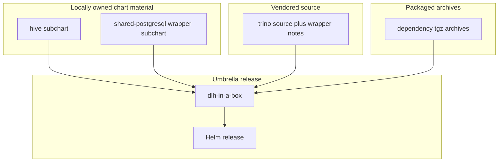

# Subcharts And Dependency Bundles

This folder contains three very different kinds of chart material:

- local subcharts written in this repo
- vendored chart source copied from upstream
- packaged dependency archives

Understanding that split is the main job of this guide.

## Who Should Read This

| Reader | Why this guide matters |
| --- | --- |
| contributor | to know what is safe to edit directly |
| maintainer | to understand dependency refresh output |
| reviewer | to spot accidental edits to vendored or packaged material |



## What Lives In This Folder

| Path or file | Ownership | What it is for |
| --- | --- | --- |
| `hive/` | repo-owned | local Hive subchart |
| `shared-postgresql/` | repo-owned | local wrapper subchart that lets `sharedPostgresql.bundled.*` reach a nested Bitnami PostgreSQL dependency (aliased `bundled`); see `shared-postgresql/README.md` |
| `trino/` | mostly upstream with local notes | vendored Trino chart source and patch points |
| `datahub-0.8.21.tgz` | generated dependency archive | packaged DataHub chart |
| `datahub-prerequisites-0.2.3.tgz` | generated dependency archive | packaged DataHub prerequisites chart |
| `hive-0.1.0.tgz` | generated dependency archive | packaged local Hive subchart |
| `jupyterhub-4.3.3.tgz` | generated dependency archive | packaged JupyterHub dependency |
| `keycloak-25.2.0.tgz` | generated dependency archive | packaged Keycloak dependency |
| `minio-15.0.7.tgz` | generated dependency archive | packaged MinIO dependency |
| `oauth2-proxy-10.1.4.tgz` | generated dependency archive | packaged oauth2-proxy dependency |
| `postgresql-14.3.3.tgz` | generated dependency archive | packaged PostgreSQL dependency used by multiple aliases |
| `prefect-server-2026.6.1154549.tgz` | generated dependency archive | packaged Prefect server dependency |
| `prefect-worker-2026.6.1154549.tgz` | generated dependency archive | packaged Prefect worker dependency |
| `shared-postgresql-0.1.0.tgz` | generated dependency archive | packaged local shared-postgresql wrapper subchart |
| `spark-operator-2.4.0.tgz` | generated dependency archive | packaged Spark Operator dependency |
| `superset-0.15.2.tgz` | generated dependency archive | packaged Superset dependency |
| `trino-1.41.0.tgz` | generated dependency archive | packaged Trino dependency |
| `vault-0.32.0.tgz` | generated dependency archive | packaged Vault dependency |

## How To Think About Each Material Class

### `hive/`

This is locally owned by this repo.

Changes here are normal when:

- Hive behavior is repo-specific
- catalog-to-Hive generation needs to change
- secret or schema-init behavior needs to change

### `trino/`

This folder is different.

Most of it is vendored upstream Trino chart source. The repo-specific guidance
is carried by:

- `trino/OVERVIEW.md`
- `trino/templates/_README.txt`

Edit the vendored Trino source only when you are sure the change belongs to the
local patch set.

### `*.tgz` archives

These files are generated outputs of the dependency refresh flow, but they are
committed because the umbrella chart packages them.

You normally do not edit them manually.

They move when:

- `Chart.yaml` dependency versions change
- `helm-dependency-update.sh` is run

## How Dependency Refresh Shows Up Here

`./hack/helm-dependency-update.sh` repopulates this folder's packaged archives.

That means a dependency update is not complete until this folder reflects the
new archives that match `Chart.lock`.

## Common Tasks

If you need to:

- change local Hive behavior: edit `hive/`
- understand local Trino patch points: read `trino/OVERVIEW.md`
- review dependency refresh output: inspect the `.tgz` files here alongside
  `Chart.lock`

## Validation

After changing anything related to this folder:

```bash
./scripts/helm-dependency-update.sh
./scripts/license-check.sh
./scripts/verify.sh
./scripts/package.sh
```

## Common Mistakes

- editing packaged `.tgz` files directly
- assuming all files under `trino/` are locally owned
- forgetting that one PostgreSQL archive can back multiple alias dependencies

## When You Can Ignore This Folder

You can ignore this folder unless you are working on chart internals or chart
dependencies.
