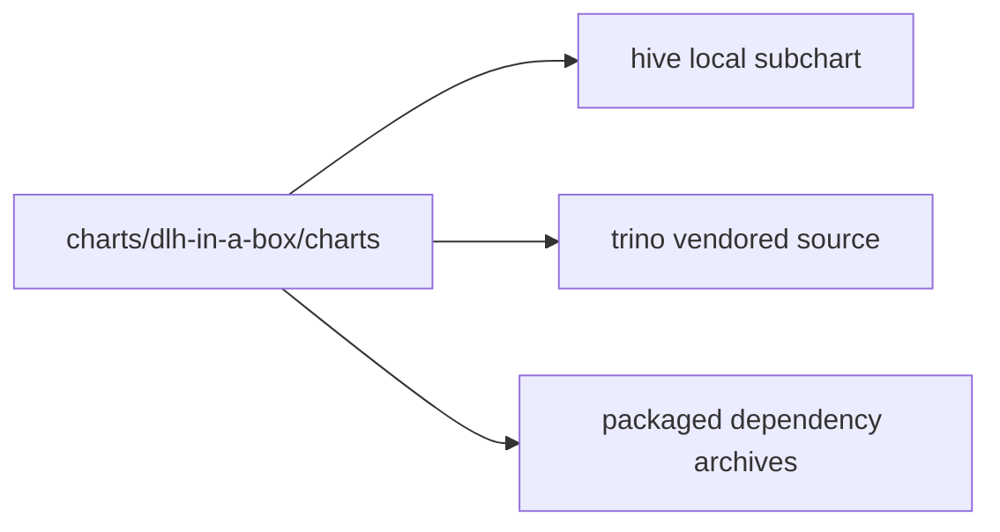

# Subcharts And Vendored Dependencies

This directory is where the umbrella chart meets its local subcharts and
vendored dependency material.

It is not the main onboarding path for chart consumers. Use the parent
[../README.md](../README.md) first unless you are working on chart internals.

## Ownership model

## Inventory

| Path or pattern | Role |
| --- | --- |
| `hive/` | Local subchart that generates one Hive metastore per catalog |
| `trino/` | Vendored upstream Trino chart source with a small local patch set |
| `*.tgz` | Packaged dependency archives refreshed by `helm dependency update` |

## Child guides

| Path | Guide | Purpose |
| --- | --- | --- |
| `hive/` | [hive/README.md](hive/README.md) | Local Hive subchart behavior |
| `trino/` | [trino/README.md](trino/README.md) | Upstream Trino chart README kept as reference material |
| `trino/templates/` | [trino/templates/_README.txt](trino/templates/_README.txt) | Local patch points inside the vendored Trino source |

## Maintainer note

- The Hive chart is locally owned and documented in this repository.
- The Trino chart README is upstream reference material; prefer updating the
  local wrapper docs around it instead of rewriting the vendored README.
- The packaged archives in this directory are part of the reproducible release
  inputs.
