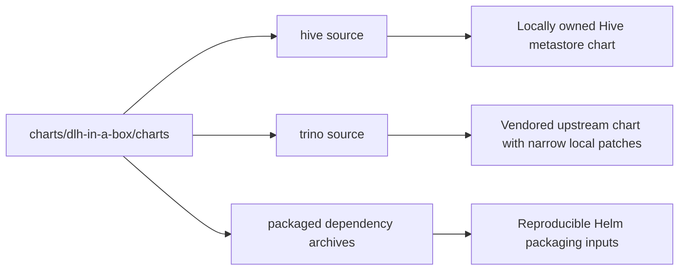

# Subcharts and Vendored Dependencies

This directory is where the umbrella chart meets its local and vendored
dependencies.

## Ownership model

## Inventory

| Path or pattern | Role |
| --- | --- |
| `hive/` | Local subchart that provisions one metastore deployment per catalog |
| `trino/` | Vendored upstream Trino chart source with targeted local modifications |
| `*.tgz` | Packaged chart dependencies used by Helm packaging and release validation |

## Child guides

| Path | Guide | Purpose |
| --- | --- | --- |
| `hive/` | [hive/README.md](hive/README.md) | Local Hive subchart architecture and template ownership |
| `trino/` | [trino/README.md](trino/README.md) | Vendored upstream Trino chart documentation |
| `trino/templates/` | [trino/templates/_README.txt](trino/templates/_README.txt) | Local Trino patch points |

## Maintainer note

- `helm dependency update` refreshes the packaged archives in this directory.
- The local Hive chart is authored here and then packaged back into this
  directory as `hive-<version>.tgz`.
- The vendored Trino source exists so the umbrella chart can own a very small
  patch set without forking the entire platform design away from upstream.
