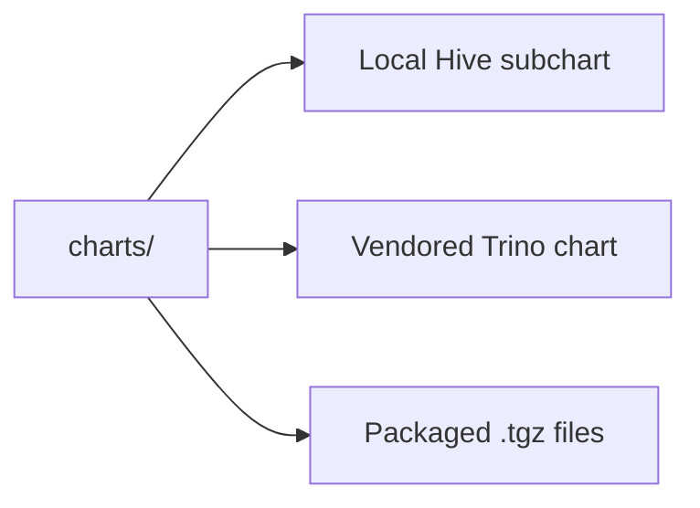

# Subcharts And Dependency Bundles

This folder contains:

- local subcharts written in this repo
- vendored chart source copied from upstream
- packaged dependency archives

## What is in this folder

| Path or pattern | Plain meaning |
| --- | --- |
| `hive/` | Local Hive subchart owned by this repo |
| `trino/` | Vendored upstream Trino chart source plus local wrapper notes |
| `*.tgz` | Packaged dependency archives used for reproducible builds |

## When you can ignore this folder

You can ignore this folder unless you are working on chart internals or chart
dependencies.

## Common mistake

Not everything here is locally owned. The Hive subchart is local. The Trino
chart source is mostly upstream and should be treated more carefully.
