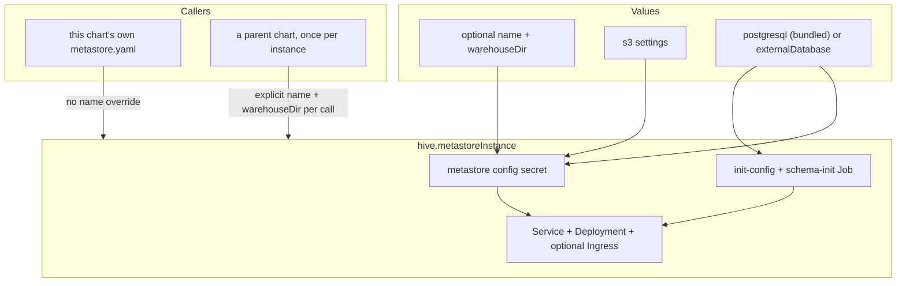

# Hive Subchart

This folder contains a self-contained Hive Metastore chart. It has no notion
of "catalogs," "data lakes," or anything else specific to the umbrella chart
it happens to live inside — it knows how to run one Hive Metastore, backed by
one PostgreSQL database and one object-store location, connected to whatever
Postgres and S3-compatible endpoints its values point at.

## What This Subchart Does

By default, installing this chart produces exactly one Hive Metastore:
a Service, a Deployment, a metastore configuration Secret, a schema-init Job,
and an optional Ingress — all plainly named off the release, with no suffix.

It is responsible for:

- deploying the metastore itself, and optionally a bundled PostgreSQL
  instance to back it
- wiring PostgreSQL and S3 credentials into Hive's `core-site.xml` /
  `metastore-site.xml`
- initializing (or upgrading) the metastore schema
- creating the Service and optional Ingress

A parent chart that needs *several* independently-named metastores (for
example, one per data catalog) composes them itself by calling this chart's
`hive.metastoreInstance` template once per name — see
[Composing Multiple Instances](#composing-multiple-instances) below. This
chart's own default rendering and a parent's composed rendering are mutually
exclusive: set `metastore.enabled: false` when something else is doing the
composing.



## Files In This Folder

| Path | What it is for |
| --- | --- |
| `Chart.yaml` | chart metadata, and its own PostgreSQL dependency (see below) |
| `values.yaml` | default settings for this chart's own single metastore (see below) |
| `templates/_metastore.tpl` | the `hive.metastoreInstance` template — all metastore render logic, see [How The Subchart Works](#how-the-subchart-works) |
| `templates/metastore.yaml` | calls `hive.metastoreInstance` with no name, for this chart's own default rendering |
| `templates/init-config.yaml`, `postgres-secret.yaml`, `s3-secret.yaml` | chart-wide (not per-instance) supporting resources |
| `templates/_helpers.tpl` | naming, secret-resolution, and shared init-container helpers |

This chart declares its own dependency on the Bitnami `postgresql` chart
(for the bundled-instance case below) — it is a fully independent chart, not
one that relies on anything from its parent beyond ordinary Helm `global.*`
values (currently just `global.domain`, for Ingress hosts).

`values.yaml` is intentionally small. It defines:

- `metastore.enabled` — whether this chart's own default single instance
  renders (set `false` when a parent is composing instances itself)
- image locations for the metastore and schema-init containers (default
  `docker.io/apache/hive:4.2.0`)
- the JDBC driver download URL (`jdbcDriver.url`), defaulting to the
  PostgreSQL JDBC driver
- `postgresql.*` (bundled instance) and `externalDatabase.*` (external
  connection) — see [PostgreSQL wiring](#postgresql-wiring)
- `s3.*` and `warehouseDir` — see [Storage wiring](#storage-wiring)
- `database` — the database name used by this chart's own default instance
- `ingress.*`

## How The Subchart Works

### One template renders one metastore instance

`templates/_metastore.tpl` defines `hive.metastoreInstance`, called as:

```
{{- include "hive.metastoreInstance" (dict "context" $ "name" "<optional>" "warehouseDir" "<optional>") -}}
```

- `context` — the root template context scoped to this chart's own
  `Values`/`Release`/`Chart`. From this chart's own templates that's just
  `$`. A parent chart composing several instances passes
  `.Subcharts.hive` instead, so the macro sees this chart's own resolved
  values exactly as if it were rendering from inside this chart.
- `name` — optional. If given, it becomes the Postgres database name and is
  woven into every resource name. If omitted, the database name falls back
  to `.Values.database` and resources get no name suffix at all.
- `warehouseDir` — optional. If given, it's used verbatim as
  `metastore.warehouse.dir`. If omitted, falls back to `.Values.warehouseDir`.

`templates/metastore.yaml` — the only template this chart renders on its
own — calls this with no overrides, gated on `metastore.enabled` (default
`true`). That's what makes `helm install myhive ./hive` work out of the box:
one metastore, plainly named, backed by `.Values.database` and
`.Values.warehouseDir`.

### Composing multiple instances

A parent chart that wants several named metastores loops over its own data
and calls the same macro once per name, via `.Subcharts.hive`:

```
{{- range $name, $spec := .Values.something -}}
{{ include "hive.metastoreInstance" (dict "context" $.Subcharts.hive "name" $name "warehouseDir" $spec.warehouseDir) }}
{{- end -}}
```

When composing this way, set `hive.metastore.enabled: false` so this chart's
own default single instance doesn't also render alongside the composed ones.

### Storage wiring

Hive needs object-store credentials and endpoint information, from:

- `s3.endpoint`
- `s3.accessKey` and `s3.secretKey`, unless `s3.existingSecret` is supplied
- `warehouseDir` (or the per-call override, if a parent is composing)

These become `core-site.xml` and `metastore-site.xml` entries so Hive can
talk to MinIO or any S3-compatible backend.

### PostgreSQL wiring

Hive Metastore state is stored in PostgreSQL, in one of two ways:

- **`postgresql.enabled: true`** (default) — this chart deploys its own
  bundled PostgreSQL instance (a declared dependency on the Bitnami
  `postgresql` chart). Hive connects as that instance's superuser
  (`postgres`), which is why it's also able to self-create its own database
  in the schema-init Job — appropriate here because this chart owns the
  entire instance, not a role scoped on a Postgres instance shared with
  other applications.
- **`postgresql.enabled: false`** — Hive connects to `externalDatabase.*`
  instead: `host`, `port`, `user`, and either `password` or
  `existingSecret`. Whoever manages that Postgres instance (an external
  cluster's own admin, or another chart's provisioning job) is responsible
  for the database existing; this chart never creates it in that case.

### Schema initialization lifecycle

Schema initialization and upgrades are handled by a regular Kubernetes Job,
rendered by the same `hive.metastoreInstance` template. The metastore
Deployment waits for the schema to be ready using an init container, but
never creates or modifies the schema itself.

**Schema Job** (`schemainit.job.enabled=true`, default) runs init containers
in order:

1. `wait-for-postgres` — polls `pg_isready` until PostgreSQL accepts connections
2. `download-jdbc` — fetches the PostgreSQL JDBC driver
3. `create-db` (only when `postgresql.enabled=true`) — creates this
   instance's database if it does not already exist

The Job's main container then runs `schematool -upgradeSchema`, falling back
to `schematool -initSchema` if no schema exists yet.

The Job name includes the Hive image tag, so bumping the image version
creates a new Job on the next `helm upgrade`, which triggers a schema
upgrade automatically.

**Metastore Deployment** init containers:

1. `wait-for-postgres` — polls `pg_isready`
2. `download-jdbc` — fetches the PostgreSQL JDBC driver
3. `wait-for-schema` — loops on `schematool -info` until the schema exists
   and is at the expected version

The metastore pod will not start until `schematool -info` succeeds. On
restart, this check passes immediately because the schema already exists.
There are no Helm hooks and no ordering concerns — Kubernetes retry handles
the wait naturally.

The JDBC init container and volume definitions are shared via named
templates in `_helpers.tpl`. If the driver URL or mount path changes, update
it there — every call site (the schema Job and the metastore Deployment)
uses the same helper.

## Common Tasks

If you need to:

- change how metastore config is generated, schema-init behaves, or
  Service/Deployment/Ingress shape: edit `templates/_metastore.tpl`
- change the JDBC driver URL or postgres-wait image: edit
  `templates/_helpers.tpl`
- change how generated secrets work: edit `templates/postgres-secret.yaml`
  or `templates/s3-secret.yaml`
- change the bundled PostgreSQL dependency's version: edit `Chart.yaml`'s
  `dependencies` entry

## Validation

After changing anything here, run:

```commandline
make verify
```

Use `helm template` output to confirm the expected metastore Service(s) and
Deployment(s) are rendered — for this chart alone (one instance), and for
any parent chart composing several.

## Common Mistakes

- leaving `metastore.enabled: true` (the default) while something else is
  also composing instances via `hive.metastoreInstance` — this renders an
  extra, unwanted default instance alongside the composed ones