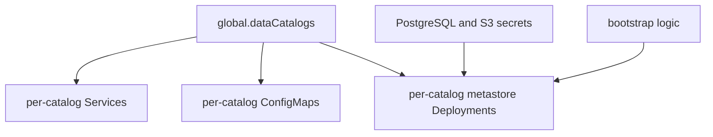

# Hive Subchart

This is the locally owned Hive metastore subchart used by `dlh-in-a-box`.

It exists because the umbrella chart needs behavior that is specific to this
project: one metastore per catalog, schema bootstrap, and storage wiring that
comes from the umbrella values model.

## How it works

## Chart responsibilities

| Area | Responsibility |
| --- | --- |
| Catalog expansion | Turn `global.dataCatalogs` into per-catalog Hive resources |
| Database bootstrap | Prepare PostgreSQL connection inputs for each metastore |
| Schema bootstrap | Run Hive schema initialization when configured |
| Storage wiring | Inject S3 or MinIO settings into metastore config |
| Optional ingress | Expose metastore services when enabled |

## Files

| File | Purpose |
| --- | --- |
| `Chart.yaml` | Subchart metadata |
| `values.yaml` | Hive-specific defaults expected by the umbrella chart |
| `templates/` | Kubernetes resources generated by the local Hive layer |

## Child guide

| Path | Guide | Purpose |
| --- | --- | --- |
| `templates/` | [templates/_README.txt](templates/_README.txt) | Template-by-template implementation guide |

## Maintainer note

Keep this chart narrow. If a need can be met by passing values into an
upstream chart instead, prefer that over growing the local Hive subchart.
