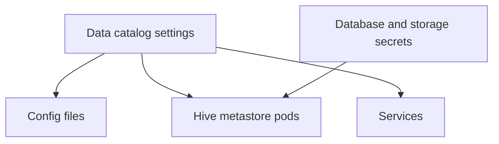

# Hive Subchart

This folder contains the local Hive subchart used by `dlh-in-a-box`.

This subchart exists because the umbrella chart needs Hive behavior that is
specific to this repo.

## How it works

## What is in this folder

| File or folder | Plain meaning |
| --- | --- |
| `Chart.yaml` | Hive subchart metadata |
| `values.yaml` | Default Hive settings used by the umbrella chart |
| `templates/` | The render files for the Hive subchart |

## What this subchart is responsible for

- turning data catalog settings into Hive resources
- wiring database settings into Hive
- wiring object storage settings into Hive
- creating optional schema setup jobs
- creating optional network exposure for Hive

## When you can ignore this folder

You can ignore this folder unless you are changing Hive-specific render logic.

## Common mistake

Keep this subchart narrow. If a change can be done by passing settings into an
upstream chart instead, prefer that.
