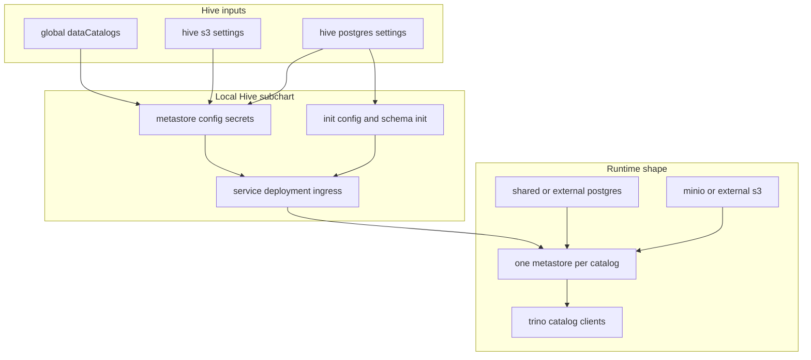

# Hive Subchart

This folder contains the local Hive subchart used by `dlh-in-a-box`.

The repo keeps Hive as a local subchart because the platform needs
catalog-aware metastore generation that is tightly coupled to the umbrella
chart's shared catalog and storage model.

## Who Should Read This

| Reader | Why this guide matters |
| --- | --- |
| contributor | to understand where Hive Metastore resources are generated and why they are local |
| operator | to see how catalog definitions, PostgreSQL, and object storage become working metastores |
| maintainer | to understand the boundary between this local subchart and the rest of the umbrella chart |

## What This Subchart Does

The Hive subchart turns shared catalog definitions into one Hive Metastore
deployment per catalog.

It is responsible for:

- creating the per-catalog metastore configuration files
- wiring PostgreSQL and S3 credentials into Hive
- creating the database if needed
- initializing the metastore schema
- creating the Service and optional Ingress for each metastore



## What Lives In This Folder

| Path | Ownership | What it is for |
| --- | --- | --- |
| `Chart.yaml` | repo-owned | local subchart metadata |
| `values.yaml` | repo-owned | default Hive-specific settings used by the umbrella chart |
| `templates/` | repo-owned | all Hive Metastore render logic |
| `README.md` | repo-owned guide | this folder manual |

There is no vendored Hive chart here. This entire subchart is locally owned.

## How The Subchart Works

### Catalog iteration is the core pattern

The subchart reads `global.dataCatalogs` from the umbrella values and loops
over those catalogs.

For each catalog, it renders:

- a Service
- a Deployment
- a metastore configuration secret
- an optional Ingress

This is why a single values file can create several independent metastore
endpoints.

### Storage wiring

Hive needs object-store credentials and endpoint information.

The subchart uses:

- `hive.s3.endpoint`
- `hive.s3.accessKey` and `hive.s3.secretKey`, unless an existing secret is
  supplied
- `hive.warehouseDir`

Those values become `core-site.xml` and `metastore-site.xml` entries so Hive
can talk to MinIO or an external S3-compatible backend.

### PostgreSQL wiring

Hive Metastore state is stored in PostgreSQL.

The subchart supports two patterns:

- generate a small secret from inline values
- reuse an existing PostgreSQL secret

The rendered config points every catalog at the same PostgreSQL host and port,
but uses a separate database name per catalog.

### Schema initialization lifecycle

Schema initialization and upgrades are handled by a regular Kubernetes Job
(`init-schema-job.yaml`). The metastore Deployment waits for the schema to be
ready using an init container, but never creates or modifies the schema itself.

**Schema Job** (`schemainit.job.enabled=true`, default):

Each catalog gets one Job that runs init containers in order:

1. `wait-for-postgres` — polls `pg_isready` until PostgreSQL accepts connections
2. `download-jdbc` — fetches the PostgreSQL JDBC driver
3. `create-db` (optional, when `postgres.createDatabase=true`) — creates the
   per-catalog database if it does not already exist

The Job's main container then runs `schematool -upgradeSchema`, falling back to
`schematool -initSchema` if no schema exists yet.

The Job name includes the Hive image tag. Bumping the image version creates a
new Job on the next `helm upgrade`, which triggers a schema upgrade automatically.

**Metastore Deployment** init containers:

1. `wait-for-postgres` — polls `pg_isready`
2. `download-jdbc` — fetches the PostgreSQL JDBC driver
3. `wait-for-schema` — loops on `schematool -info` until the schema exists and
   is at the expected version

The metastore pod will not start until `schematool -info` succeeds. On restart,
this check passes immediately because the schema already exists. There are no
Helm hooks and no ordering concerns — Kubernetes retry handles the wait naturally.

The JDBC init container and volume definitions are shared via named templates in
`_helpers.tpl`. If the driver URL or mount path changes, update it there.

### How Trino uses the result

This subchart does not configure Trino directly.

Instead:

1. this subchart creates the Hive Metastore services
2. the vendored Trino chart patches render Trino catalog properties from the
   shared catalog contract
3. those Trino catalogs point at the per-catalog Hive Metastore services

That is the end-to-end bridge from `global.dataCatalogs` to queryable tables.

## Important Files

### `values.yaml`

This file is intentionally small compared with the umbrella chart defaults.

It defines:

- image locations for the metastore and schema-init containers (default
  `docker.io/apache/hive:4.2.0`)
- the JDBC driver download URL (`jdbcDriver.url`), defaulting to the
  PostgreSQL JDBC driver
- PostgreSQL and S3 secret expectations
- the warehouse directory base
- ingress toggles

The actual catalog list still comes from `global.dataCatalogs` at the umbrella
layer.

### `templates/`

This is where the real behavior lives. Read
[`templates/_README.txt`](templates/_README.txt) next if you are changing the
subchart.

## Common Tasks

If you need to:

- change how per-catalog metastore config is generated: edit
  `templates/configmap.yaml`
- change schema init or upgrade logic: edit `templates/init-schema-job.yaml`
- change how long the metastore waits for the schema: edit
  `templates/metastore.yaml`
- change startup, mounts, or ingress for metastore pods: edit
  `templates/metastore.yaml`
- change the JDBC driver URL or postgres wait image: edit
  `templates/_helpers.tpl`
- change how generated secrets work: edit `templates/postgres-secret.yaml` or
  `templates/s3-secret.yaml`

## Validation

After changing anything here, run:

```commandline
make verify
```

Use `helm template` output to confirm the expected number of metastore Services
and Deployments are rendered for your example catalogs.

## Common Mistakes

- assuming Hive owns the catalog list locally instead of consuming
  `global.dataCatalogs`
- forgetting that one catalog means one metastore Deployment, Service, and
  schema init Job
- expecting the metastore to create or upgrade the schema; it only waits for
  the schema to be ready via `schematool -info`
- disabling the schema Job (`schemainit.job.enabled=false`) without an external
  mechanism to create the schema; the metastore will hang indefinitely
- editing the JDBC download or postgres wait init containers directly in
  `metastore.yaml` or `init-schema-job.yaml` instead of updating the shared
  helpers in `templates/_helpers.tpl`
- changing secret generation without checking the existing-secret path
- adding umbrella-only logic here when it belongs at the parent chart layer

## When You Can Ignore This Folder

You can ignore this folder unless you are changing Hive Metastore generation or
debugging how a catalog reaches Trino.
