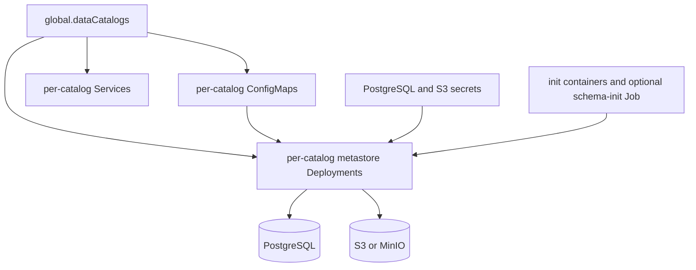

# Hive Subchart

This is the locally owned Hive metastore subchart. It exists because the
umbrella chart needs behavior that is specific to `dlh-in-a-box`: one
metastore per catalog, automatic schema bootstrapping, and S3/PostgreSQL wiring
derived from the umbrella values model.

## How it works

## Chart responsibilities

| Area | Responsibility |
| --- | --- |
| Catalog expansion | Turn `global.dataCatalogs` into per-catalog resources |
| Database bootstrap | Create PostgreSQL databases if they do not already exist |
| Schema bootstrap | Run `schematool` during startup and optionally via a hook job |
| S3 wiring | Inject S3 endpoint and credentials into Hive metastore configuration |
| Optional ingress | Expose metastore services when enabled |

## Files

| File | Purpose |
| --- | --- |
| `Chart.yaml` | Subchart metadata |
| `values.yaml` | Hive-specific value defaults expected by the umbrella chart |
| `templates/` | All generated Kubernetes resources for the Hive metastore layer |

## Child guide

| Path | Guide | Purpose |
| --- | --- | --- |
| `templates/` | [templates/_README.txt](templates/_README.txt) | Template-by-template implementation guide |

## Maintainer note

This chart is intentionally narrow. If a requirement can be solved by passing
values into an upstream chart instead, prefer that route over growing the local
Hive chart further.
