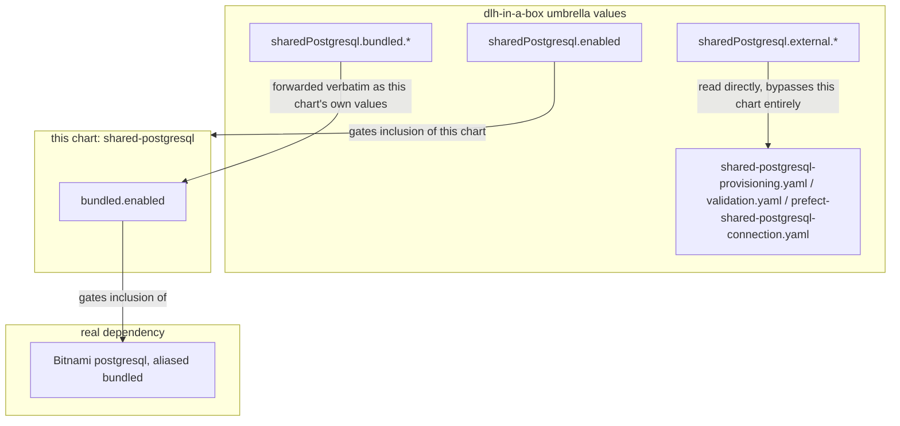

# Shared PostgreSQL Wrapper Subchart

This folder contains a local wrapper chart used by `dlh-in-a-box`. It has no
templates of its own.

## Who Should Read This

| Reader | Why this guide matters |
| --- | --- |
| contributor | to understand why `sharedPostgresql.bundled.*` exists as a nested key instead of sitting flat under `sharedPostgresql` |
| maintainer | to see the boundary between this alias-remapping shim and the umbrella-owned provisioning/validation templates |

## Why This Chart Exists

Helm dependency aliasing forwards a parent chart's values verbatim to the
aliased subchart -- there is no way to redirect only a nested sub-path (for
example `sharedPostgresql.bundled`) to a dependency while `sharedPostgresql`
is itself the alias.

This chart exists purely to add one more level of nesting: it declares the
real Bitnami `postgresql` chart as its own dependency, aliased `bundled`. The
parent umbrella chart depends on *this* chart (aliased `sharedPostgresql`,
gated on `sharedPostgresql.enabled`), so from the umbrella's perspective,
`sharedPostgresql.bundled.*` now lands on the real Bitnami chart, and
`sharedPostgresql.bundled.enabled` independently gates whether that pod
actually deploys.

Everything else under `sharedPostgresql` in the umbrella chart's values --
`external.*`, `provisioning.*`, `migration.*` -- is read directly by
umbrella-owned templates (`templates/shared-postgresql-provisioning.yaml`,
`templates/shared-postgresql-validation.yaml`,
`templates/prefect-shared-postgresql-connection.yaml`) and has nothing to do
with this chart or its dependency tree.