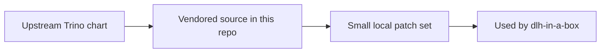

# Trino Wrapper Notes

This folder contains the vendored upstream Trino chart source used by this
repo.

The normal `README.md` in this folder is upstream reference material.

This file is the local explanation of how this repo uses that vendored chart.

## What is in this folder

| File or folder | Plain meaning |
| --- | --- |
| `README.md` | Upstream Trino chart README |
| `README.md.gotmpl` | Upstream source for that README |
| `Chart.yaml` | Trino chart metadata |
| `values.yaml` | Default Trino settings |
| `templates/` | Trino render files, including local patch points |

## When you can ignore this folder

You can ignore this folder unless you are changing Trino behavior inside the
umbrella chart.

## Common mistake

Do not treat the upstream `README.md` as the explanation of this repo's local
patches. Use `templates/_README.txt` for the repo-specific patch points.
