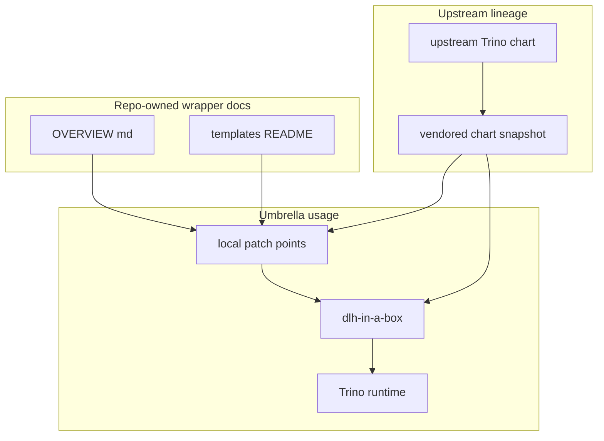

# Trino Wrapper Notes

This folder contains the vendored upstream Trino chart source used by this
repo.

The upstream `README.md` stays untouched as reference material. This
`OVERVIEW.md` is the repo-specific guide that explains how the umbrella chart
uses, patches, and packages that vendored source.

## Who Should Read This

| Reader | Why this guide matters |
| --- | --- |
| contributor | to know which Trino files are local patch points and which are upstream material |
| operator | to understand where Trino auth and catalog behavior is actually coming from |
| maintainer | to understand how vendored source refreshes interact with local patches and license obligations |



## What Lives In This Folder

| Path | Ownership | What it is for |
| --- | --- | --- |
| `README.md` | upstream reference | upstream Trino chart documentation |
| `README.md.gotmpl` | upstream reference source | source for the upstream README generation |
| `LICENSE` | upstream license text | license material that must stay with the vendored source |
| `Chart.yaml` | vendored upstream metadata | current vendored chart metadata, version `1.41.0` and app version `477` in this repo snapshot |
| `values.yaml` | vendored upstream defaults | base Trino chart defaults consumed by the umbrella chart |
| `templates/` | mixed | mostly upstream templates plus the repo's local patch points |
| `OVERVIEW.md` | repo-owned guide | this file |

## Ownership Boundary

This folder is easy to edit in the wrong way unless the ownership line is kept
clear.

### Upstream material

These files are upstream-owned reference or source material:

- `README.md`
- `README.md.gotmpl`
- `LICENSE`
- most of `values.yaml`
- most of `templates/`

### Repo-owned explanation around the vendored source

This repo owns:

- `OVERVIEW.md`
- `templates/_README.txt`
- the documented local patch set inside `templates/`

### What that means in practice

If you need to explain how the vendored chart behaves in this repo, edit the
wrapper guides.

If you need to change repo-specific Trino behavior, first look for an existing
local patch point in `templates/_README.txt`.

If the needed change is really upstream behavior, make the smallest safe change
possible and be deliberate about preserving or re-applying the local patch set
when the vendored chart is refreshed.

## How This Folder Fits Into The Umbrella Chart

The umbrella chart does not treat Trino as a black box.

It relies on the vendored Trino chart for core runtime templates, but overlays
repo-specific behavior for:

- catalog generation from `global.dataCatalogs`
- shared object-storage wiring
- shared identity and OIDC behavior
- optional file-based versus Ranger-backed access-control
- secret and rollout wiring for coordinator and worker pods

That means this vendored chart snapshot is part upstream source and part
platform integration surface.

## Where The Important Local Behavior Lives

The repo-specific Trino control points are documented in
[`templates/_README.txt`](templates/_README.txt).

The most important practical split is:

- `README.md` tells you how upstream Trino works in general
- `OVERVIEW.md` tells you how this repo uses the vendored chart
- `templates/_README.txt` tells you which exact files shape auth, catalogs,
  and rollout behavior in this repo

## Common Tasks

If you need to:

- understand Trino auth and catalog wiring in this repo: start with
  `templates/_README.txt`
- update the vendored Trino chart version: review `Chart.yaml`, `LICENSE`, and
  the local patch files together
- change only repo-specific docs: edit this file or `templates/_README.txt`
- read general chart usage for Trino itself: use the upstream `README.md`

## Validation

After changing anything in this folder, run:

```bash
make verify
```

## Common Mistakes

- treating the upstream `README.md` as if it documented the repo's local patch
  behavior
- editing vendored upstream files without checking whether a documented local
  patch point already exists
- forgetting that the vendored `LICENSE` file is part of the compliance story
  for this snapshot

## When You Can Ignore This Folder

You can ignore this folder unless you are changing Trino internals or trying to
understand how the umbrella chart wires Trino into the broader platform.
