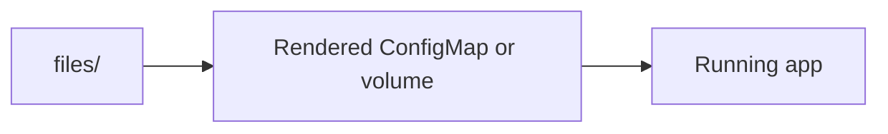

# Chart File Payloads

This folder contains extra files that the chart copies into rendered
Kubernetes objects.

## What is in this folder

| Path | Plain meaning |
| --- | --- |
| `platform-home/` | Extra browser files for the optional home page |

## When you can ignore this folder

You can ignore this folder unless you are changing a file that must be copied
into a running app.

## Common mistake

Do not put normal template logic here. This folder is for file payloads, not
for Helm render logic.
