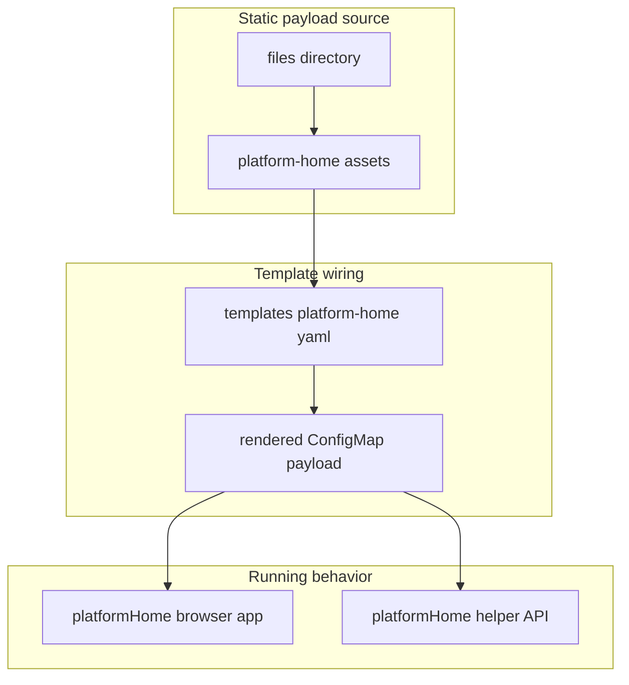

# Chart File Payloads

This folder contains static files that the chart copies into rendered runtime
objects.

It is deliberately small. Most of the interesting behavior that newcomers
expect to find here actually lives inline in
[`../templates/platform-home.yaml`](../templates/platform-home.yaml).

## Who Should Read This

| Reader | Why this guide matters |
| --- | --- |
| contributor | to know whether a change belongs in `files/` or in a template |
| operator | to understand why `platformHome` behavior is mostly not stored as standalone files |



## What Lives In This Folder

| Path | Ownership | What it is for |
| --- | --- | --- |
| `platform-home/` | repo-owned | static browser asset payloads used by the optional launchpad |
| `README.md` | repo-owned guide | explains why the folder is small and what belongs here |

There are no vendored payload trees here and no generated artifacts checked
into this folder.

## Why This Folder Is So Small

The chart uses `files/` only for assets that need to be copied verbatim into a
rendered object.

The important distinction is:

- `files/` is for payload files such as browser adapters
- `templates/` is for behavior, control flow, and runtime code generation

For `platformHome`, that means:

- the browser adapter file lives here
- the page HTML, CSS, JavaScript, helper API, access-control UI, and launch
  logic live inline in `templates/platform-home.yaml`

That split keeps the chart simple to package while still letting the template
generate environment-aware runtime behavior.

## How It Fits Into The Repo

This folder currently exists entirely to support `platformHome`.

The render path is:

1. a file under `files/platform-home/` is read by `platform-home.yaml`
2. the template embeds or mounts that asset into a rendered ConfigMap
3. the `platformHome` Deployment consumes the rendered payload at runtime

If a future feature needs a true static payload file, it would likely be added
here. If it needs values-aware logic, it belongs in `templates/` instead.

## Common Tasks

If you need to:

- update a static browser dependency used by `platformHome`: edit the relevant
  file under `platform-home/`
- change the page itself, launch behavior, or helper API: edit
  `../templates/platform-home.yaml` instead

## Validation

After changing files in this folder, run:

```bash
./hack/template.sh examples/values-local-auth.yaml
./hack/lint.sh
```

Use the local auth smoke install when you changed a browser asset that could
affect actual login flow.

## Common Mistakes

- putting values-aware logic in `files/` when it belongs in a template
- assuming every `platformHome` change should happen here
- forgetting that a copied file may still be consumed by large inline runtime
  code in `platform-home.yaml`

## When You Can Ignore This Folder

You can ignore this folder unless you are changing a literal file payload.
