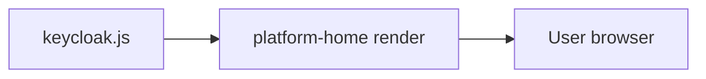

# platform-home Extra Files

This folder contains extra browser files used by `platformHome`.

`platformHome` is the optional home page this chart can show in a browser.

## What is in this folder

| File | Plain meaning |
| --- | --- |
| `keycloak.js` | The browser adapter used by the home page for Keycloak sign-in |

## When you can ignore this folder

You can ignore this folder unless you are changing the browser home page or
its sign-in file.

## Common mistake

Most of the home page code does not live here. It lives inline in
[`../../templates/platform-home.yaml`](../../templates/platform-home.yaml).
