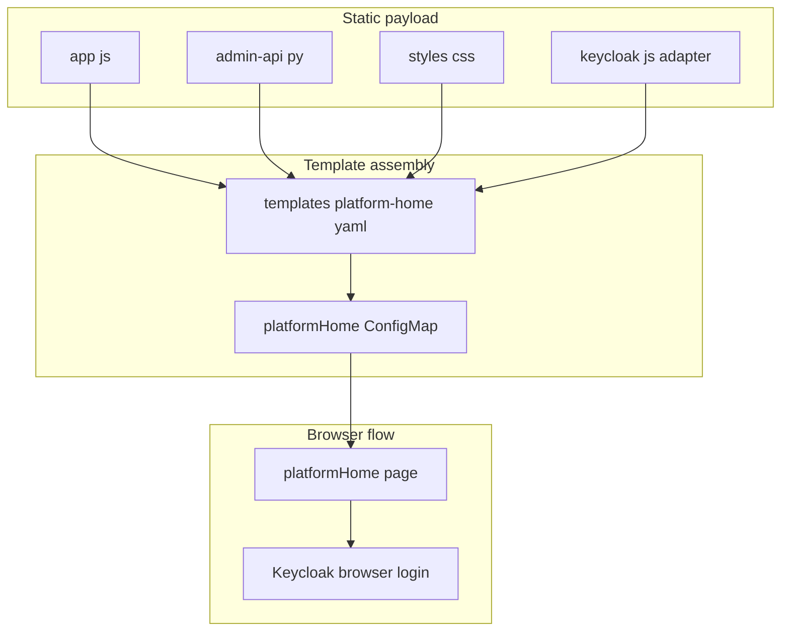

# platform-home Extra Files

This folder contains the static payload portion of `platformHome`.

That usually surprises people, because the `platformHome` feature itself is
large. The values-aware page shell and generated runtime configuration still
live in [`../../templates/platform-home.yaml`](../../templates/platform-home.yaml),
while static JavaScript, CSS, and Python payloads live here so they can be
edited and validated as normal source files.

## Who Should Read This

| Reader | Why this guide matters |
| --- | --- |
| contributor | to know whether a `platformHome` change belongs here or in the big template |
| operator | to understand what file-level payload is actually shipped to the browser |



## What Lives In This Folder

| File | Ownership | What it is for |
| --- | --- | --- |
| `app.js` | repo-owned source | launchpad browser behavior |
| `admin-api.py` | repo-owned source | platform-home helper API mounted into the API container |
| `styles.css` | repo-owned source | static launchpad layout and component styles |
| `keycloak.js` | repo-owned copied asset | Keycloak JavaScript adapter used by the launchpad browser login flow |
| `README.md` | repo-owned guide | explains the split between static payload and inline runtime logic |

## What Stays In The Template

`platformHome` mixes two different kinds of content:

- static browser assets that must be copied as-is
- values-aware runtime code that must be generated by Helm

`app.js`, `admin-api.py`, `styles.css`, and `keycloak.js` fall into the first
category, so they live here.

The HTML shell, generated `theme.css`, nginx config, launchers, and generated
JSON config fall into the second category, so they stay in `platform-home.yaml`.

This keeps the chart from needing a separate front-end build step while still
allowing the template to inject environment-specific URLs, enabled apps, and
policy state.

## When To Edit This Folder

Edit this folder when:

 - the launchpad browser behavior changes
 - the helper API behavior changes
- the static launchpad layout or component styles change
- the Keycloak browser adapter version needs to change
- browser compatibility requires a different adapter asset
- the launchpad needs a different static dependency file

Do not edit this folder when:

- the page layout changes
- launch targets or health checks change
- the CSS theme variables, font faces, custom CSS, or generated branding values change

Those changes belong in `../../templates/platform-home.yaml`.

## Validation

After changing these files, run:

```bash
python3 -c 'import ast; ast.parse(open("charts/dlh-in-a-box/files/platform-home/admin-api.py").read())'
./scripts/template.sh examples/values-local-auth.yaml
./scripts/smoke-install.sh charts/dlh-in-a-box examples/values-local-auth.yaml
```

The template check proves the asset still renders into the chart. The smoke
install is what catches browser-login regressions.

## Common Mistakes

- looking only in `platform-home.yaml` for the browser or helper API code
- putting Helm template expressions into files in this folder without also
  changing the template to render them through `tpl`
- forgetting that `platformHome` currently depends on bundled Keycloak browser
  integration

## When You Can Ignore This Folder

You can ignore this folder unless you are changing the platform-home browser
logic, helper API, or copied Keycloak browser adapter.
