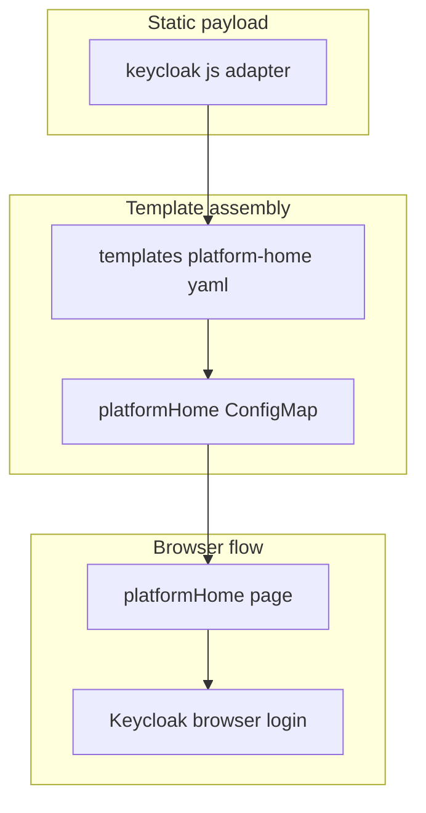

# platform-home Extra Files

This folder contains the tiny static payload portion of `platformHome`.

That usually surprises people, because the `platformHome` feature itself is
large. The reason is simple: almost all of the launchpad page and helper API
live inline in
[`../../templates/platform-home.yaml`](../../templates/platform-home.yaml),
while this folder only holds the browser adapter file that needs to be copied
verbatim.

## Who Should Read This

| Reader | Why this guide matters |
| --- | --- |
| contributor | to know whether a `platformHome` change belongs here or in the big template |
| operator | to understand what file-level payload is actually shipped to the browser |



## What Lives In This Folder

| File | Ownership | What it is for |
| --- | --- | --- |
| `keycloak.js` | repo-owned copied asset | Keycloak JavaScript adapter used by the launchpad browser login flow |
| `README.md` | repo-owned guide | explains the split between static payload and inline runtime logic |

## Why There Is Only One Real File

`platformHome` mixes two different kinds of content:

- static browser assets that must be copied as-is
- values-aware runtime code that must be generated by Helm

`keycloak.js` falls into the first category, so it lives here.

The page shell, launchers, access-control UI, and helper API fall into the
second category, so they live in `platform-home.yaml`.

This keeps the chart from needing a separate front-end build step while still
allowing the template to inject environment-specific URLs, enabled apps, and
policy state.

## When To Edit This Folder

Edit this folder when:

- the Keycloak browser adapter version needs to change
- browser compatibility requires a different adapter asset
- the launchpad needs a different static dependency file

Do not edit this folder when:

- the page layout changes
- launch targets or health checks change
- the admin access-control UI changes
- the helper API behavior changes

Those changes belong in `../../templates/platform-home.yaml`.

## Validation

After changing `keycloak.js`, run:

```bash
./hack/template.sh examples/values-local-auth.yaml
./hack/smoke-install.sh charts/dlh-in-a-box examples/values-local-auth.yaml
```

The template check proves the asset still renders into the chart. The smoke
install is what catches browser-login regressions.

## Common Mistakes

- looking here for the main `platformHome` code and assuming it is missing
- editing `keycloak.js` for behavior that is actually controlled by the inline
  page and API code
- forgetting that `platformHome` currently depends on bundled Keycloak browser
  integration

## When You Can Ignore This Folder

You can ignore this folder unless you are updating the copied Keycloak browser
adapter itself.
