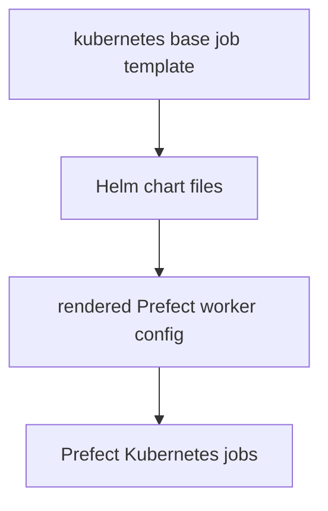

# Prefect File Payloads

This folder contains static Prefect payloads that the chart copies into
rendered runtime objects.

## What Lives Here

| File | What it is for |
| --- | --- |
| `kubernetes-base-job-template.json` | base Kubernetes job template used by Prefect workers |
