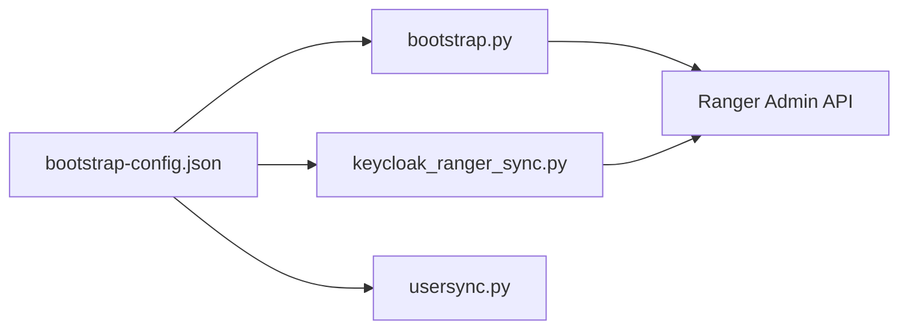

# Ranger Automation Files

Python helpers mounted into the chart-managed Ranger bootstrap and
Keycloak-to-Ranger sync jobs.

```mermaid
flowchart LR
    Config[bootstrap-config.json] --> Bootstrap[bootstrap.py]
    Config --> KeycloakSync[keycloak_ranger_sync.py]
    Config --> UserSync[usersync.py]
    Bootstrap --> Ranger[Ranger Admin API]
    KeycloakSync --> Ranger
```
