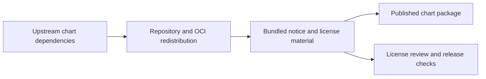

# Third-Party Notice Material

This directory contains bundled notice and license material that the repository
ships alongside the chart for redistribution hygiene.

## Why this exists

## Inventory

| Path | Purpose |
| --- | --- |
| `datahub/` | Carries the reproduced upstream DataHub `NOTICE` file |
| `gcloud-sqlproxy/` | Carries the reproduced MIT license text for bundled `gcloud-sqlproxy` material |
| `oauth2-proxy/` | Carries the reproduced MIT license text for the bundled `oauth2-proxy` dependency |

## Child guides

| Path | Guide | Purpose |
| --- | --- | --- |
| `datahub/` | [datahub/README.md](datahub/README.md) | Provenance of the bundled DataHub `NOTICE` |
| `gcloud-sqlproxy/` | [gcloud-sqlproxy/README.md](gcloud-sqlproxy/README.md) | Provenance of the bundled MIT license text |
| `oauth2-proxy/` | [oauth2-proxy/README.md](oauth2-proxy/README.md) | Provenance of the bundled MIT license text |

## Maintainer note

The canonical dependency inventory still lives in
[`../THIRD_PARTY_NOTICES.md`](../THIRD_PARTY_NOTICES.md). This directory exists
for the actual bundled notice files that need to ship with the repository or
packaged chart.
