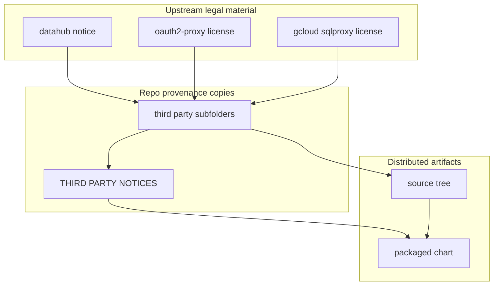

# Third-Party Notice Material

This folder contains copied notice and license files that must travel with the
chart source and packaged artifacts.

It is not the main dependency list. It is the provenance-and-compliance corner
of the chart tree.

## Who Should Read This

| Reader | Why this guide matters |
| --- | --- |
| maintainer | to understand which copied legal files must move when dependencies change |
| reviewer | to verify that packaged dependency refreshes still carry the right notices and licenses |



## What Lives In This Folder

| Path | Ownership | What it is for |
| --- | --- | --- |
| `datahub/NOTICE` | copied upstream notice | notice text for bundled DataHub material |
| `datahub/README.md` | repo-owned guide | provenance notes for the DataHub notice copy |
| `gcloud-sqlproxy/LICENSE` | copied upstream license | MIT license text for the `gcloud-sqlproxy` material bundled transitively through DataHub prerequisites |
| `gcloud-sqlproxy/README.md` | repo-owned guide | provenance notes for the license copy |
| `oauth2-proxy/LICENSE` | copied upstream license | MIT license text for the bundled `oauth2-proxy` chart material |
| `oauth2-proxy/README.md` | repo-owned guide | provenance notes for the license copy |
| `README.md` | repo-owned guide | this folder manual |

## How This Folder Relates To The Rest Of The Chart

This folder works together with:

- [`../THIRD_PARTY_NOTICES.md`](../THIRD_PARTY_NOTICES.md), which is the human
  summary of bundled third-party material
- `../Chart.yaml` and `../Chart.lock`, which define which dependencies are
  actually bundled
- `../charts/*.tgz`, which are the packaged dependency archives that make the
  legal copies necessary

The pattern is:

1. a dependency is bundled or vendored in the chart
2. the repo keeps the relevant upstream notice or license text here
3. the summary notice file points at or incorporates that provenance
4. `scripts/repo/license-check.sh` verifies the expected compliance files are still
   present

## Update Triggers

Review this folder whenever one of these changes happens:

- `Chart.yaml` dependency versions change
- `Chart.lock` changes
- packaged `.tgz` archives under `charts/` change
- vendored source refreshes pull in different bundled legal material

If a dependency disappears from the bundle, a file in this folder may also need
to be removed or the summary notice updated.

## What Does Not Belong Here

This folder should not be used for:

- general dependency documentation
- operator instructions
- configuration examples
- new source code

It is intentionally narrow: provenance copies and the guides that explain them.

## Validation

After changing anything here, run:

```bash
./scripts/license-check.sh
./scripts/verify.sh
```

## Common Mistakes

- updating `Chart.yaml` or packaged archives without reviewing the copied legal
  files here
- treating this folder as the authoritative dependency inventory instead of
  using `THIRD_PARTY_NOTICES.md` and `Chart.lock`
- dropping provenance notes because a file "looks copied anyway"

## When You Can Ignore This Folder

Most contributors can ignore this folder unless they are changing dependency,
packaging, or notice behavior.
